# Digitalurth Screen Survey

> Forty-four exhibits recovered from a thirty-minute onboarding recording, a screen-shared product review and a set of direct captures — reassembled in the order the product's own sidebar presents them, and then measured against what CINQFLOW is building.

**44** exhibits · **16 of 25** destinations opened · **40** annotated plates · **42** capabilities compared · captures dated 5, 10 and 20 August 2026.

Companion artifact: *Digitalurth Screen Survey*. Images live in `survey_frames/`.

## Where these images come from

| Source | What it is |
|---|---|
| **A — the onboarding recording** | Thirty minutes of screen share with narration, walking one ADT feed from creation to first run. Timecodes on these plates are offsets into that recording. |
| **B — the product review calls** | Two screen-shared sessions, 10 and 20 August, moving through Data Gov and DataOps. Cropped out of the meeting frame, so the resolution is the meeting's. |
| **C — direct captures** | Screenshots taken on the machine itself, at native resolution. Fewest in number, sharpest in detail, and the only source for the medallion tier editor. |

Every destination in the product's own sidebar appears below, in the product's own order. Where a destination was never opened in front of a camera it still gets a heading, a route and a note on what can be inferred — because the gaps are as useful to know about as the screens.

## Coverage

| Group | Destination | Route | Plates |
|---|---|---|---|
| ENTRY | Sign-in | `/` | 1 |
| ENTRY | Home | `/home` | 2 |
| ENTRY | Reference model | `Data-Platform-Architecture-and-Control-Model v1.pdf` | 1 |
| DATA GOV | Data Catalog | `/agent-datagov/catalog` | — *not opened* |
| DATA GOV | Schema Drift | `/agent-datagov/schema-drift` | — *not opened* |
| DATA GOV | Domain | `/agent-datagov/domain` | 2 |
| DATA GOV | Glossary | `/agent-datagov/glossary` | 1 |
| DATA GOV | Agent Studio | `/agent-datagov/agent-studio` | 2 |
| DATA GOV | Catalog Audit | `/agent-datagov/audit` | 1 |
| DATA GOV | Lineage | `/agent-datagov/lineage` | — *not opened* |
| PIPELINE | Data Pipeline | `/pipeline/ai-pipeline` | 1 |
| PIPELINE | Data Flow | `/agent-pipeline/data-flow` | — *not opened* |
| PIPELINE | Ingestion | `/agent-pipeline/ingestion` | 14 |
| PIPELINE | Knowledge Base | `/agent-pipeline/knowledge-base` | 1 |
| PIPELINE | Orchestration Workflows | `/agent-pipeline/orchestration` | 1 |
| DATAOPS | Ops Explore | `/dataops-hub/ops-explore` | 1 |
| DATAOPS | Ops Hub | `/dataops-hub/ops-hub` | 2 |
| DATAOPS | Control Operations | `/dataops-hub/control-ops` | 5 |
| DATAOPS | Recovery Library | `/dataops-hub/recovery-library` | 2 |
| DATAOPS | Ops Incidents | `/dataops-hub/incidents` | — *not opened* |
| DATAOPS | LLM Observability | `/dataops/agent-observability` | 2 |
| DATAOPS | Cost Optimization | `/dataops-hub/cost` | — *not opened* |
| ELSEWHERE | All Chats | `/chats` | 1 |
| ELSEWHERE | Migration | `/migration` | — *not opened* |
| ELSEWHERE | Admin | `/admin` | — *not opened* |

---

# ENTRY

*How you get in, and what greets you when you do.*

## Sign-in

`/` — *Who are you, and which tenant?*

### Plate 01 — The tenant door

*Aug 5 · capture C*

Digitalurth presents a wordmark, a single **Login** in the corner and one action in the middle of an otherwise empty page: **Sign in with Digitalurth**. Behind that button sits Keycloak — realm `cinqcare` on `kc.dataplatform.cinq.care` — offering a password field or *Continue with Azure*. The product describes itself on that page in five words: "End to End Data Engineering Platform."

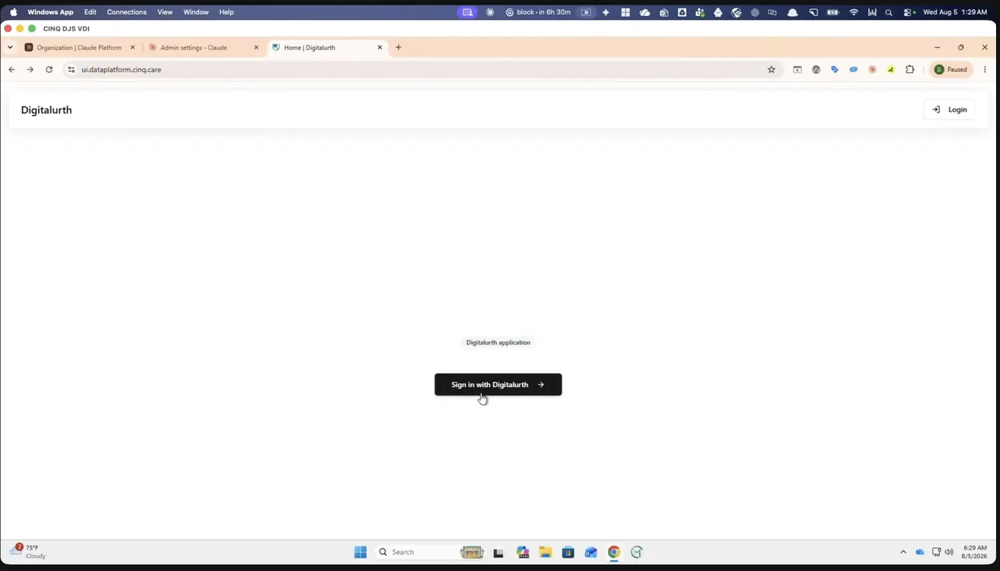

| | |
|---|---|
| **Host** | ui.dataplatform.cinq.care |
| **Identity** | Keycloak · realm cinqcare · Azure federation |
| **Accessed through** | a managed Windows desktop — the title bar reads CINQ DJS VDI |

> **What this means for our build.** The platform is operated from a locked-down virtual desktop, not from a laptop browser. Whatever we build will be used the same way: through a VDI, on a Windows session, over a remote display. That is a real constraint on latency budgets, on drag-and-drop, and on anything that assumes a fast local machine.

## Home

`/home` — *What do you want to start?*

### Plate 02 — The whole product in one frame

*Aug 10 · capture B*

This is the map the rest of this survey follows. Twenty destinations in four groups, plus a theme switch and a chat history. The vocabulary is the engineering team's own: **DATA GOV**, **PIPELINE**, **DATAOPS** — not the vocabulary of the analyst or the steward who has to use it.

The body of the page is four chips and a sentence: *Please select an action above to continue…* Home is a dispatcher. It does not tell you what arrived overnight, what completed, what needs review or what needs action; it asks you what you would like to start.

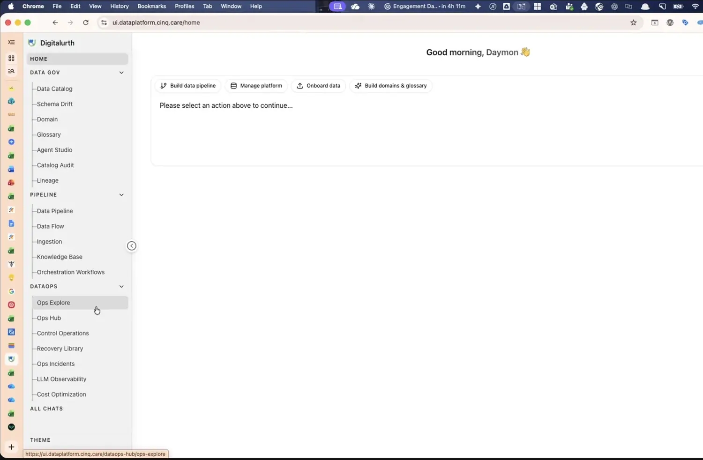

| | |
|---|---|
| **Groups** | DATA GOV · PIPELINE · DATAOPS, then ALL CHATS and THEME |
| **Home actions** | Build data pipeline · Manage platform · Onboard data · Build domains & glossary |
| **Build drift** | the Aug 20 build adds MIGRATION, ADMIN and LOGOUT to the same rail |

> **What this means for our build.** The single largest design divergence in this survey is here, on the first screen. Our blueprint puts **Data Operations** at home and makes it answer four questions before you click anything. Digitalurth's home answers none — it delegates. Every operator therefore starts each morning by navigating, not by reading.

### Plate 03 — Home as a pipeline prompt

*Aug 10 · capture B*

Choose **Build data pipeline** and home becomes a prompt box. You describe the pipeline in prose, or dictate it — there is a microphone. Three selectors sit under the box: **Project**, **Engine** and **Model**.

The engine dropdown is open in this frame and holds exactly one entry, PySpark. The model selector reads `claude-son… (Default)` and is exposed to whoever is standing at the screen.

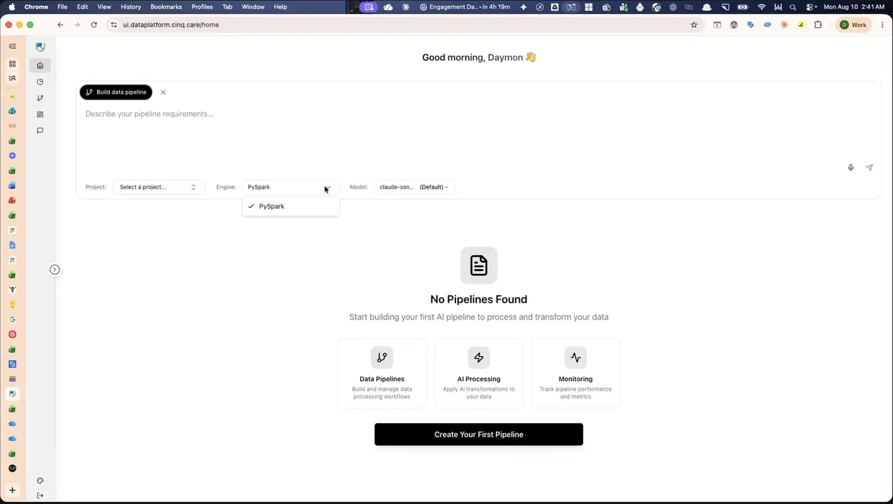

| | |
|---|---|
| **Empty state** | Data Pipelines · AI Processing · Monitoring, then Create Your First Pipeline |
| **Engine** | PySpark — the abstraction exists, with one implementation behind it |
| **Model** | chosen per request, by the end user, at the point of work |

> **What this means for our build.** Model choice belongs in a profile, not in the hands of an analyst mid-task — it is the one control that silently changes cost, latency and behaviour at once, and no screen here shows the consequence of changing it. Keep the prompt box; move the model into the connection profile.

## Reference model

`Data-Platform-Architecture-and-Control-Model v1.pdf` — *What is the console actually configuring?*

### Plate 04 — What the console is configuring

*Aug 5 · capture C*

Before the screens make sense, this does. The architecture deck the team works from lays the platform out as a single left-to-right run — **Landing → Bronze → Silver Raw → Integration → Silver ODS → Gold → Consumption** — with two services sitting above it: a **Control Model** that captures logs, stats and statuses, and an **Orchestration** layer that drives the hops and receives validation and SLA alerts back.

Landing is guarded by three named properties — *Arrival SLA, File Integrity, Idempotency* — and every tier carries its own contract underneath it. Those contracts are the vocabulary the Ingestion screens later let you edit.

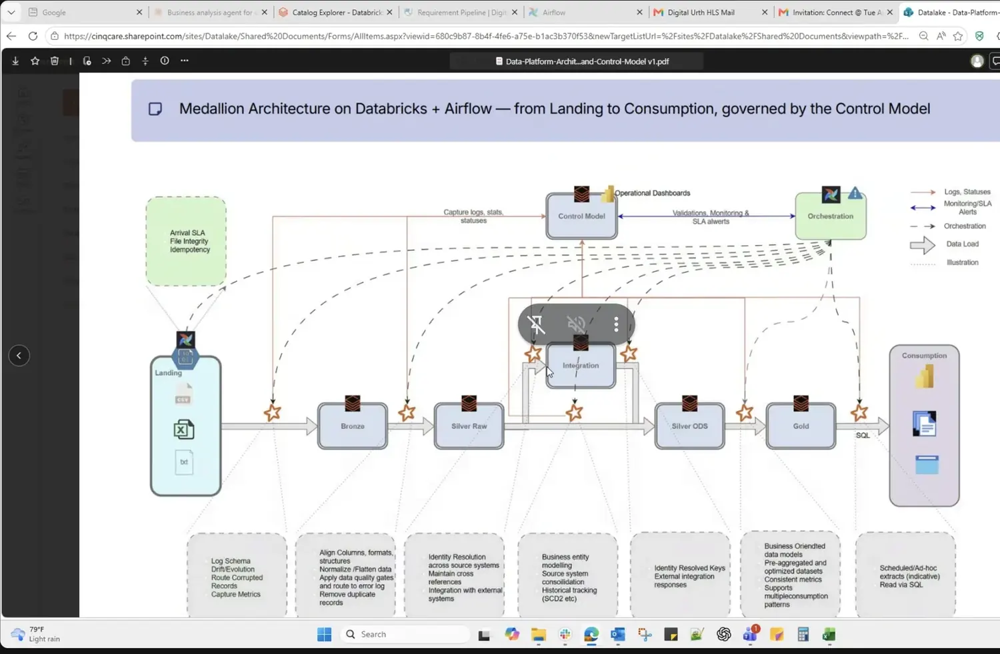

| | |
|---|---|
| **Landing** | log schema drift and evolution · route corrupted records · capture metrics |
| **Bronze** | align columns, formats, structures · normalize and flatten · apply DQ gates and route to error log · de-duplicate |
| **Silver Raw** | identity resolution across source systems · maintain cross references · integrate with external systems |
| **Integration** | business entity modelling · source-system consolidation · historical tracking (SCD2) |
| **Silver ODS** | identity-resolved keys · external integration responses |
| **Gold** | business-oriented models · pre-aggregated datasets · consistent metrics · multiple consumption patterns |

> **What this means for our build.** This diagram is the single most reusable artefact in the survey. It names the tiers, it names what each tier owes, and it puts the control plane *above* the data plane rather than inside it — which is exactly the separation our chip model makes structural. Adopt the tier names verbatim; the team already speaks them.

---

# DATA GOV

*Seven destinations. Meaning, structure, and who changed what.*

## Data Catalog

`/agent-datagov/catalog` — *What data objects exist and what shape are they?*

**Not opened on camera.** Catalog Audit writes against "all catalog entities" and counts four entity types, `DATA_SOURCE` among them. A platform tool *lists layout fields from catalog API*, and the feed page offers **Save & sync catalog** and **Rediscover layout**. The catalog therefore holds data sources and their layout fields, and the ingestion screens write into it.

## Schema Drift

`/agent-datagov/schema-drift` — *What changed shape, and does it matter?*

**Not opened on camera.** Control Operations reports **Registry 752** and **Policies 246** beside its drift events — a registry of known dataset shapes and a policy table are already populated. This destination is almost certainly where both are maintained.

## Domain

`/agent-datagov/domain` — *What business areas do we govern?*

### Plate 05 — Five governed domains

*Aug 10 · capture B*

A tree on the left, cards on the right, and one parent domain — `cinqcare` — with four children: **ADT**, **Claims**, **Enrollments** and **Reference Data Management**. The descriptions are not placeholders; they are working value-based-care definitions written by the team.

Two creation paths sit in the corner: **+ Create** and **Generate with AI**. The same pair reappears on Glossary. Generation is offered at the point of authoring, not as a separate wizard.

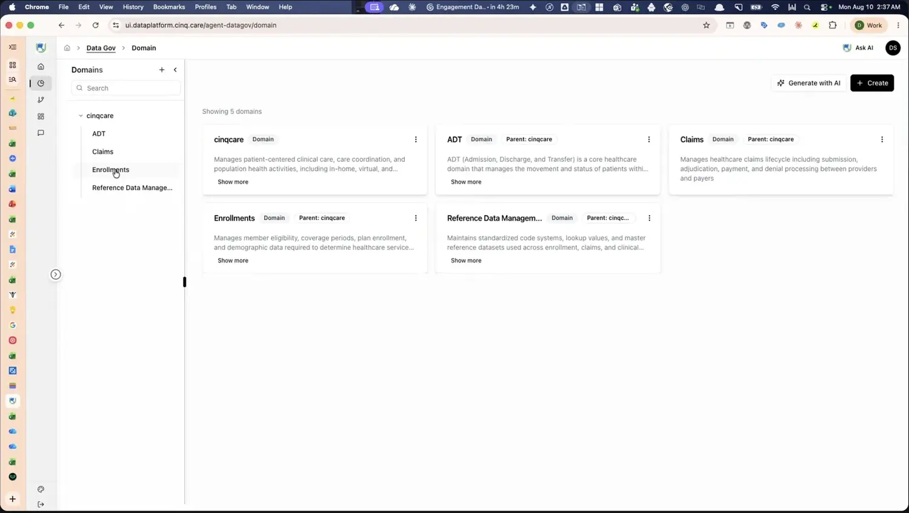

| | |
|---|---|
| **Enrollments** | "Manages member eligibility, coverage periods, plan enrollment, and demographic data required to determine healthcare service…" |
| **Reference Data Management** | "Maintains standardized code systems, lookup values, and master reference datasets used across enrollment, claims, and clinical…" |
| **Hierarchy** | one level deep — parent tenant domain, then subject domains |

### Plate 06 — Tribal knowledge, as a textarea

*Aug 10 · capture B*

Open a domain and the second tab is **Tribal & DQ**. This is where Digitalurth keeps its domain knowledge, and the page says how it is structured: *"Same structure as glossary terms: business context, processing logic, ranges, notes, and one DQ rule per line."*

Six free-text fields and one JSON field. The Enrollments entry reads "Defines whether a patient is eligible for services. All claims and care activities depend on valid enrollment", with an operational note instructing a name parser to split member names into first, middle, last and suffix, and a mapping rule that continues in raw JSON with escaped newlines.

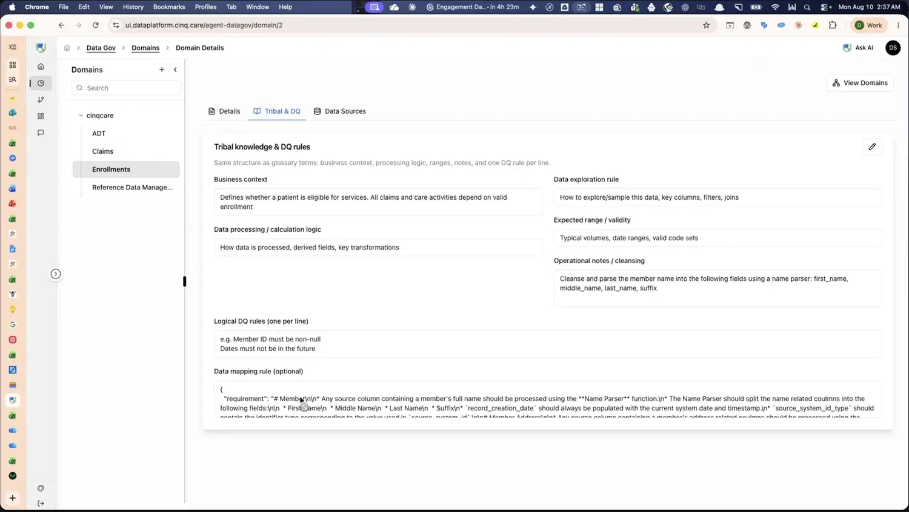

| | |
|---|---|
| **Tabs** | Details · Tribal & DQ · Data Sources |
| **Fields** | business context · data exploration rule · processing / calculation logic · expected range / validity · operational notes / cleansing · logical DQ rules (one per line) · data mapping rule (optional, JSON) |
| **Storage shape** | prose in a textarea, one blob per domain |

> **What this means for our build.** This is prompt material, not a knowledge base. It cannot be retrieved by layer, scored for confidence, versioned against a decision, or partially superseded — it can only be pasted whole into a context window. Our typed domain pack answers exactly this: the same six ideas, but as addressable objects with identifiers, layers and provenance. The content here is good and should be imported; the container should not survive.

## Glossary

`/agent-datagov/glossary` — *What does this column mean, in whose standard?*

### Plate 07 — Four hundred and three governed terms

*Aug 10 · capture B*

The richest asset in the incumbent. Four hundred and three glossary entries, nested three deep — **Claims** → **Claim Adjudication** → the individual fields — and each one bound to a physical column, a schema and, where one exists, an external coding standard with a resolvable URL.

*Adjudication Category Code* points at the FHIR CodeSystem for adjudication. *Adjudication Reason Code* points at X12 CARC and gives examples, CO45 and PR1. *Adjudication Type* records that PR, CO, OA and PI come from X12 835 and are "not present in FHIR; derived or null for CMS data". Every card carries a stable key and an author.

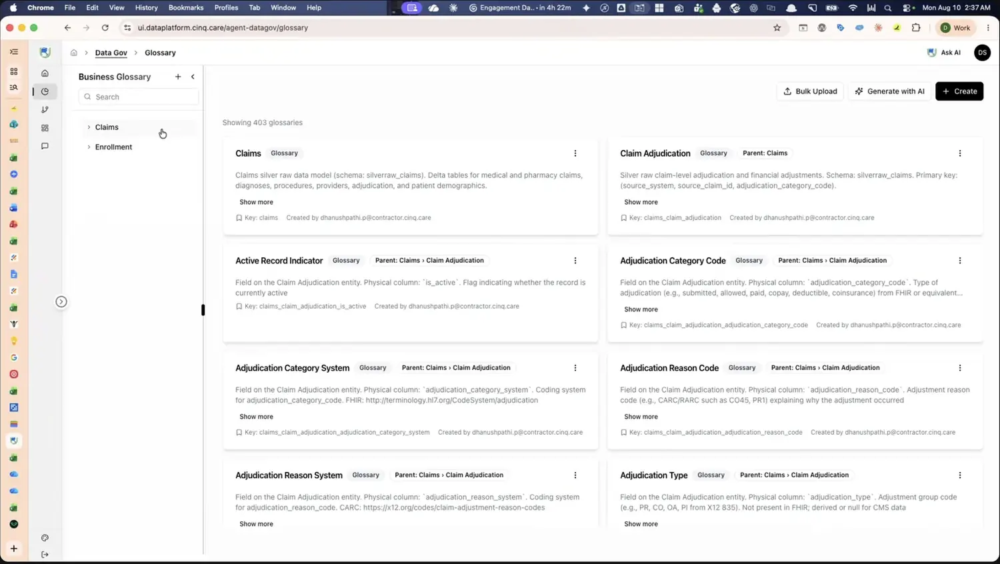

| | |
|---|---|
| **Volume** | 403 terms, hierarchical, column-level |
| **Binding** | schema `silverraw_claims` · physical column `adjudication_category_code` |
| **Standards** | FHIR terminology.hl7.org · X12 CARC · X12 835 |
| **Key** | `claims_claim_adjudication_adjudication_category_code` — stable, joinable |
| **Authoring** | Bulk Upload · Generate with AI · Create |

> **What this means for our build.** Four hundred and three curated, standards-linked, column-level terms with stable keys is a semantic layer we would otherwise spend a wave authoring. Import it. The stable key is the join column between this glossary and any retrieval index we build — which makes the import a data migration, not a re-authoring exercise.

## Agent Studio

`/agent-datagov/agent-studio` — *What can the agents do, and what may they touch?*

### Plate 08 — Fifty-eight typed platform tools

*Aug 10 · capture B*

Agent Studio has four tabs — **My Agents**, **System Agents**, **Platform Tools**, **My Tools** — and the platform ships fifty-eight ready-made tools described as "building blocks for agents — AI prompts, backend lookups, and data transforms."

Each tool carries badges that classify it, and the classification is the interesting part: some are **internal · Platform runtime**, some are **Backend service · Wrapper fork · Reads platform data**, and some are **AI prompt · Prompt-customizable · Computes a result — does not change data**. Writes are named as writes: *Bulk create glossary synonyms (write)*, *Apply governance proposal*. Every tool declares its inputs inline — *Needs: ingestion_group_id, template_cleanse_name*.

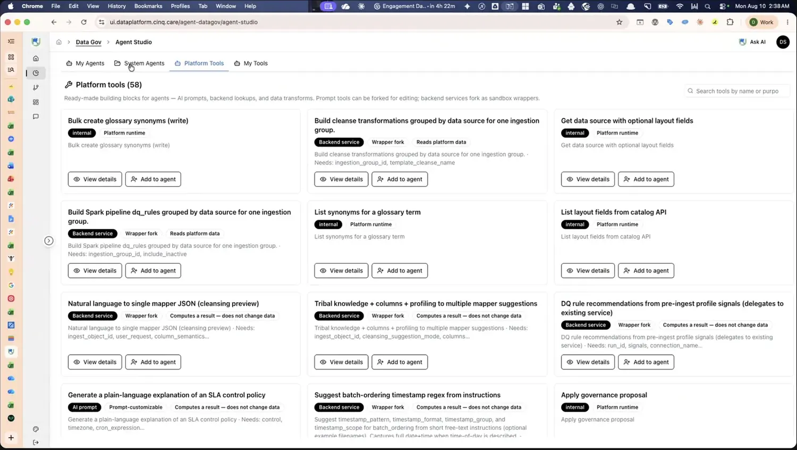

| | |
|---|---|
| **Reads** | Get data source with optional layout fields · List layout fields from catalog API · List synonyms for a glossary term |
| **Computes** | Natural language to single mapper JSON (cleansing preview) · Tribal knowledge + columns + profiling to multiple mapper suggestions · DQ rule recommendations from pre-ingest profile signals |
| **Writes** | Bulk create glossary synonyms · Apply governance proposal |
| **Actions** | View details · Add to agent |

> **What this means for our build.** The read / compute / write distinction is already in the metadata — the same axis our action gateway gates on. But here it is a *label*. Nothing between "Add to agent" and a write tool executing shows a gate, a risk class, or an approval. The taxonomy is right and the enforcement is missing; that gap is precisely what stage six of our call pipeline exists to close.

### Plate 09 — Five system agents, read-only, dry-runnable

*Aug 10 · capture B*

The System Agents tab holds five platform-provided templates: **Pipeline**, **Pipeline diagnostics**, **Pipeline editor** and **Pipeline tests** among them. They are declared LangGraph graphs — the badge says `langgraph` and the count says *2 nodes* — and the modal renders the graph in React Flow with a **Test run** button beneath it.

The modal is explicit about authority: *"Platform-managed agent. View tools and run a dry-run test; cloning is disabled."* The header of the tab adds the intended workflow: *"Browse read-only, then clone to customize in My Agents."*

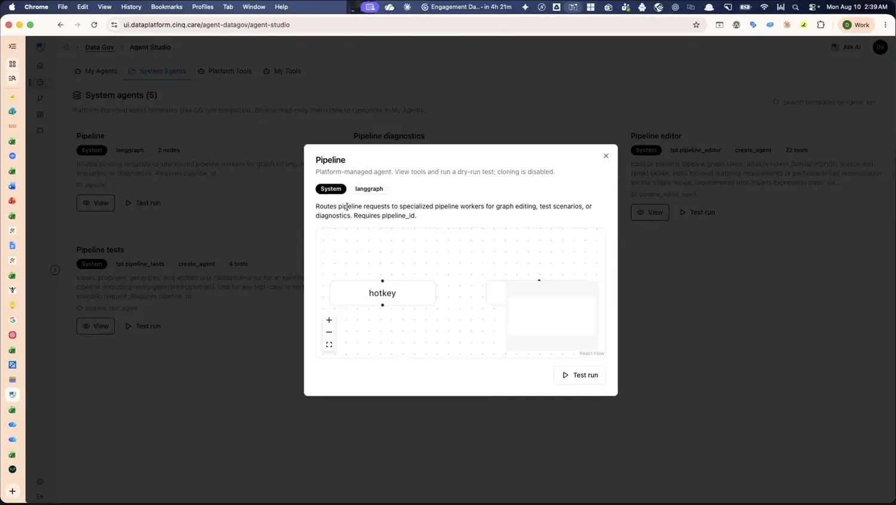

| | |
|---|---|
| **Pipeline** | routes requests to specialised workers for graph editing, test scenarios or diagnostics · requires pipeline_id |
| **Pipeline editor** | `tpl.pipeline_editor` · 22 tools · edits or explains graph steps, binds and unbinds source and target tables, edits focused mapping requirements, inserts Expression steps |
| **Pipeline tests** | `tpl.pipeline_tests` · 4 tools · views, proposes, generates and applies test cases |

> **What this means for our build.** This is the feature with the widest gap in our favour — against us. A graph editor, a dry-run, a read-only system tier, a clone-to-customise path and a user-authoring surface are all live here. In our plan, LangGraph is an unpopulated Wave 2 seat. We do not need to design this surface; we need to decide whether to inherit it.

## Catalog Audit

`/agent-datagov/audit` — *Who changed what, and from what to what?*

### Plate 10 — Field-level change history

*Aug 10 · capture B*

Every mutation to a catalog entity, one row per field. Entity, operation, field, old value, new value, who, when. The values are stored as JSON — `{ &quot;value&quot;: &quot;bronze_enrollment&quot; }` — and the whole trail, 3,633 records at capture, exports in one click.

The flyout in this frame also gives the complete DATA GOV group: Data Catalog, Schema Drift, Domain, Glossary, Agent Studio, Catalog Audit, Lineage.

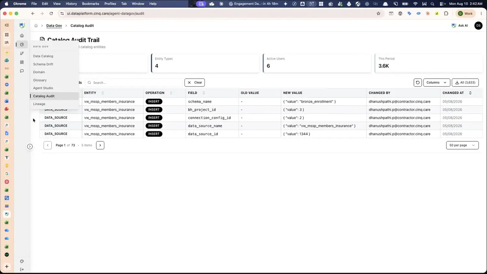

| | |
|---|---|
| **Counters** | Entity Types 4 · Active Users 6 · This Period 3.6K |
| **Row** | DATA_SOURCE · vw_mssp_members_insurance · INSERT · schema_name · — → bronze_enrollment |
| **Scale** | 3,633 records · 73 pages · exportable |

> **What this means for our build.** A real audit substrate — attributed, before-and-after, at field grain. What it does not contain is a row for "the agent proposed this and a human approved it". Catalog mutations are recorded; *decisions* are not. Our decision record is the sibling table this design is missing, and it should be built to the same grain so the two can be read on one clock.

## Lineage

`/agent-datagov/lineage` — *Where did this column come from?*

**Not opened on camera.** No evidence beyond the navigation entry. Our own implementation notes name *column-level lineage* as the highest-value prerequisite for the analyst agents, which makes this the most important unknown in the survey.

---

# PIPELINE

*Five destinations. Where a feed is defined, mapped, scheduled and shipped.*

## Data Pipeline

`/pipeline/ai-pipeline` — *Which transforms exist and are their tests passing?*

### Plate 11 — Pipelines carry their test results

*0:01:06 · capture A*

The pipeline register puts test outcomes in the table itself: **ENGINE/TYPE**, **TOTAL TESTS**, **PASSED**, **FAILED**, **STATUS**. The engine is PySpark and the model reads `claude-sonn… (Default)`, the same selector as on home.

The section flyout confirms the PIPELINE group: Data Pipeline, Data Flow, Ingestion, Knowledge Base, Orchestration Workflows.

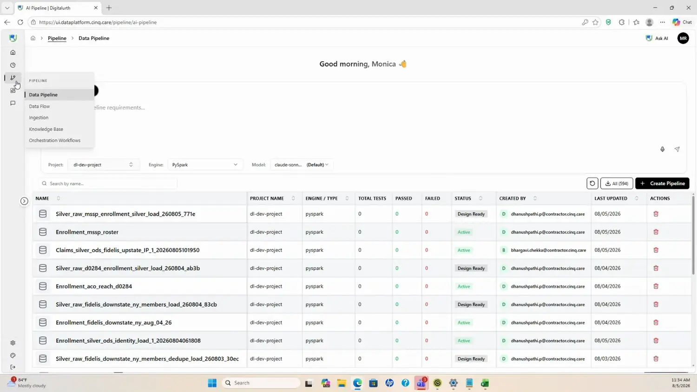

| | |
|---|---|
| **Columns** | engine/type · total tests · passed · failed · status |
| **Implication** | a pipeline without tests is visibly a pipeline without tests |

> **What this means for our build.** Surfacing the test count in the register — not behind a tab — is a small decision with a large effect: it makes coverage a property you cannot avoid seeing. Copy it exactly, and extend the same treatment to mappings and rules.

## Data Flow

`/agent-pipeline/data-flow` — *How are pipelines strung together into a run?*

**Not opened on camera.** Orchestration Workflows ships *Flow Templates* and a *Flow Lifecycle Manager* that "deploys to Airflow", and the ingestion modal binds a flow template separately from a pipeline template. Flow is the orchestration-level object; pipeline is the transform-level object. This destination is where flows are composed.

## Ingestion

`/agent-pipeline/ingestion` — *How does a new feed get onboarded, end to end?*

### Plate 12 — The feed register

*0:01:11 · capture A*

Every onboarded feed is a *group*. The register lists **GROUP NAME**, **ENVIRONMENT**, **LAST UPDATED**, **CREATED BY** and **STAGE**, and at this capture every row is badged *Metadata OK* — with some rows further along reading *Profiling…*.

The naming convention carries the domain, the payer, the geography and the version: `claims_centene_il_member_eligibility`, `enrollment_fidelis_downstate_ny_aug_04_26`, `adt_fidelis_v4`. Two hundred and eighty-five groups at this capture, every one of them in `dl-dev-environment`, authored by three named contractors.

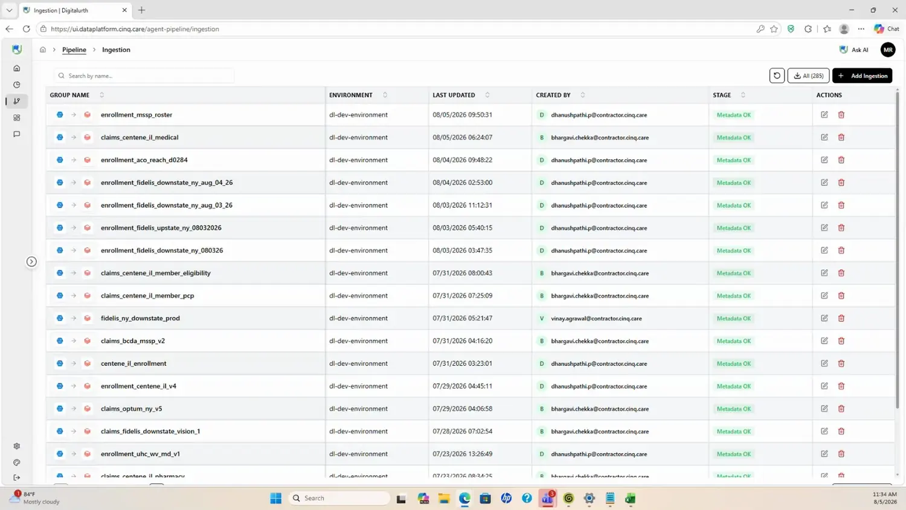

| | |
|---|---|
| **Grain** | one row per ingestion group, per environment |
| **Stage badge** | Metadata OK · Profiling… — the lifecycle state of the definition, not of a run |
| **Actions** | edit and delete, inline on the row |
| **Scale** | All (285) — exportable in one click |
| **Environment** | every group sits in dl-dev-environment; there is no production row here |

> **What this means for our build.** Separating the *definition* lifecycle (Metadata OK, Profiling) from the *run* lifecycle (received, completed, failed) is correct and we should keep it. It is also the first place the status vocabulary forks: two sets of words, on two screens, for two different things — with no shared lexicon binding them.

### Plate 13 — Add New Ingestion — identity

*0:01:33 · capture A*

The onboarding modal opens on identity. **Project**, **Environment**, **Data domain**, **Group Name**, an **Ingestion workflow** and two template bindings.

The data-domain dropdown is the join back to Data Gov: *No domain · ADT · cinqcare · Claims · Enrollments*. A feed is attached to a governed domain at the moment it is created, which is why the domain's tribal knowledge can later be used to seed its mappings.

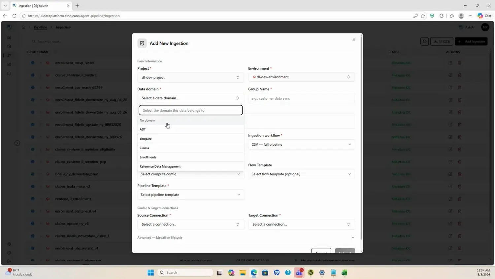

| | |
|---|---|
| **Ingestion workflow** | CSV — full pipeline |
| **Bindings** | Flow template and Pipeline template chosen here, before any file is seen |
| **Also here** | Reference Data Management as a first-class domain option |

### Plate 14 — The medallion, as configuration

*Aug 5 · capture C · native resolution*

This is the most valuable single screen in the survey. Under **Advanced — Medallion lifecycle**, each hop of the medallion is a checkbox with a machine name, a pipeline mode, ordering arrows and a disclosure: `landing_bronze`, `bronze_silverraw`, `silverraw_silverods`, and a **+ Add custom tier** beside them.

The instruction text is worth quoting whole: *"Configure medallion tiers for this ingest group. Ingestion workflow stages are always created. Disable tiers you do not need, bind a static pipeline per tier, or use the arrows to set execution order (top runs first)."*

Above the tiers, the run substrate is bound: source connection `cinq-landing-blob-storage`, target `cinqdev-databricks-dev`, compute `single-node-v2 (dl-dev-environment)`, flow template *Databricks Validate Archive Ingest Flow v1.0.0*, pipeline template *File to DB Ingestion V3 v1.0.0*.

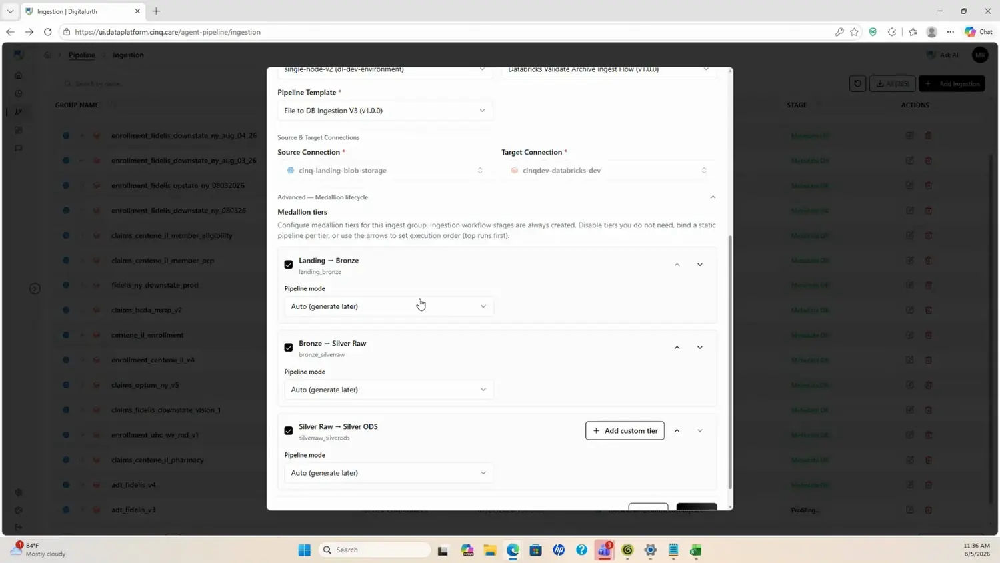

| | |
|---|---|
| **Per hop** | enable/disable · pipeline mode · execution order · disclosure for detail |
| **Pipeline mode** | Auto (generate later) — the agent writes it — or Use static pipeline |
| **Extensible** | custom tiers can be inserted between the standard ones |
| **Always created** | ingestion workflow stages exist whether or not a tier is enabled |

> **What this means for our build.** The medallion is not a fixed architecture here; it is per-feed configuration with a per-hop authoring mode. That is the same idea as our rungs and sockets, expressed in a UI an engineer can operate in ninety seconds. Lift this screen more or less as drawn — the checkbox, the machine name, the ordering arrow and the custom tier all earn their place.

### Plate 15 — Two authoring modes per hop

*Aug 5 · capture C · native resolution*

Switch a single tier's **Pipeline mode** from *Auto (generate later)* to *Use static pipeline* and two controls appear: a pipeline selector and **Import pipeline file**. Everything else on the feed stays generated.

That is a per-hop escape hatch. If the silver-raw transform for one payer has to be hand-written and reviewed, it can be — without abandoning generation for the other two hops or for the rest of the feed.

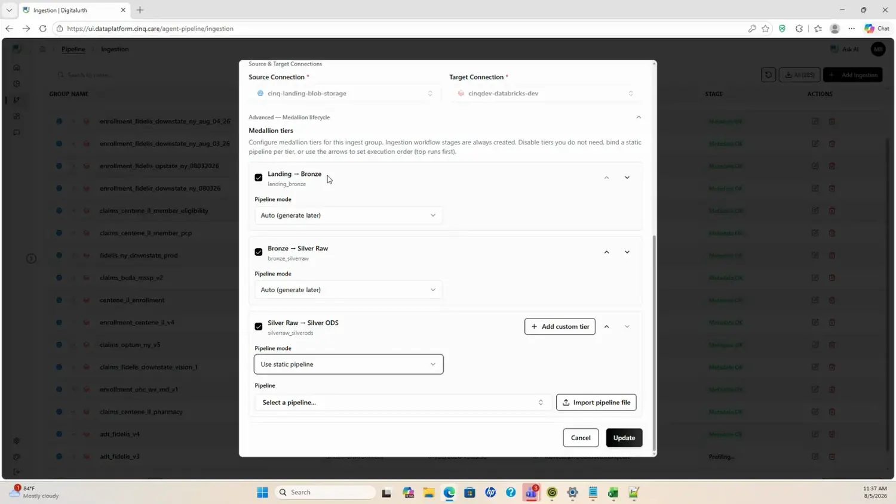

| | |
|---|---|
| **Modes** | Auto (generate later) · Use static pipeline |
| **Static path** | select an existing pipeline, or import a pipeline definition from disk |
| **Scope** | one tier — the setting does not cascade |

> **What this means for our build.** This is the answer to the question every reviewer asks about an agentic platform: *what happens when the generated artefact is wrong and we cannot wait?* A per-hop switch to a hand-authored, version-controlled pipeline is a better answer than any confidence threshold. Build it in from the first wave, not as a Wave 4 escape.

### Plate 16 — The four-tab feed spine

*0:05:11 · capture A*

Every onboarded feed opens on the same four tabs, in the same order, and that order is the workflow: **Configuration** → **Map to domain** → **Schedule & Monitoring** → **Publish**.

The page also carries the object table for the feed, a supporting-document upload, Bronze extensions, and two actions that reach outward — **Save & sync catalog** and **Rediscover layout**. A secondary bar above offers Catalog, Design, OpsHub, Explore, LLM Observability and **Ask AI**.

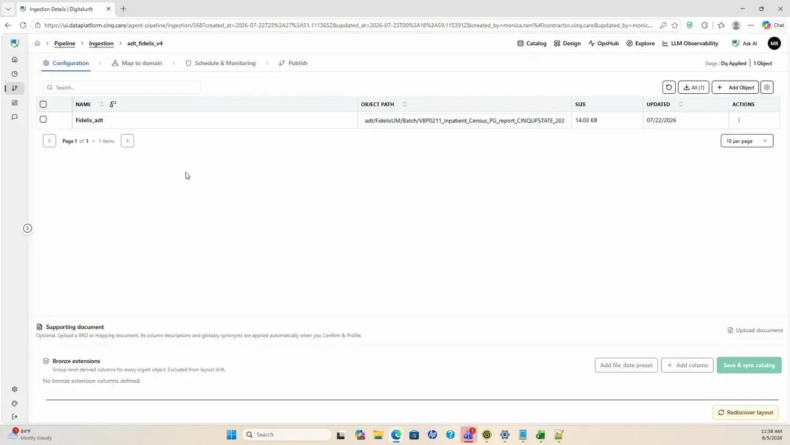

| | |
|---|---|
| **Spine** | configure the objects → map them to the domain → schedule and control them → publish |
| **Outward actions** | Save & sync catalog (writes to Data Catalog) · Rediscover layout (re-reads the source) |
| **Supporting documents** | a payer's file spec can be attached to the feed and used as grounding |

> **What this means for our build.** Four tabs, one direction, no branching — a feed is never in an ambiguous state, because the state *is* which tab you have completed. Our onboarding stories should adopt this spine rather than invent a different one; the team already navigates it without thinking.

### Plate 17 — Object configuration — the reader half

*0:07:20 · capture A*

Each object in a feed is configured twice, once as a reader and once as a writer. The reader half is the file contract: **Type** File, **Status** Active, source type, **File Type** Excel, compression, **Has Header**, a path prefix, a multi-file / DAG mode, an archive path and a block of Advanced Read Options.

A **DQ recommendation** control sits in the same panel — quality expectations are attached to the object where the object is defined, not in a separate quality module.

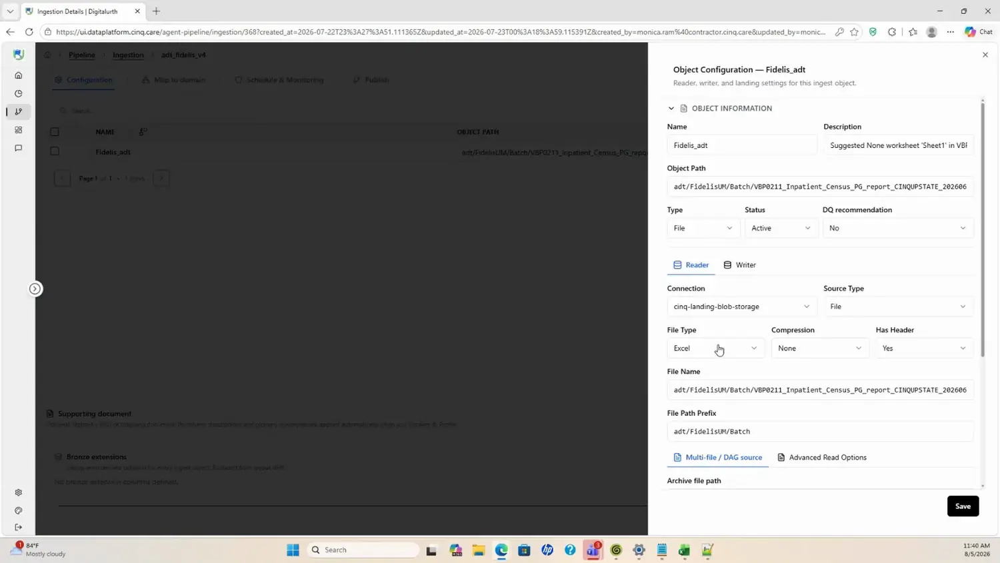

| | |
|---|---|
| **Match by** | a path prefix plus a filename regex — not by full path |
| **Multi-file** | a single logical object can be assembled from many files, in DAG mode |
| **After the read** | the source file is moved to a configured archive path |

### Plate 18 — Object configuration — the writer half

*0:09:57 · capture A*

The writer half names the destination and the semantics of arrival: **Load Mode** Append, **Schema** `bronze_adt`, **Table** `Garage_adt`, plus **Pre-SQL** and **Post-SQL** hooks and Advanced Write Options.

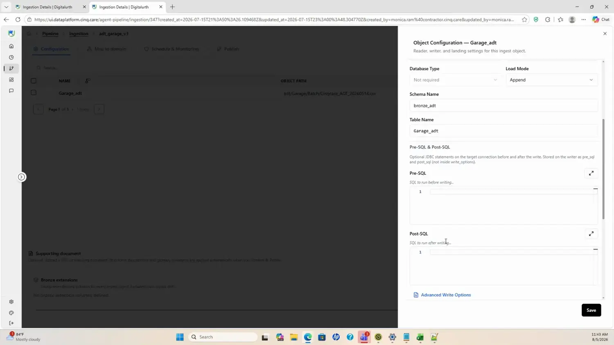

| | |
|---|---|
| **Load mode** | Append — and therefore idempotency is the pipeline's problem, not the writer's |
| **Hooks** | arbitrary SQL before and after the write, per object |
| **Naming** | schema follows the tier, table follows the source object |

> **What this means for our build.** Pre-SQL and Post-SQL are the platform's pressure-release valve, and they are also its largest ungoverned surface: arbitrary SQL, per object, running inside the run, with no diff, no review and no place in the audit trail. If we keep the hook — and we probably must — it belongs in the publish diff and in the decision record.

### Plate 19 — The mapping instruction is an artefact

*0:11:42 · capture A*

**Map to domain** pairs a source object with a target entity — here `optum_adt` → `encounter` — and then shows the instruction the agent will be given. It is editable text, stored with the feed, and it is shouting.

*HARD CONSTRAINTS FOR SOURCE/TARGET SELECTION (MANDATORY)*, then *STRICT RULES*: bare `CAST(col AS )` in Bronze, no date, timestamp, numeric or boolean casts, a composite dedupe key, explicit non-null requirements. Further down, per-field parse and cast rules — including the recorded root cause of `AdmissionDate` arriving null on one hundred per cent of rows.

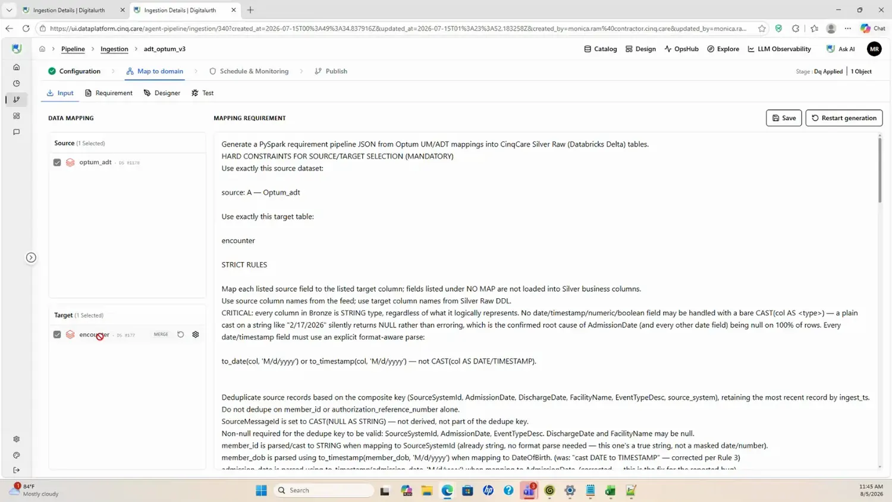

| | |
|---|---|
| **Grain** | one instruction document per source → target pair |
| **Content** | hard constraints · strict rules · per-field parse and cast rules · recorded defects |
| **Authoring** | free text, edited in the browser, versioned only by the publish commit |

> **What this means for our build.** Two findings sit on top of each other here. First, the instruction being a first-class, editable, per-feed artefact is *right* — that is grounding, and it belongs to the feed. Second, the capitals are a symptom: the team is compensating in content for what should be structure. Constraints that must hold belong in the schema the model is handed and in the validator that rejects its output, not in an adjective.

### Plate 20 — Mapping, counted

*0:13:13 · capture A*

The outcome of a mapping run is four numbers: **0 Pending · 0 SME Review · 39 Completed · 46 Skipped**. Every target column resolves into exactly one of those four states, and each carries either its own mapping requirement or the phrase *"Skipped per user request"*.

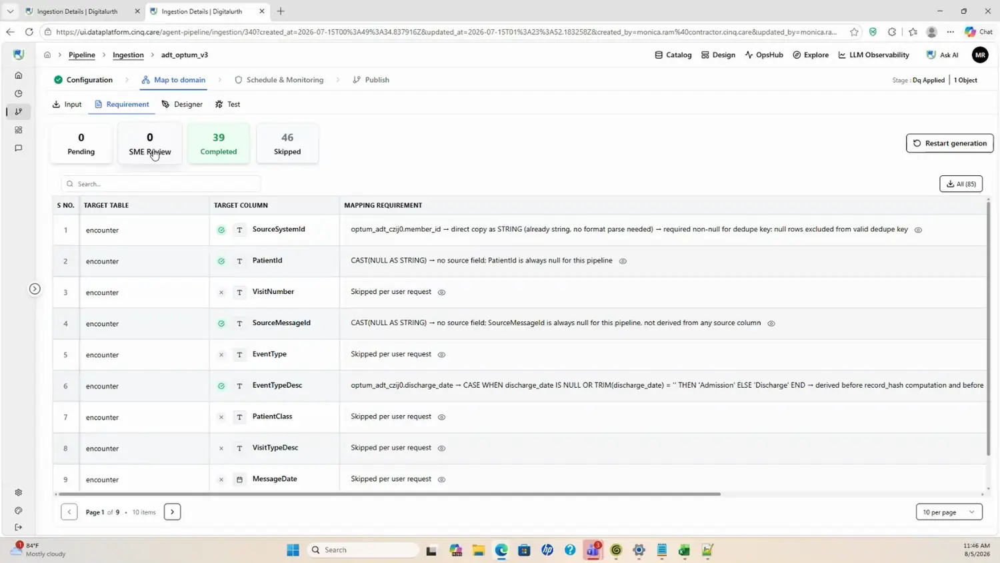

| | |
|---|---|
| **States** | Pending · SME Review · Completed · Skipped |
| **Human queue** | SME Review is a real destination, not a status label |
| **Refusal is recorded** | "Skipped per user request" keeps the human's decision in the artefact |

> **What this means for our build.** The approval loop we describe as future work is already shipped here, at column grain, with a counter. What it lacks is the thing that makes such a loop shrink over time: nothing on this screen shows *why* a column went to SME Review rather than completing, so nothing tells you which class of question to fix first.

### Plate 21 — Feed identity and Explain with AI

*0:16:02 · capture A*

The Schedule & Monitoring tab opens on identity: **Feed Name**, **Domain** ADT, **Source System**, **Timezone** UTC, **Effective From**, and an **Active** switch. The action row reads Delete All, Refresh, **Validate**, Update & Save — and **Explain with AI**.

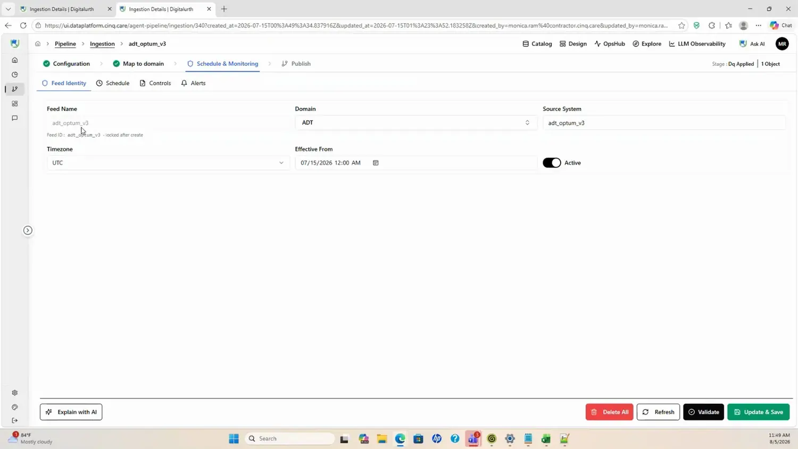

| | |
|---|---|
| **Validate** | a dry check of the schedule and controls before saving |
| **Explain with AI** | a read-only explanation of the configuration in front of you |
| **Timezone** | stored on the feed — cron is evaluated against it, not against the server |

> **What this means for our build.** "Explain with AI" placed next to "Validate" is the correct pairing and the correct authority level: the assistant explains the configuration, the platform validates it. That is our R0 Pipeline Insight capability, already sitting in the right place on the screen.

### Plate 22 — Cron, dictated

*0:16:17 · capture A*

An **AI Cron Generator** sits above the manual cron field. Type "Run every day at 2:30 AM" — or speak it — and it produces the expression. Preset chips and the raw field remain beside it, unchanged.

This is the same tool that appears in LLM Observability as `schedule.cron_from_nl`, invoked through `/api/v1/tools/…/invoke` and costing nothing measurable per call.

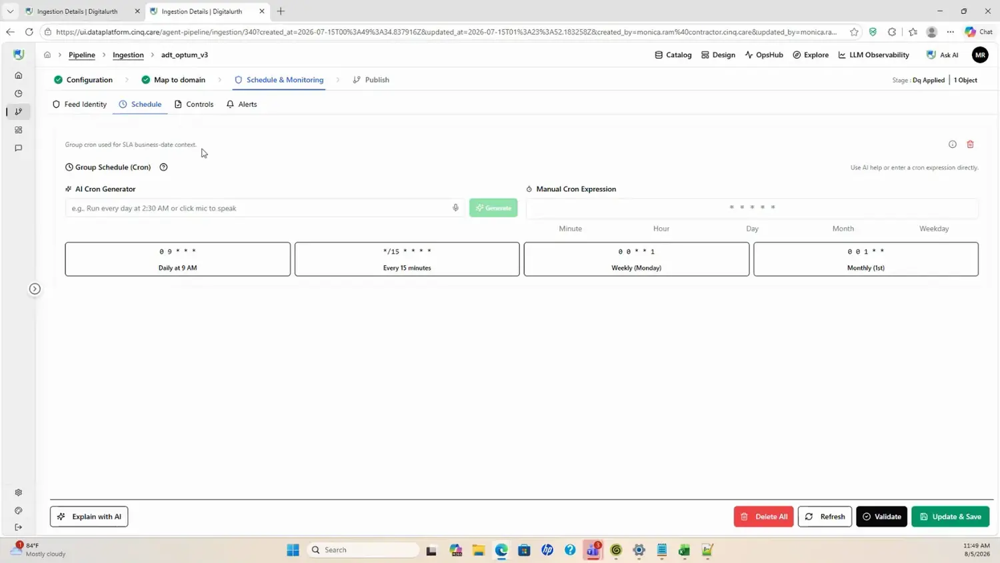

| | |
|---|---|
| **Input** | natural language or speech |
| **Fallbacks** | preset chips · a manual cron field, always visible |
| **Traced** | every generation appears in LLM Observability as cron_generate |

> **What this means for our build.** The pattern to copy is not the cron generator; it is the shape. A generated value, a deterministic field holding the same value, and both visible at once — so the human can read what the model produced in the notation they will have to support at three in the morning.

### Plate 23 — Controls, added by category

*0:16:30 · capture A*

Controls are not a checkbox list; they are added, one at a time, from three categories. **Schedule & Monitoring** contributes the on-time milestone. **Inbound Validation** contributes batch ordering. **Pipeline Outcomes** contributes completeness and reconciliation.

On-time arrival, structural validation and schema drift each toggle independently, and the on-time control opens into real parameters: *Evaluation Mode* Freshness, periodicity derived automatically from the cron, *max lag* 60 minutes, *extra lag tolerance* 30, *missing after* 120.

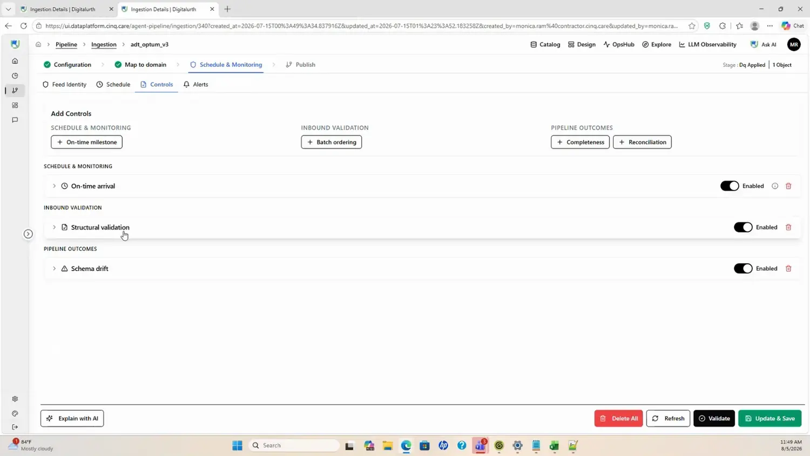

| | |
|---|---|
| **Categories** | Schedule & Monitoring · Inbound Validation · Pipeline Outcomes |
| **Freshness parameters** | periodicity (from cron) · max lag · extra tolerance · missing-after threshold |
| **Alternative mode** | a fixed cut-off time, instead of freshness relative to the schedule |

> **What this means for our build.** Deriving periodicity from the cron rather than asking for it twice is the kind of detail that decides whether controls get configured correctly. And separating *late* from *missing* with two thresholds is the mechanism behind two of our seven status words — Needs Attention and Missing — already implemented.

### Plate 24 — Alerts, routed per control

*0:17:02 · capture A*

Notification channels are bound per control and per breach severity, with a default fallback channel behind them. A drift warning and a missing file do not have to reach the same people.

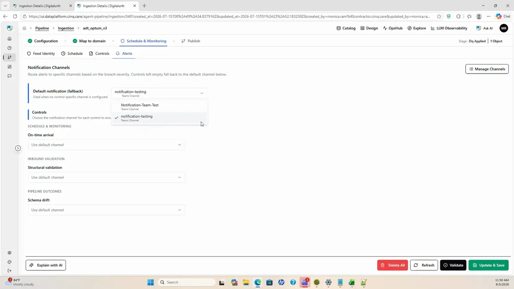

| | |
|---|---|
| **Grain** | control × severity → channel |
| **Fallback** | a default channel catches anything unrouted |

### Plate 25 — Publish is a git commit

*Aug 5 · capture C · native resolution*

The fourth tab, **Publish**, resolves into this: a commit in `CINQ-CARE/datalake-ddl`. The requirement documents live under `03_claims/requirements/` — *Centene IL*, *D0284_CCLF*, *Fidelis*, and loose files `D0284_BCDA.txt`, `MSSP_CCLF_Req.txt`, `OPTUM_NY.txt` — beside `seeding_views/` and `views/` holding the SQL.

The repository is organised by domain and payer, mirroring the ingestion group names, and it is hand-maintained: `01_refernce_data` is spelled that way on `main`.

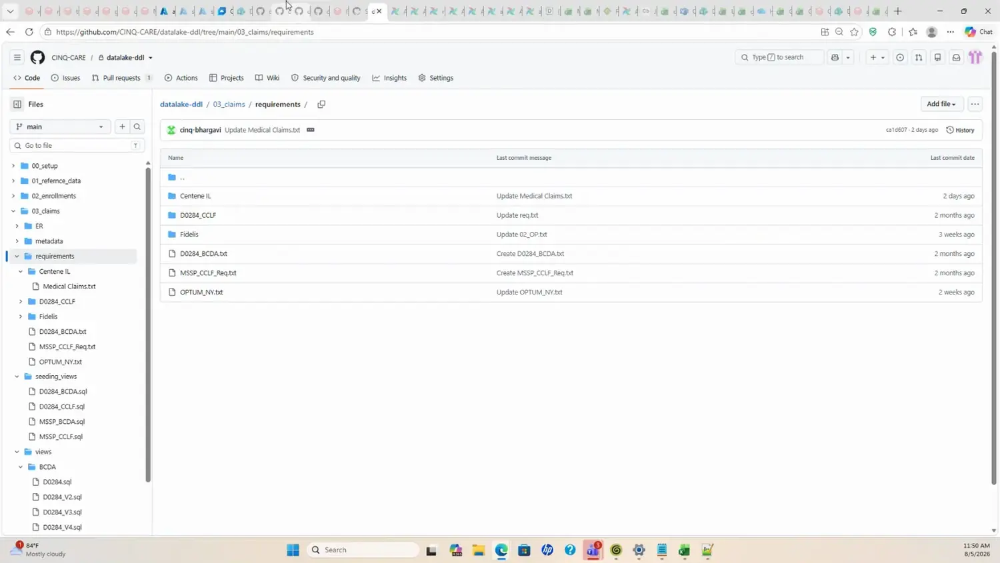

| | |
|---|---|
| **Repository** | CINQ-CARE/datalake-ddl — requirements as .txt, models as .sql |
| **Layout** | 00_setup · 01_refernce_data · 02_enrollments · 03_claims{ER, metadata, requirements, seeding_views, views} |
| **Companion** | dl-dev-project holds the deployed pipeline definitions |
| **Sync** | a GitHub Action carries the commit to Airflow, and from Airflow to the Databricks workspace |

> **What this means for our build.** The system of record is a git repository, not a database — which means everything the agent produces is already diffable, reviewable and revertible by tools the team owns. That is a stronger foundation for approval than any in-app workflow, and it is free. Publish to git; put the decision record in the commit.

## Knowledge Base

`/agent-pipeline/knowledge-base` — *What has a human already decided, and can we reuse it?*

### Plate 26 — The SME loop, instrumented

*Aug 10 · capture B*

"SME answers reused across requirement pipelines." Five counters run across the top: **ALL ENTRIES 397**, **READY TO REUSE 273**, **AWAITING SME 115**, **TARGETS 42**, **PIPELINES 80** — the last broken down as 390 field-level and 7 plan-level.

A single entry reads like a transcript. *Agent question:* how should `record_hash` be mapped — system-generated, derived from source fields, or left empty? *Your answer:* skip mapping, this field is not applicable. Then the provenance — target, pipeline 607, mapping 328, recorded Aug 6 — and a link back to the requirement pipeline it came from.

The footer states the mechanism, and its limit: *"Future pipelines mapping the same target field can retrieve this decision… This decision is stored for your tenant. When you map the same target again, the agent can retrieve it (API today; semantic search planned)."*

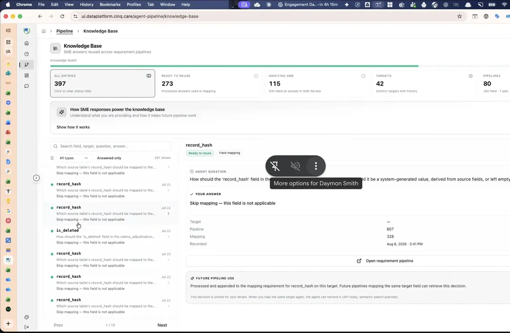

| | |
|---|---|
| **Loop** | agent asks → human answers → answer is appended to the mapping requirement → future pipelines reuse it |
| **Retrieval** | exact target-field lookup through an API. Semantic search is stated as planned, not built |
| **Backlog** | 115 of 397 entries — 29% — are still waiting on a human |
| **Health** | a single "knowledge health" bar summarises the ratio |

> **What this means for our build.** Three things at once. The write-back loop is real and should be lifted whole. The retrieval underneath it is an exact-key lookup, which means a question phrased differently about the same concept misses — and that is the gap our retrieval service closes. And the 29% backlog is the honest number to beat: a knowledge base is only compounding if that fraction falls.

## Orchestration Workflows

`/agent-pipeline/orchestration` — *What runnable building blocks do we ship?*

### Plate 27 — A block library, versioned

*Aug 10 · capture B*

Four tabs: **Processes**, **Block Library**, **Block Registration**, **Artifact Management**. Ten processes, all active, each versioned and tagged, each offering Design, Parameters, Edit, Clone and Delete.

The catalogue is the platform's actual runtime vocabulary: *EMR Lifecycle Flow* (create a cluster, submit a job, delete the cluster), *Databricks Validate Archive Ingest Flow* (landing validation, compute, sequential multi-pipeline jobs, archive, teardown), *File to DB Ingestion V3* — cloned from V2 — *Multi Pipeline Flow V2*, *Single Pipeline Flow Generic*, and *Flow Lifecycle Manager V2*, which "creates flow metadata, generates deployment configuration from templates, and deploys to Airflow."

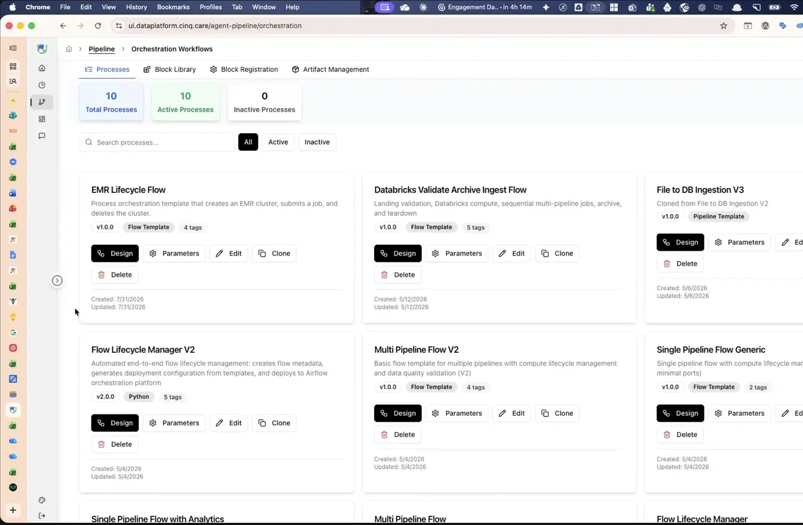

| | |
|---|---|
| **Registry** | Block Library + Block Registration — typed, registrable components |
| **Artifacts** | Artifact Management holds the versioned outputs |
| **Versioning** | v1.0.0 / v2.0.0 on every process, with clone-to-fork |
| **Kinds** | Flow Template (orchestration) and Pipeline Template (transform) are different objects |

> **What this means for our build.** This is chip architecture, in the incumbent, in the incumbent's own words. Blocks are pins, registration is the conformance boundary, artifacts are the built adapters, and the flow/pipeline split is the socket/rung split. We should stop describing our model as new to this team and start describing it as the formalisation of this one.

---

# DATAOPS

*Seven destinations. What ran, what broke, what it cost.*

## Ops Explore

`/dataops-hub/ops-explore` — *What happened, in one timeline?*

### Plate 28 — One typed event stream

*direct capture*

An audit log explorer: a timeline histogram over the window, then the events themselves, each typed and attributed to the service that emitted it. *"Feed 'adt_healthix_v3' is delayed (on time arrival, severity MEDIUM)"* from `bh-audit-api`, beside SLA monitoring runs from `bh-orchestration`.

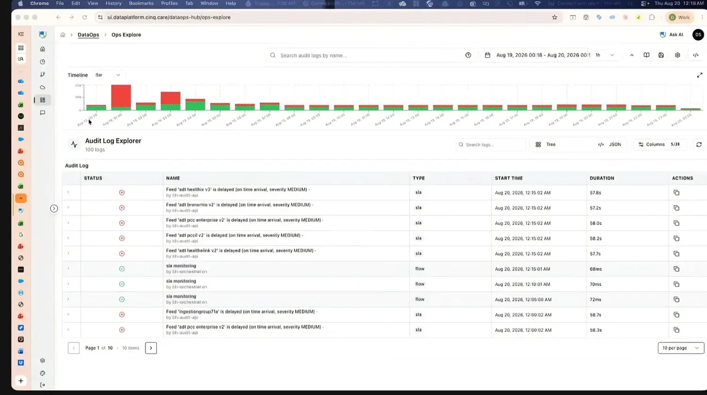

| | |
|---|---|
| **Types present** | sla · flow |
| **Attribution** | every row names the emitting service |
| **Window** | 100 logs in the visible range, histogram above |

> **What this means for our build.** The clock is right and the lanes are incomplete. There are no agent, tool or approval events on this timeline — so the question "what did the assistant do between the delay and the recovery?" cannot be answered on the screen built to answer exactly that shape of question. Three more event types, same stream.

## Ops Hub

`/dataops-hub/ops-hub` — *Did every feed arrive on time and intact?*

### Plate 29 — Arrival and integrity, per feed per cycle

*direct capture*

Four headline states — **On-time Arrival Feeds 0/10**, **On-time Arrival Breached**, **Structure Validation Failed**, **Schema Drift Failed** — over a table with one row per feed per expected cycle: **FEED NAME** and id, **ARRIVAL EPT**, **ARRIVED AT**, **ON-TIME ARRIVAL**, **STRUCTURE VALIDATION**, **SCHEMA DRIFT**, **LAST EVALUATED AT**.

The frame itself makes the argument. Every visible row is an ADT feed — `adt_healthelink_v2`, `adt_bronxrhio_v2`, `adt_pccil_v2`, `adt_pcc_enterprise_v2`, `adt_healthix_v3` — every one expected at 23:15 and again at 23:00 on 19 August, every one with an empty *arrived at*, every one badged **DELAYED**. Ten rows on one page, out of four hundred and eighty-five pages.

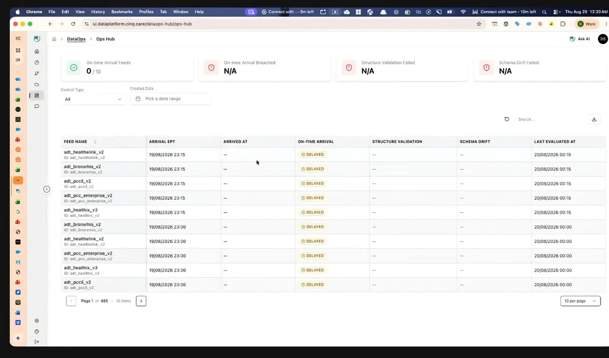

| | |
|---|---|
| **Grain** | feed × expected cycle |
| **Columns** | expected time, actual time, three independent verdicts, and when the verdict was last computed |
| **Filters** | control type · created-date range · search · export |
| **Scale** | 485 pages at 10 per page — roughly 4,850 evaluations, ungrouped |

> **What this means for our build.** This is the grouping case, caught on camera. Five ADT feeds missed the same two boundaries in the same minute — one upstream sender, one fault — and the screen shows ten separate delays with no relationship between them. Expected-versus-actual per cycle is the right grain; the missing layer is the one above it. A grouping proposal — *one incident, five symptoms* — is the difference between a table and a tool, and this frame is the evidence to show the client.

### Plate 30 — Recovery is a human write

*direct capture*

*"This records a new RECOVERED entry for the Arrival SLA of feed adt_healthelink_v2. This action cannot be undone."* A recovery note is optional; the write is explicit, attributed and irreversible.

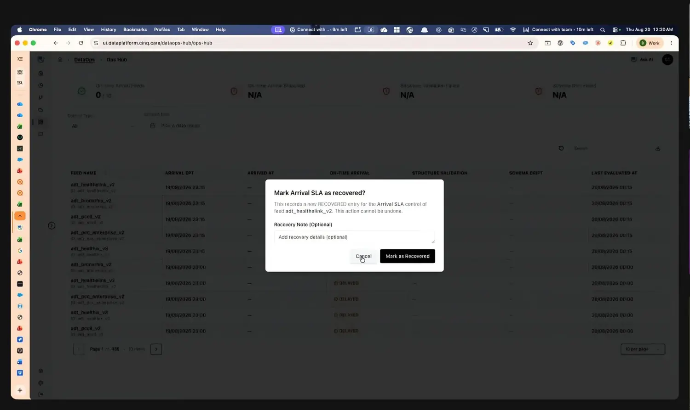

| | |
|---|---|
| **Semantics** | recovery is an appended entry, not a mutation of the breach |
| **Note** | optional free text carried with the entry |

> **What this means for our build.** The incumbent already treats human judgement as a first-class record with its own row. That is the correct instinct, and it is one line of code away from being the decision record that agent proposals also need.

## Control Operations

`/dataops-hub/control-ops` — *What did this batch actually do?*

### Plate 31 — The run register and the run drawer

*Aug 20 · capture B*

The deepest surface in the product. The header binds the whole page to a control plane — `cinqdev-databricks-dev · cinqdev.control` — over a seven-day window, and five tabs count what is inside it: **Batch runs 66**, **Inputs 478**, **Errors 0**, **Schema & drift 378**, **SLA 0**.

Open a batch and a drawer gives the whole run at once. Identity and status at the top, then jump-links — *Open in* Errors, Drift, Inputs, SLA — then a metric strip: **DURATION 1m**, **INPUTS 1**, **VOLUME —**, **IN RECORDS 5**, **BRONZE 5**, **SILVER 0**, **ERRORS 0**. Beneath it the group run with its own state (*running*, members 0/1), and five sub-tabs: **Stages · Reconciliation · Inputs · Errors · Quarantine**, with the bronze stage timed to the minute and balanced *In 5 → Out 5*.

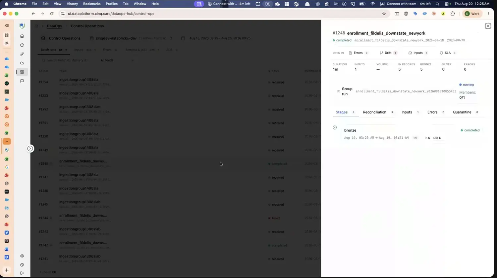

| | |
|---|---|
| **Bound to** | a named Databricks workspace and a control schema |
| **Batch identity** | #1248 · enrollment_fildelis_downstate_newyork · a delivery id · a business date |
| **Per-tier counters** | in records, bronze, silver, errors — the medallion, counted |
| **Quarantine** | a first-class tab, beside errors, not inside them |

> **What this means for our build.** One batch, one drawer, everything about it — this is the interaction our own Control Operations screen commits to, and it is already built. Note especially that quarantine is separated from errors: rejected rows are a population you inspect, not an exception you count. Keep that distinction.

### Plate 32 — Reconciliation, per flow

*Aug 20 · capture B*

The Reconciliation tab balances the run flow by flow. **__GROUP__ FLOW** shows records in and records out; **BRONZE FLOW** shows five in and five out. Each flow is its own balance, not a single total.

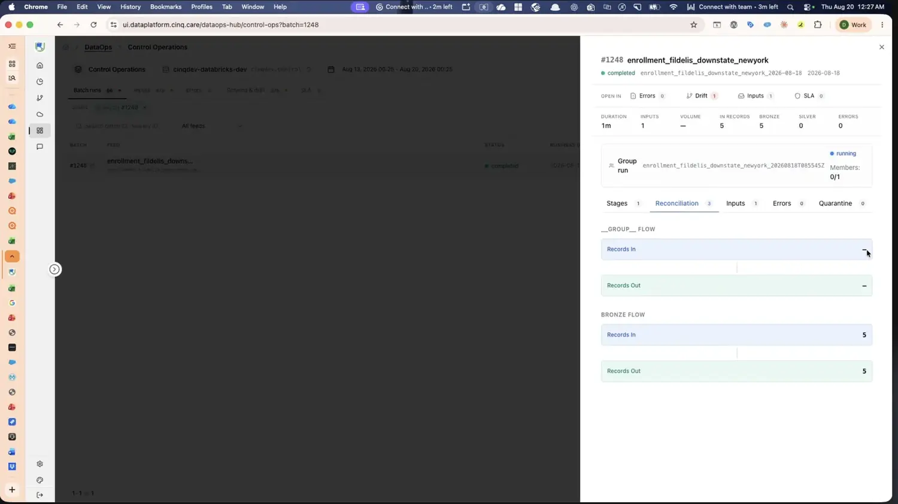

| | |
|---|---|
| **Grain** | one in/out pair per flow within the batch |
| **Reading** | a mismatch localises to a hop, not to the run |

### Plate 33 — Drift is classified, not just detected

*Aug 20 · capture B*

Scoped to a single batch, the Schema & drift tab returns one row — and the row is a judgement, not an observation: dataset `fidelis_ny_downstat…`, drift **COLUMN_ORDER_CHANGE**, severity **info**, action **WARN**.

Three counters in the corner explain how that judgement was reached: **Drift events 1**, **Registry 752**, **Policies 246**.

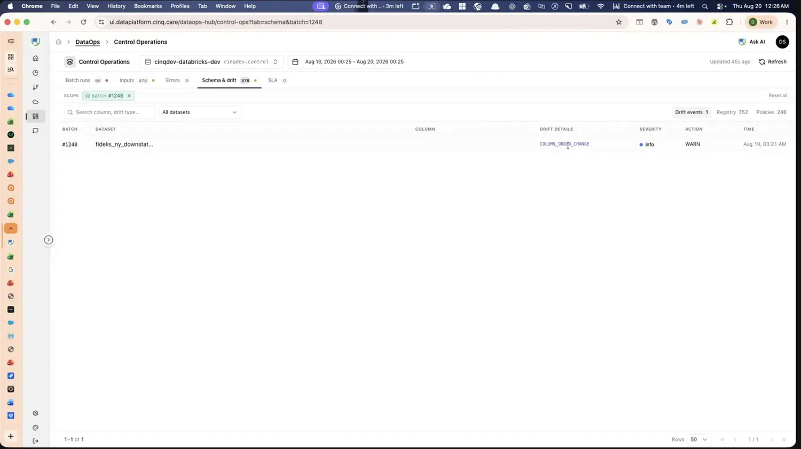

| | |
|---|---|
| **Taxonomy** | named drift types — COLUMN_ORDER_CHANGE among them |
| **Registry** | 752 known dataset shapes |
| **Policy** | 246 rules mapping drift type × context → severity and action |
| **Actions** | WARN — and, by implication, the ones that do not warn |

> **What this means for our build.** A registry of shapes plus a policy table deciding severity and action is the most mature mechanism in the incumbent, and it is precisely the shape of our gate model: detection is cheap, classification is the product. Adopt the split — a shape registry and a policy table, separately versioned — rather than embedding thresholds in the detector.

### Plate 34 — What the console shows when it is unwell

*Aug 20 · capture B*

The same screen with the browser console open, and it is worth recording plainly. Status filters read **Running 2 · Failed 8 · Completed 30 · Received 26**; the duration column on received rows renders `NaNh`; and the console carries repeated `SSE Connection Error: TypeError: network error`, dozens of `RBACGuard: No pageKey found for route /dataops-hub`, and a route audit reporting `60/82 routes | 140 assets, 0 endpoints found`. Two thousand and seventy-one errors are logged.

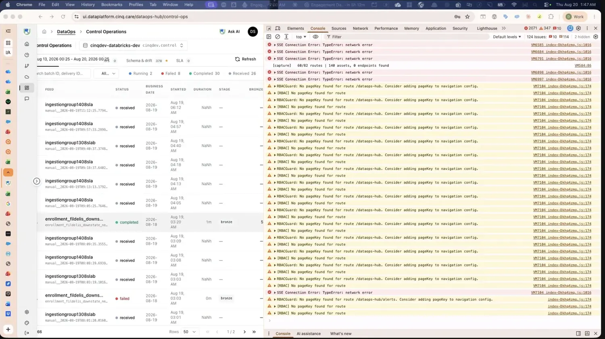

| | |
|---|---|
| **Live updates** | the server-sent-events stream is failing and reconnecting |
| **Permissions** | the route → permission map covers 60 of 82 routes |
| **Rendering** | duration is computed before its inputs exist, and renders NaNh |

> **What this means for our build.** This is not a list of bugs to enjoy; it is a map of where the foundations are thin. Live streaming, a complete route-to-permission registry and a defined empty state are exactly the three things a rebuild gets right for free and a retrofit fights for months. It is also the clearest argument for the conformance kit: none of these three would pass a boundary test.

### Plate 35 — Corroboration — the same three views, a different build

*direct captures*

The run drawer, the reconciliation balance and the drift classification were also captured directly, on a different day and a different build, along with the loading state and the console. The surfaces are identical — which tells us these three are stable, shipped and safe to design against.

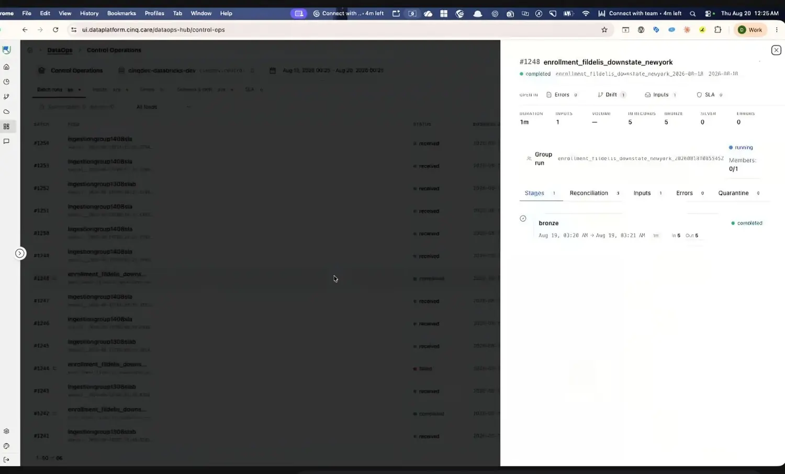
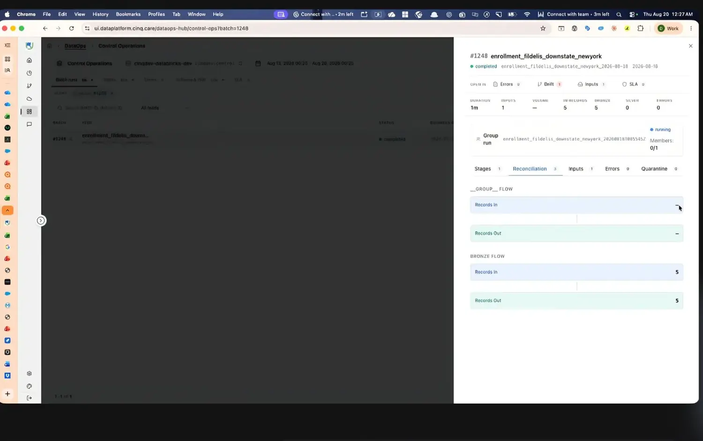
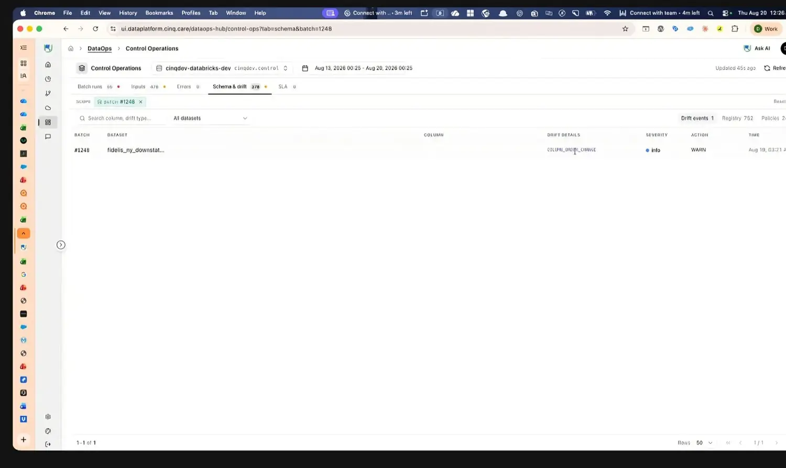
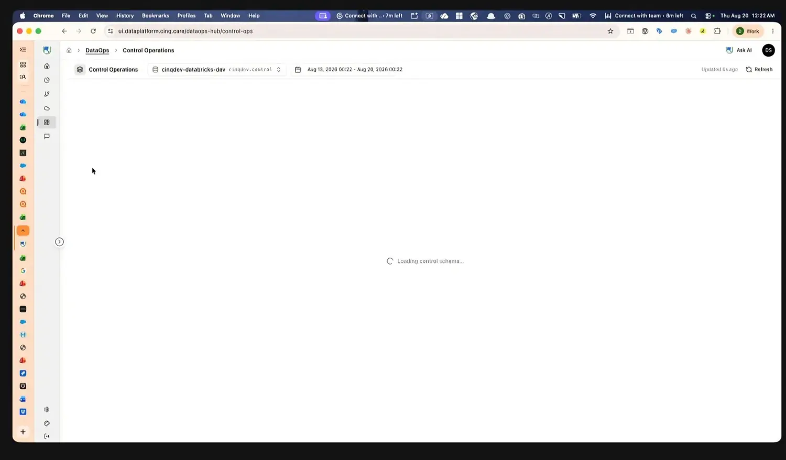
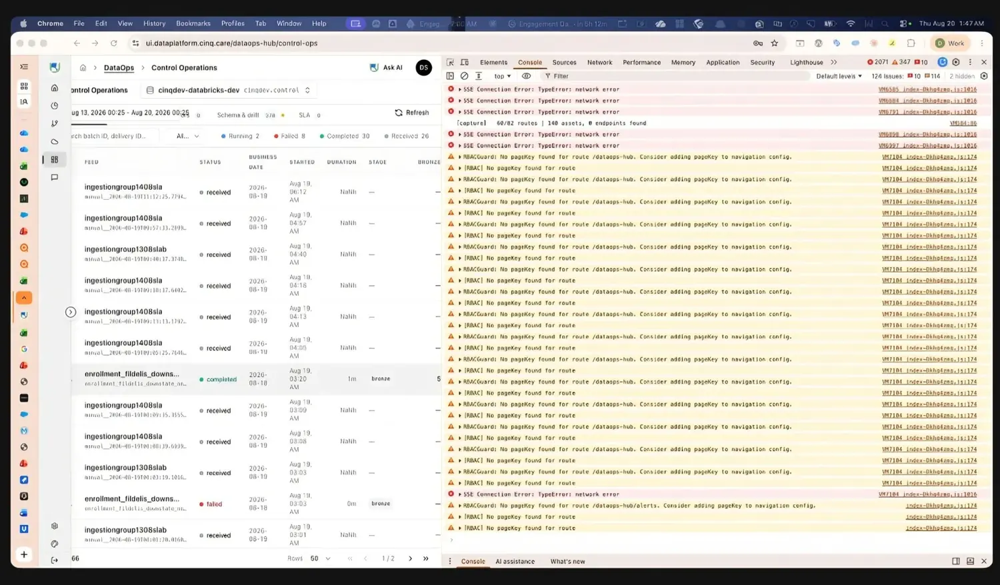

| | |
|---|---|
| **Left to right** | run drawer · reconciliation · drift · loading state · console |
| **Value** | stability across builds — a design target that will not move under us |

## Recovery Library

`/dataops-hub/recovery-library` — *We have seen this failure before — what do we do?*

### Plate 36 — Seventy guides and zero matchers

*direct capture*

"Step-by-step guides for known failures, plus a review queue for agent-suggested improvements." A catalogue with a fingerprint scheme of its own — `BH-AF-001` through `BH-AF-008` and onward — each row carrying a category (*Airflow & orchestration*, *Audit & logging*), a priority and a runbook. Four counters describe the library's health: **70 recovery guides**, **69 with runbooks**, **0 classifier rules**, **9 awaiting review**.

The tab strip is the finding. *Recovery Guides · Suggested Updates (9) · **Classifier Rules** · Test Harness.* The tab exists. The counter beneath it, described as "active logs match heuristics rules", reads zero.

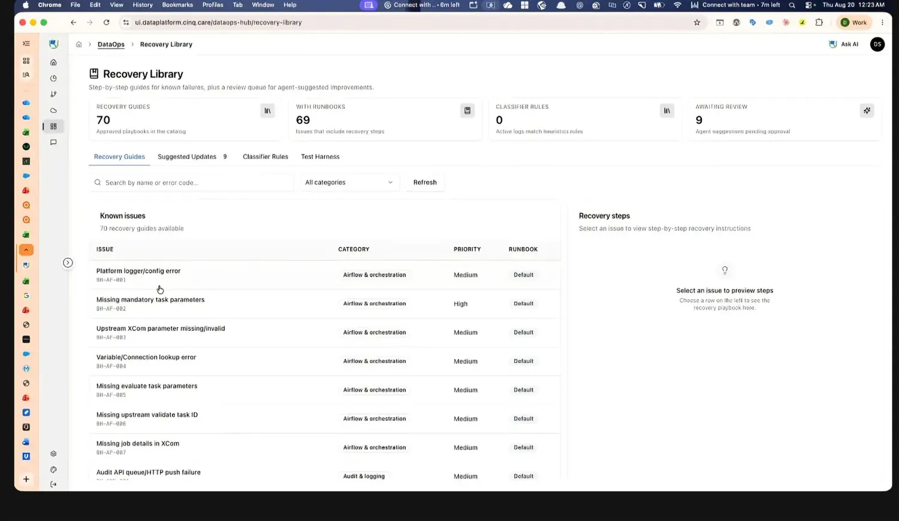

| | |
|---|---|
| **Tabs** | Recovery Guides · Suggested Updates (9) · Classifier Rules · Test Harness |
| **Identifiers** | BH-AF-nnn — a stable fingerprint namespace already exists |
| **Row shape** | issue · category · priority (High / Medium) · runbook |
| **Coverage** | 69 of 70 guides carry an executable runbook |
| **Matching** | zero classifier rules — the tab is built and empty |

> **What this means for our build.** Seventy guides, sixty-nine runbooks, a Test Harness to prove matchers work, and nothing to match. The library is a manual lookup: an engineer must already know which guide to open. Our failure-fingerprinting capability is not a new feature against this product — it is the missing half of a feature they have already paid to build, and it is the highest return per unit of work in the entire survey.

### Plate 37 — Suggestions, with confidence and evidence

*direct capture*

Nine agent-proposed updates wait in a review queue. Each carries a confidence badge and a pair of actions, **Approve** and **Decline**. The highest — 98% — proposes a five-step runbook with an estimated time and an escalation path, and shows the failure diagnostic it was derived from directly underneath the proposal.

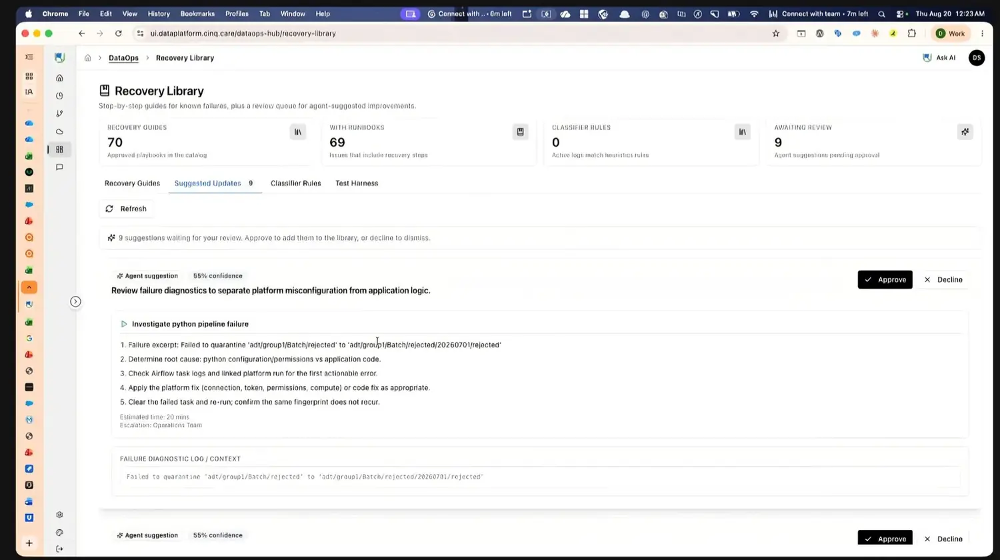

| | |
|---|---|
| **Queue** | 9 pending suggestions |
| **Confidence** | surfaced per suggestion, on the card |
| **Evidence** | the diagnostic the suggestion was derived from travels with it |
| **Decision** | Approve / Decline — binary, attributed |

> **What this means for our build.** Proposal, confidence, evidence, approval. The loop we specify is running here for one artefact type. What is absent is the axis that must come first: nothing states the *risk class* of the change being approved, so a 98% confidence on a documentation edit and a 98% on an escalation path are presented identically. Risk class first, confidence second.

## Ops Incidents

`/dataops-hub/incidents` — *What is open right now and who owns it?*

**Not opened on camera.** Ops Explore carries typed events and Ops Hub carries breaches, but neither surfaces an incident object with an owner and a lifecycle. Whether one exists behind this entry is unknown.

## LLM Observability

`/dataops/agent-observability` — *What did the agents run, how long, at what cost?*

### Plate 38 — Cost and latency, per agent run

*Aug 20 · capture B*

Traces over a chosen window, with presets for 24 hours, 7, 30 and 90 days. Six columns: **WORKFLOW**, **ENDPOINT**, **USER**, **STARTED**, **DURATION**, **COST**.

Three runs of `silver_raw_fidelis_ny_downstate_roster_to_members_load` against `aiagent.dataplatform.cinq.care/api/v1/ingestion_pipeline/update` take roughly 205 seconds and cost roughly $0.61 each. The `cron_generate` calls to `/api/v1/tools/schedule.cron_from_nl/invoke` cost nothing measurable.

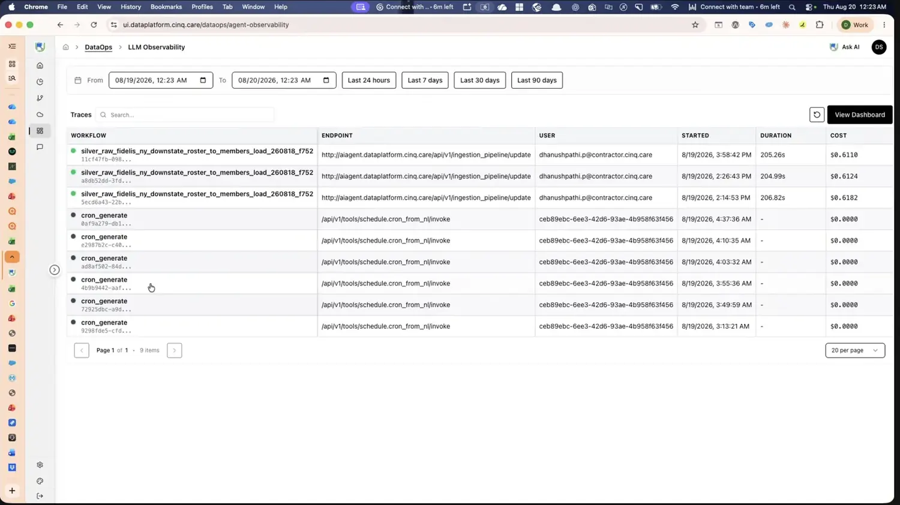

| | |
|---|---|
| **Attribution** | workflow, endpoint and user on every trace |
| **Real numbers** | ~205s and ~$0.61 to generate one silver-raw mapping |
| **Also** | a View Dashboard link to aggregate views |

> **What this means for our build.** Cost and latency are observed. *Authority* is not: there is no column for risk class, no split between read, propose and mutate, no grounding score, no approval outcome, and — most tellingly — no count of refusals. Adding five columns to a table that already exists is the cheapest large improvement available to us.

### Plate 39 — The same table, an earlier build

*direct capture*

Captured independently on another day: the same six columns, the same workflows, the same endpoint. Another stable surface.

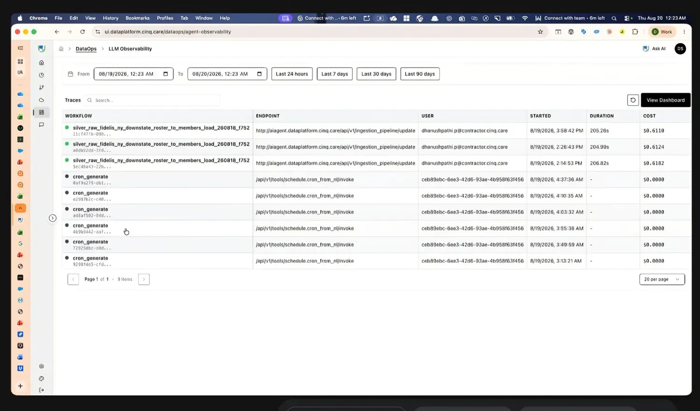

| | |
|---|---|
| **Value** | confirms the trace schema has not moved between builds |

## Cost Optimization

`/dataops-hub/cost` — *Where is compute being wasted?*

**Not opened on camera.** No evidence. LLM Observability proves per-run cost is captured at trace level, so the data this screen would need already exists.

---

# ELSEWHERE

*Three destinations that appear in navigation and nowhere else.*

## All Chats

`/chats` — *What have I asked the copilot before?*

### Plate 40 — Navigation, complete

*direct capture*

One frame holds the whole rail as it stood on Aug 20, including three destinations that appear nowhere else in this survey: **MIGRATION**, **ADMIN** and **LOGOUT**, added since the Aug 10 capture.

**HOME · DATA GOV · PIPELINE · MIGRATION · DATAOPS** — Ops Explore, Ops Hub, Control Operations, Recovery Library, Ops Incidents, LLM Observability, Cost Optimization — **· ALL CHATS · ADMIN · THEME · LOGOUT**.

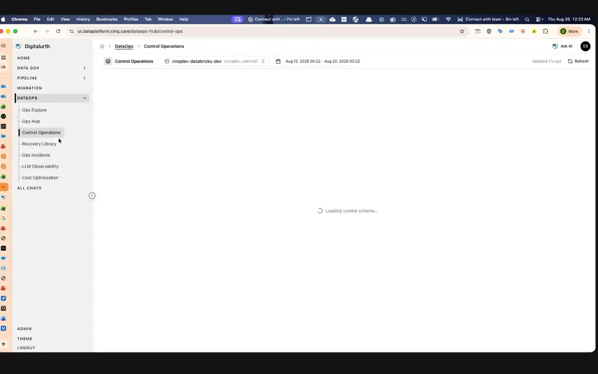

| | |
|---|---|
| **Growth** | the navigation gained three entries in ten days |
| **Unopened** | All Chats, Migration, Admin, Ops Incidents, Cost Optimization, Data Catalog, Schema Drift, Data Flow and Lineage were never opened on camera |

> **What this means for our build.** Nine of twenty-five destinations were never opened in front of a camera. Four of them — Lineage, Data Catalog, Ops Incidents and Cost Optimization — have direct counterparts in our own scope, so their depth is unknown exactly where we most need to know it. That is the agenda for the next session with the incumbent, and it is short enough to fit in one hour.

## Migration

`/migration` — *How do we move an environment?*

**Not opened on camera.** Added to the rail between the Aug 10 and Aug 20 builds, at the same level as DATA GOV and DATAOPS — a top-level concern, not a settings page.

## Admin

`/admin` — *Who can do what?*

**Not opened on camera.** Added alongside Migration. The console log shows an `RBACGuard` resolving routes to page keys, so a role model exists; this is presumably where it is edited.

---

# Route for route

The CINQFLOW console is built: 57 routes in a Next.js app-router tree, using the client's own vocabulary — Data Intake, Data Explorer, Work Queue. Laying the two navigations side by side turns the comparison from a plan against a product into a product against a product.

**57** built routes · **21** components · **~12.4k** lines of UI · **5** of their destinations have no route at all · **8** of ours have no destination there

| Digitalurth destination | Our route | How the two differ |
|---|---|---|
| **ENTRY** | | |
| Sign-in | `/signin` | One-to-one. |
| Home | `/` | Same slot, opposite job: theirs dispatches, ours reports. |
| **DATA GOV** | | |
| Data Catalog | `/data/explorer` `/data/layers` `/data/layers/[layer]` `/data/layers/[layer]/[table]` | Split in two on purpose — the Explorer answers *what data do we have*, Layers answers *where is it now*. |
| Schema Drift | `/data/intake/contract/[feedId]` `/operations/monitor` | Drift is attached to the feed's contract rather than given its own destination. |
| Domain | `/data/canonical` `/data/canonical/[entity]` | Our canonical model plays the role their Domain plays. |
| Glossary | `/data/intake/glossary/[slug]` | A term page exists; there is no index, and no bulk import to receive their 403 terms. |
| Agent Studio | **no route** | **No route.** The single largest hole in the built app relative to the incumbent. |
| Catalog Audit | `/admin/audit` | Ours sits under Administration rather than Governance. |
| Lineage | `/operations/lineage` `/operations/lineage/[feedId]` | Ours is built and theirs is unopened — the comparison runs the other way here. |
| **PIPELINE** | | |
| Data Pipeline | `/data/intake/feed/[feedId]/plan` | We model the plan as a property of the feed; they model the pipeline as an object in its own register. |
| Data Flow | **no route** | **No route.** We have no orchestration-level object at all. |
| Ingestion | `/data/intake` `/data/intake/new` `/data/intake/sources` `/data/intake/feed/[feedId]` `…/onboarding` `…/plan` `…/deliver` `…/clone` `…/history` `/data/intake/contract/[feedId]` `/data/intake/mapping/[feedId]` `…/compare` `/data/intake/rules/[feedId]` `/data/intake/rule/[ruleId]` `/data/intake/profile/[profileId]` `/data/intake/document/[documentId]` | Sixteen routes against their one destination — the depth is on our side; the tier editor is not. |
| Knowledge Base | `/data/intake/proposals` `/data/intake/proposals/[proposalId]` | Proposals exist; the reuse loop that turns an answer into future grounding does not. |
| Orchestration Workflows | **no route** | **No route.** No block library, no artifact management, no flow versioning. |
| **DATAOPS** | | |
| Ops Explore | `/operations/monitor` | One screen carries what they split across Explore and Hub. |
| Ops Hub | `/operations/monitor` `/operations/queue` | Work Queue is ours alone — the "what needs me today" surface has no counterpart there. |
| Control Operations | `/operations/control` `…/batch/[batchId]` `…/@drawer/(.)batch/[batchId]` `…/error/[errorHash]` | Built to the same shape, including the intercepted-route drawer — the closest match in the whole map. |
| Recovery Library | `/data/intake/runbook/[runbookId]` | A runbook page exists; the library, the fingerprints and the review queue do not. |
| Ops Incidents | `/operations/incidents` | Built here, unopened there. |
| LLM Observability | `/ai/observability` `/ai/acceptance` | We split observation from acceptance; they have observation only. |
| Cost Optimization | **no route** | **No route.** Unopened on their side too — neither party has evidence. |
| **ELSEWHERE** | | |
| All Chats | `/ai/ask` | Ours is the ask surface; the history is not built. |
| Migration | **no route** | **No route.** Wave 5 on our side. |
| Admin | `/admin/users` `/admin/audit` `/no-access` | Ours includes an explicit no-access page — the RBAC failure their console logs. |

## Eight things we have built that they have no destination for

| Area | Routes | Why it exists |
|---|---|---|
| **Identity resolution** | `/data/identity/queue` `/data/identity/merge` `/operations/identity-coverage` | Three screens for the decision the architecture diagram names at Silver Raw and the console never surfaces. |
| **The ODS model** | `/data/ods-model` `/data/ods-model/[entity]` `/data/ods-model/versions` | A versioned canonical model as a first-class destination, not an implicit schema. |
| **Certification** | `/operations/certification` `/operations/certification/batch/[batchId]` | Sign-off on a batch, with an export route beside it — the artefact an auditor asks for. |
| **Data Quality** | `/data/quality` | "Can I trust this data?" as its own destination rather than a column in a table. |
| **Landing forensics** | `/data/explorer/landing/[fingerprint]` | A file, by content fingerprint, before anything has been made of it. |
| **Delivery** | `/data/intake/deliver` `/data/intake/feed/[feedId]/deliver` | What we owe the client back, tracked as explicitly as what arrives. |
| **Cross-feed mapping** | `/data/mapping` | Mapping as a portfolio view, not only per feed. |
| **The design system** | `/design` | The lexicon and the components in one page — where the seven status words are enforced. |

---

# Validation

42 capabilities, grouped the way the work is grouped. The plate column points back at the evidence. The verdict is the decision the row demands, not a score.

| Verdict | Meaning |
|---|---|
| **Lift** | Adopt the incumbent's design more or less as drawn. |
| **Match** | Both sides have it; the difference is depth, not existence. |
| **Ahead** | Our design is materially stronger on this axis. |
| **Gap** | They have it and we do not — and we need it. |
| **New** | No counterpart in the incumbent. |
| **Open** | Not established. Answer this before designing against it. |

### Navigation & language

| Capability | Digitalurth today | Plate | CINQFLOW | Verdict |
|---|---|---|---|---|
| **Information architecture** | 20 destinations in 4 groups, named for the engineering team: Data Gov, Pipeline, DataOps. | 02 | 10 destinations named for the reader: Data Intake, Work Queue, Data Quality — *"keep the navigation simple for BA, Data Steward and Operations users."* | **Ahead** |
| **Status vocabulary** | Words differ per surface: `received / completed / failed` on runs, `Metadata OK / Profiling…` on groups. No *Expected*. | 12 · 31 | Seven binding words — Expected, Received, Processing, Completed, Needs Review, Needs Attention, Missing — with a CI lexicon test from Wave 2. | **Ahead** |
| **Home surface** | A dispatcher. Four action chips and *"Please select an action above to continue…"* | 02 · 03 | Data Operations answers four questions before you click: what arrived, what completed, what needs review, what needs action. | **Ahead** |

### Onboarding a feed

| Capability | Digitalurth today | Plate | CINQFLOW | Verdict |
|---|---|---|---|---|
| **Feed onboarding spine** | Four tabs, one direction: Configuration → Map to domain → Schedule & Monitoring → Publish. | 16 | E4-01/02/03, Wave 1 — spine not yet fixed. | **Lift** |
| **Medallion tiers as configuration** | Per-feed hop editor: enable/disable, machine names, execution order, custom tiers, per-hop pipeline mode. | 14 | Rungs and sockets as an architectural model; no per-feed tier editor in scope. | **Lift** |
| **Escape hatch per hop** | *Auto (generate later)* or *Use static pipeline* — switchable for one tier without affecting the rest. | 15 | No equivalent. Generation is all-or-nothing per story. | **Lift** |
| **Connection registry** | Named source and target connections bound at group creation. | 14 | Connection profiles + 21 typed pins; E3 registry, Waves 0–1. | **Match** |
| **Reader / writer object contract** | File type, header, regex match, multi-file DAG, archive path; load mode, schema, table, pre/post-SQL. | 17 · 18 | E4-02/03 covers the contract; pre/post-SQL hooks have no counterpart and no governance story. | **Lift** |
| **Publish path** | A git commit into `CINQ-CARE/datalake-ddl`, then a GitHub Action to Airflow to Databricks. | 25 | ADRs and memory; no publish-to-git path defined. | **Lift** |

### Intelligence

| Capability | Digitalurth today | Plate | CINQFLOW | Verdict |
|---|---|---|---|---|
| **Schema inference** | "Rediscover layout"; layout fields held in the catalog. | 16 | E5-02, Wave 1, R2 — inference produces a *contract*, gated at ≥90% of fields accepted uncorrected. | **Ahead** |
| **Profiling** | A *Profiling…* stage on the group; a platform tool turns profile signals into DQ recommendations. | 12 · 08 | E5-01/04/05 across Waves 1–3. | **Match** |
| **PHI & code-set detection** | Not observed on any surface. | — | E5-03, Wave 1, R2 — gated at **100% recall** on flagged PHI. | **New** |
| **Mapping generation** | Per-column, four states, counted: 0 Pending · 0 SME Review · 39 Completed · 46 Skipped. | 20 | E6-02, Wave 1, R2 — ≥85% field agreement on blind re-derivation of three live feeds. | **Match** |
| **Grounding the instruction** | A free-text requirement per source→target pair, with MANDATORY and STRICT RULES in capitals. | 19 | Fixed prompt order, schema shown rather than paraphrased, input fenced as data, grounding as its own slot. | **Ahead** |
| **Natural language to artefact** | NL → mapper JSON; NL or speech → cron, with the raw field always visible beside it. | 22 · 08 | E7-01, Wave 1, R2 — ≥90% intent-equivalent across a 110-rule set. | **Match** |
| **Low-confidence routing** | SME Review exists as a destination; no confidence threshold is shown on the mapping screen. | 20 | E7-04, Wave 1, R0 — 100% routed, zero silent publications, as a gate not a preference. | **Ahead** |
| **Agent authoring surface** | Agent Studio: My Agents, 58 typed tools, 5 LangGraph system agents, React Flow editor, dry-run, clone-to-customise. | 08 · 09 | No route in the built console — `/agent-studio` does not exist. LangGraph is a Wave 2 seat. | **Gap** |
| **Tool authority** | read / compute / write encoded in badges; inputs declared per tool. No gate between adding a write tool and running it. | 08 | Action gateway as stage 6 of a six-stage pipeline; risk classes R0–R4; R4 human-always, not configurable. | **Ahead** |
| **Explain, never act** | "Explain with AI" beside "Validate"; "Ask AI" in the header. | 21 · 16 | E16-10 Pipeline Insight, Wave 0, R0 for life — read tools only, in every environment, at any confidence. | **Match** |

### Knowledge

| Capability | Digitalurth today | Plate | CINQFLOW | Verdict |
|---|---|---|---|---|
| **Decision write-back loop** | 397 entries, 273 ready to reuse, 115 awaiting SME, 42 targets, 80 pipelines. Live and instrumented. | 26 | K1/K2/K3 tiers designed; no loop running. | **Lift** |
| **Retrieval** | Exact target-field lookup through an API. The product states semantic search is *planned*. | 26 | E16-04/05 retrieval service: layer hard-filter, hybrid search, rerank to 6–8 chunks, freshness guard. | **Ahead** |
| **Domain knowledge** | Six free-text fields and a JSON blob per domain, in a textarea. | 06 | A typed VBC pack — ontology, source landscape, layer contracts, identity, playbooks, metrics, DQ rules — with identifiers, layers and confidence semantics. | **Ahead** |
| **Business glossary** | 403 terms, column-level, bound to schema and physical column, linked to FHIR and X12, stable keys, bulk upload. | 07 | 65 generated retrieval terms. | **Gap** |
| **Component registry** | Block Library, Block Registration, Artifact Management; versioned flow and pipeline templates with clone-to-fork. | 27 | Sockets, 21 pins as Protocols, four adapter families, a conformance kit — but no route: no block library, no artifact management, no flow versioning in the console. | **Match** |

### Governance

| Capability | Digitalurth today | Plate | CINQFLOW | Verdict |
|---|---|---|---|---|
| **Change audit** | Field-level, before and after, attributed, 3,633 records, exportable — for catalog entities. | 10 | E11 governance, Wave 1. | **Match** |
| **Decision record** | None. No table records that an agent proposed something and a human accepted it. | — | A typed decision record with schema, provenance and outcome; ~50 records named as the cold-start requirement. | **New** |
| **Human approval loop** | Live for runbook suggestions: confidence badge, evidence attached, Approve / Decline. | 37 | Risk class first, confidence second; R4 human-always with no autonomy path. | **Ahead** |
| **Lineage** | A DATA GOV destination. Depth unknown — never opened on camera. | 40 | Column-level lineage named as the highest-value prerequisite for the analyst agents. | **Open** |

### Operations

| Capability | Digitalurth today | Plate | CINQFLOW | Verdict |
|---|---|---|---|---|
| **Control tables** | `cinqdev.control` — batch runs, inputs, errors, schema & drift, SLA — bound to a named workspace. | 31 | 11 control tables joined on `batch_id`; gates G1–G5. | **Match** |
| **Run drawer** | One batch, one drawer: metric strip, group run, then Stages · Reconciliation · Inputs · Errors · Quarantine. | 31 | Control Operations screen, designed to the same shape. | **Match** |
| **Reconciliation** | Records in and out, per flow, per batch. | 32 | E13, Waves 0/2/3. | **Match** |
| **Drift classification** | A registry of 752 shapes and 246 policies deciding severity and action — `COLUMN_ORDER_CHANGE → info → WARN`. | 33 | Schema-drift gate; thresholds not separated from detection. | **Lift** |
| **Arrival & freshness controls** | Freshness or fixed cut-off; periodicity derived from cron; max lag, extra tolerance, missing-after. | 23 | E12 ops, Wave 2. | **Lift** |
| **Alert routing** | Per control, per severity, with a default fallback channel. | 24 | E12, Wave 2. | **Match** |
| **Failure fingerprinting** | 70 guides, 69 runbooks, **0 classifier rules** — nothing matches an incoming failure to a guide. | 36 | E12-04, Wave 2, R0→R1 — ≥95% precision on the seeded failure library. | **New** |
| **Incident grouping** | 485 pages of feed × cycle rows, ungrouped. | 29 | A grouping proposal above the table: five feeds, one upstream fault, one incident. | **Ahead** |
| **Event timeline** | One typed, service-attributed stream — carrying `sla` and `flow` events only. | 28 | The same clock across sla · flow · agent · tool · approval, including refused mutations. | **Ahead** |
| **Agent observability** | Workflow, endpoint, user, start, duration, cost. Real numbers: ~205s and ~$0.61 per silver-raw mapping. | 38 | The same table plus risk class, read/propose/mutate split, grounding, spend against a daily cap, and refusals as a first-class number. | **Ahead** |
| **Identity resolution** | Named in the architecture at Silver Raw. No user interface observed. | 04 | E9-01..04, Wave 3; E9-03 merge/split evidence card is R4 human-always, with no autonomy path ever. | **New** |
| **Live updates & permissions** | SSE stream failing and reconnecting; route→permission map covers 60 of 82 routes; 2,071 console errors. | 34 | Conformance kit — a boundary test no adapter passes by accident. | **Ahead** |
| **Cost optimization** | A DataOps destination. Never opened on camera. | 40 | No route. Neither side has evidence — but per-run cost is captured on both. | **Open** |
| **Environment migration** | A top-level destination added between the Aug 10 and Aug 20 builds. | 40 | E15-01..04, Wave 5. | **Match** |

---

# What this changes

## Lift verbatim

*These are finished designs the team already operates. Redrawing them costs weeks and buys nothing.*

- **Medallion tier editor** — plate 14 — per-hop enable, order, custom tiers
- **Per-hop Auto | static switch** — plate 15 — the escape hatch that makes generation acceptable
- **The four-tab feed spine** — plate 16 — configure → map → schedule → publish
- **Publish as a git commit** — plate 25 — diffable, revertible, already the system of record
- **Drift registry + policy table** — plate 33 — 752 shapes, 246 policies, severity and action separated from detection

## Finish what they started

*Each of these is a feature the incumbent has already paid for and left one component short.*

- **0 classifier rules → fingerprinting** — plate 36 — 70 guides exist and nothing matches a failure to them
- **Exact-key lookup → retrieval** — plate 26 — the product itself names semantic search as planned
- **Free-text tribal knowledge → typed pack** — plate 06 — same six ideas, addressable
- **Tool badges → enforced authority** — plate 08 — the taxonomy is right, the gate is missing

## Add what has no counterpart

*Nothing on any surveyed screen does these, and each is load-bearing for a value-based-care platform.*

- **The decision record** — proposals and approvals on the same clock as catalog changes
- **Risk class in observability** — five columns added to a table that already exists
- **PHI and code-set detection** — gated at 100% recall, not at a confidence score
- **Merge/split evidence card** — identity decisions that a human must always make

## Establish before designing

*Nine of twenty-five destinations were never opened on camera. Four of them matter.*

- **Lineage** — how deep — table, or column?
- **Data Catalog** — what does it hold beyond data sources and layout fields?
- **Ops Incidents** — is there already an incident object, or only events?
- **Cost Optimization** — does it propose, or does it act?
