# Onboarding a feed in Digitalurth
> A 30-minute training call, 5 August 2026. Monica Ram walks Fathullah Hussaini Syed through onboarding one data feed end to end. Every step below is what she actually said, rendered in clear words, against the screen she was on when she said it.
**Source.** `training_recording/File_process_training_2026-08-05.mp4` (30:07) and its VTT. Full transcript: [`transcript.txt`](DIGITALURTH_training_call_transcript.txt). Frames: [`walkthrough_frames/`](walkthrough_frames/), cropped to the shared-screen region `1674x944+0+68`.
**How to read this.** Each step has three registers, deliberately separated:
- normal prose — what the step means
- a `>` blockquote — what the speaker actually said
- **`for the machine`** — the mechanical fact: routes, field names, invariants

---
## The whole path, in eight moves
B. **Create the ingestion** — project - environment - domain - group - compute - workflow - templates - connections - medallion tiers
C. **Bind a location** — copy the directory prefix out of Azure blob storage; the file name is matched by regex, not by path
D. **Configure the object** — reader: file type / header / regex -- writer: schema / table / post-SQL (NDJSON only)
E. **Map bronze -> silver raw** — write the requirement, submit review, resolve any SME Review rows
G. **Schedule + 3 controls + alerts** — cron - on-time arrival (freshness or cut-off) - structural validation - schema drift
G. **Publish** — = a git commit into dl-dev-project
H. **Sync** — GitHub Actions -> Airflow DAG, then -> Databricks workspace
I. **Trigger** — find file by regex -> create compute -> landing->bronze -> bronze->silver raw -> archive -> delete compute

---

## A · Get in
*Two screens before any work starts.*

### A1 — Sign in  `00:51`
Digitalurth is reached at `ui.dataplatform.cinq.care`. Sign-in is delegated to Keycloak — the realm is `cinqcare` — with a username and password, or Continue with Azure.
The product names itself on this screen: *End to End Data Engineering Platform*.

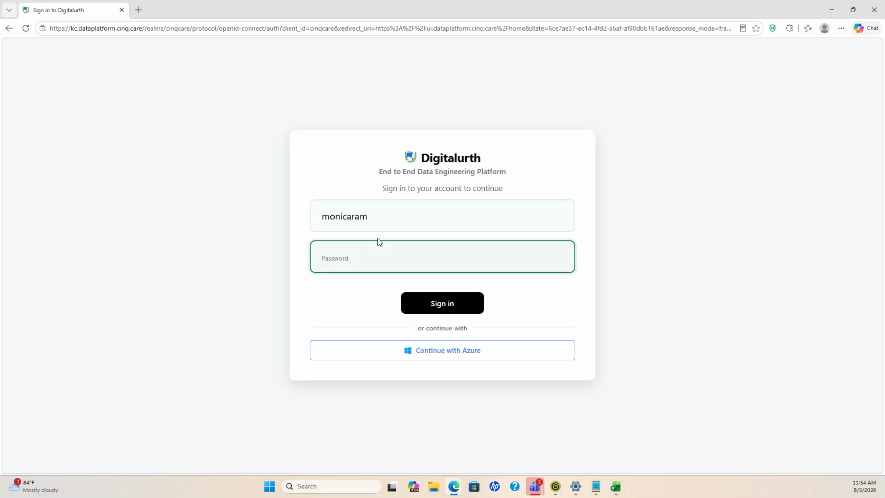

*00:51 — Sign in*

**for the machine** — Auth: Keycloak OIDC, realm `cinqcare`, redirect back to `ui.dataplatform.cinq.care`.

### A2 — Home  `00:57`
The landing screen offers four entry points: Build data pipeline, Manage platform, Onboard data, Build domains & glossary. Everything in this walkthrough begins from the first one.

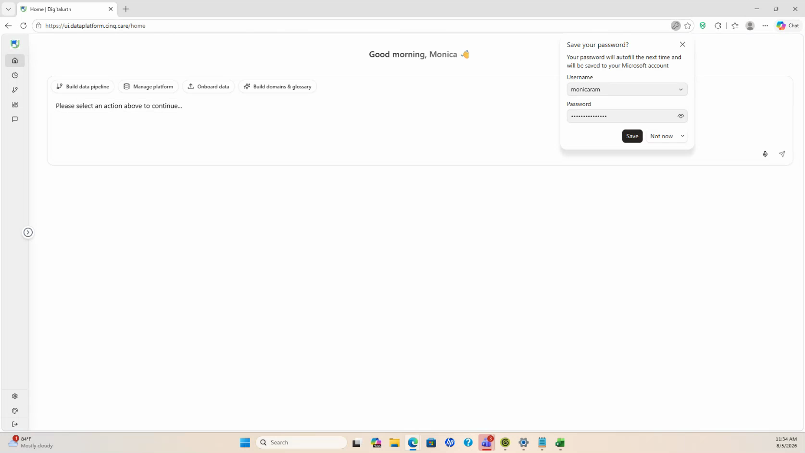

*00:57 — Home*

## B · Create the ingestion
*Everything about the feed that is decided once, in one modal.*

### B1 — Pipelines → Ingestion  `01:06`
Monica's first instruction is the navigation, and it is two clicks.
The Pipeline section holds Data Pipeline, Data Flow, Ingestion, Knowledge Base and Orchestration Workflows. Onboarding a file feed starts at Ingestion.

> “You just have to go to pipelines and you just have to click on ingestion.”
>
> — Monica Ram, 01:06

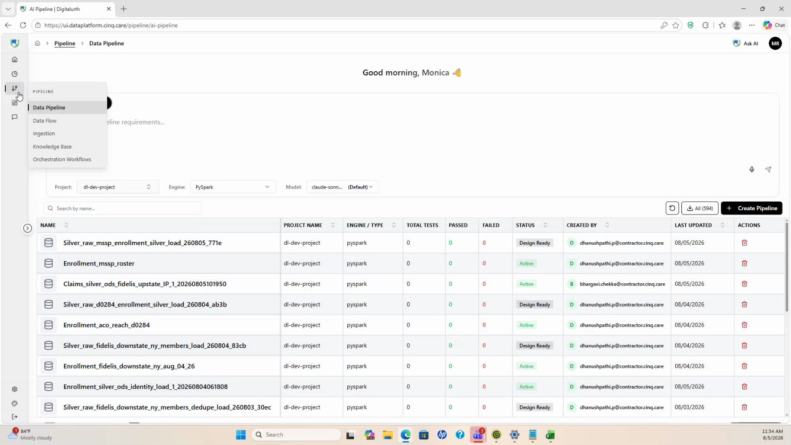

*01:06 — Pipelines → Ingestion*

**for the machine** — Route: `/pipeline/ai-pipeline` → `/agent-pipeline/ingestion`.

### B2 — The ingestion register  `01:11`
Every feed that has been onboarded appears here as a group: group name, environment, last updated, created by, stage. The stage column reads `Metadata OK` on healthy rows and `Profiling…` on rows still being read.
A new feed starts with the **Add Ingestion** button, top right.

> “Here, after that, you can click on this Add Ingestion.”
>
> — Monica Ram, 01:11

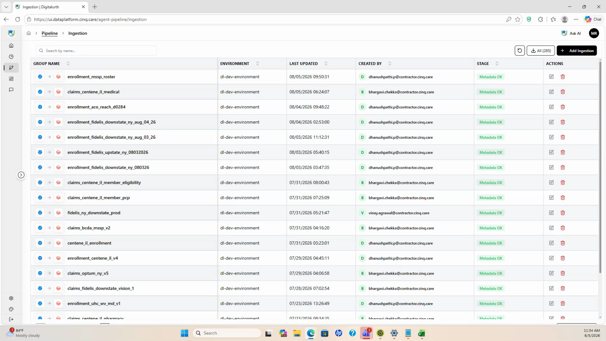

*01:11 — The ingestion register*

**for the machine** — 15 pages of groups at 20 per page — roughly 300 ingestion groups in the dev environment.

### B3 — The four things that identify a feed  `01:15`
Project, Environment, Data domain, Group name. Monica notes that the project is effectively fixed and only the environment matters today — production is a later change. Her own work is under the ADT domain.
The group name is the feed's real name, and the register is full of them: enrollment, MSSP, roster.

> “It's basically whatever you give it over here — enrollment, MSSP, roster, everything is there over here.”
>
> — Monica Ram, 01:15

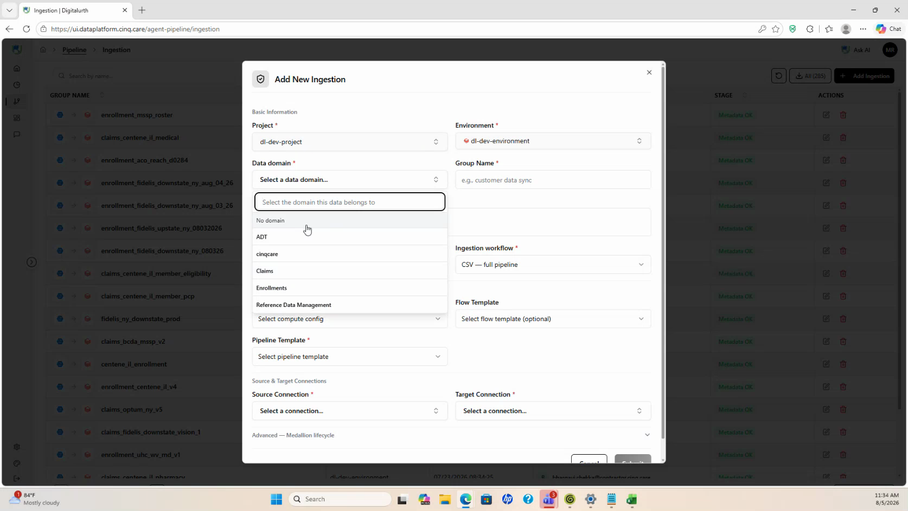

*01:15 — The four things that identify a feed*

**for the machine** — Fields: `project`, `environment`, `data_domain` (No domain · ADT · cinqcare · Claims · Enrollments), `group_name`.

### B4 — Description, and single versus multi-file  `01:55`
She opens her own Fidelis feed as the worked example. A short description goes in — hers reads *for onboard of Fidelis ADT DATA*.
Her feed is one CSV file per delivery, so she leaves **Multi file ingest** unticked. That checkbox is the only thing that distinguishes a single-file feed from a header/line set.

> “Mine is like only CSV file, that's only single file — it's not a multi-file, so I didn't even click on the multi-file ingestion.”
>
> — Monica Ram, 01:55

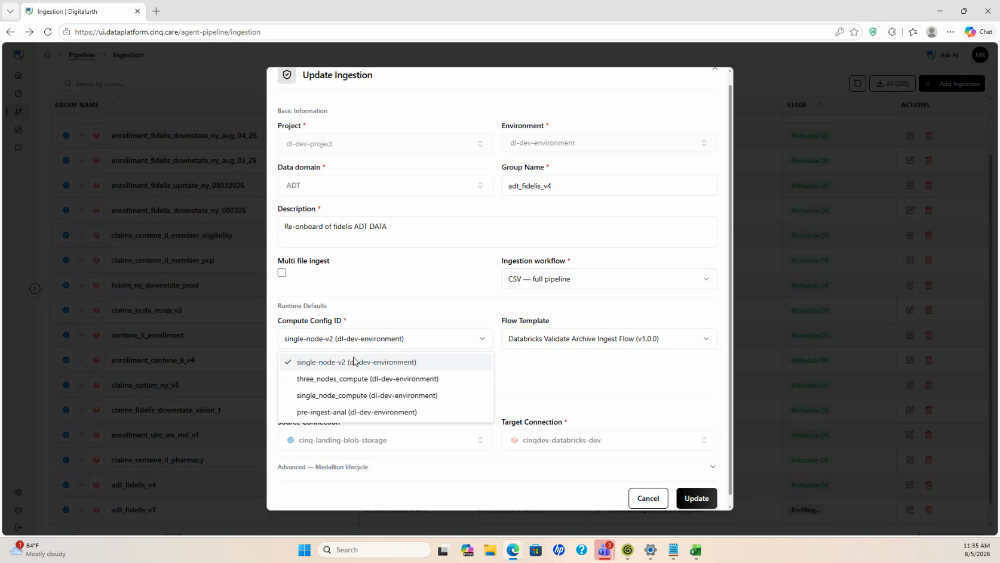

*01:55 — Description, and single versus multi-file*

### B5 — Compute: the leased cluster, and why it matters  `02:11`
The Compute Config ID dropdown offers several shapes. Monica picks `single-node-v2`, and explains the reason at length because it is the single most operationally important choice on this screen.
The V2 node *leases* a cluster rather than starting one. If a cluster is already running for another job, this feed borrows it instead of spinning up its own. First run of the day still costs about five minutes; every run after that is twenty-five to thirty seconds.
This is not a micro-optimisation for her. ADT files arrive **every fifteen minutes**. A cold cluster start per delivery would never keep up — and she names colleagues who hit exactly that wall on other feeds.

> “The cluster doesn't have to spin all over again… the first time when the cluster is trying to run, it might take like 5 minutes. But later, it's going to be like 25 seconds or 30 seconds. This is useful for ADT because for every 15 minutes the file will be coming and it has to spin.”
>
> — Monica Ram, 02:11

*02:11 — Compute: the leased cluster, and why it matters*

**for the machine** — `compute_config_id` options seen: `single-node-v2-{dl-dev-environment}`, `three-cores-compute`, `single-node-compute`, `just-regular-small`. Choose v2 for sub-hourly cadences.

### B6 — Workflow, flow template, pipeline template, connections  `03:03`
Four more fields, and each has one normal answer.
**Ingestion workflow** is *CSV — full pipeline*, which she describes as file-to-DB: landing zone into the database. **Flow template** is constant — *Databricks Validate Archive Ingest Flow*. **Pipeline template** is *File to DB Ingestion V2*.
**Source connection** is where the file physically is — blob storage, the landing zone. **Target connection** is the sink it lands in.

> “The flow template is constant — Databricks validate our flow. And source connection is basically where our file is at. It's in blob storage, landing zone, and the target is the sink there.”
>
> — Monica Ram, 03:03

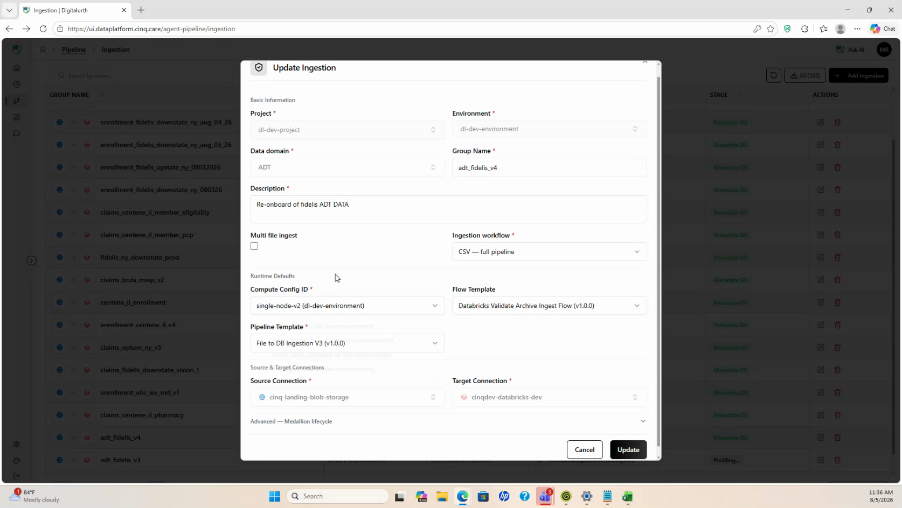

*03:03 — Workflow, flow template, pipeline template, connections*

**for the machine** — `ingestion_workflow`=CSV full pipeline · `flow_template`=Databricks Validate Archive Ingest Flow v1.0.0 · `pipeline_template`=File to DB Ingestion V2 v1.0.0 · source=`cinq-landing-blob-storage` · target=`cinqdev-databricks-dev`.

### B7 — Advanced → the medallion tiers  `03:19`
Opening **Advanced — Medallion lifecycle** reveals one row per hop: Landing → Bronze, Bronze → Silver Raw, Silver Raw → Silver ODS. Each has its own pipeline mode.
The first two are left on *Auto (generate later)*. The platform will generate those pipelines itself.

> “We have this bronze to silver raw, landing to bronze and everything.”
>
> — Monica Ram, 03:19

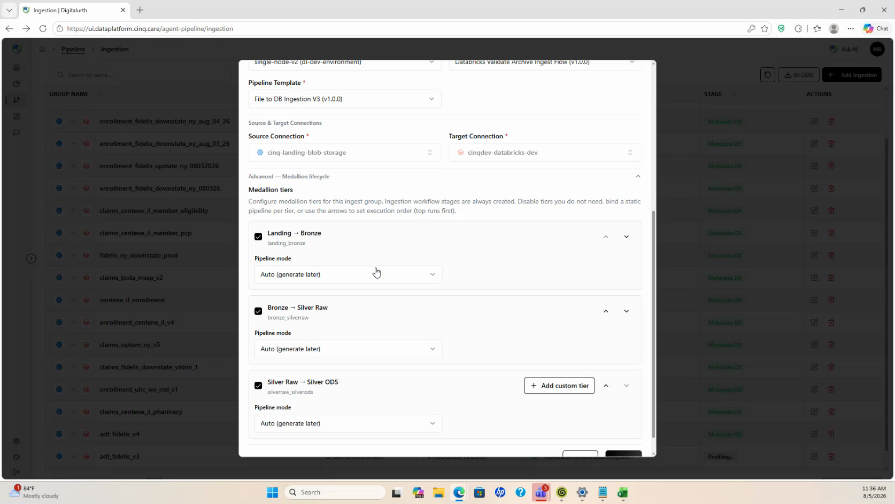

*03:19 — Advanced → the medallion tiers*

**for the machine** — Tier keys: `landing_bronze`, `bronze_silverraw`, `silverraw_silverods`. A custom tier can be added.

### B8 — Silver Raw → Silver ODS uses a static pipeline  `03:33`
The third hop is different. Instead of *Auto (generate later)*, Monica sets it to **Use static pipeline** and imports a pipeline file.
The script is not hers — Bhargavi wrote it, and it lives in GitHub. Importing it selects all three tiers automatically.

> “For silver raw to silver ODS, instead of auto generate later, we use 'use static pipeline'. And here, normally we import a pipeline file.”
>
> — Monica Ram, 03:33

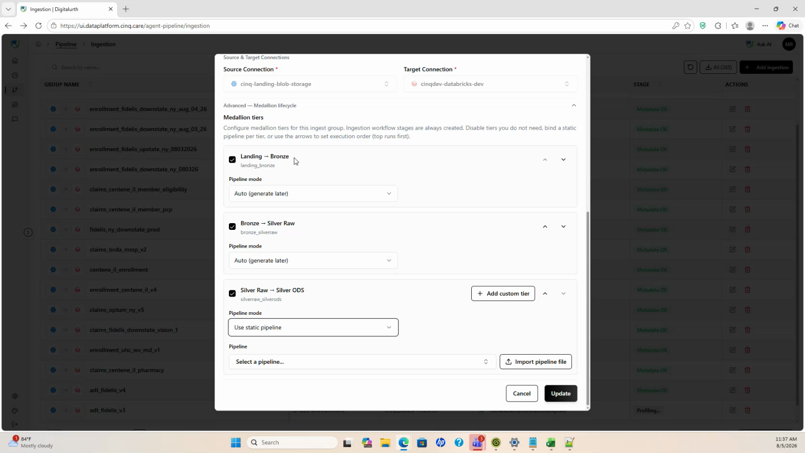

*03:33 — Silver Raw → Silver ODS uses a static pipeline*

**for the machine** — `pipeline_mode: static` + imported pipeline definition. The import populates all three tier bindings in one action.

### B9 — Asked and answered: this is a one-time setup  `04:01`
Fathullah asks the sensible question — today the chain stops at silver raw; in production a file pushed into landing should travel all the way to ODS. Does he have to choose the pipeline each time?
No. The configuration is done once. After that, every DAG run carries the file through all three layers.

> “That will be already selected. You do this all one time thing… and every time you run the flow DAG, all these three layers will be happening — landing to bronze, bronze to silver raw, silver to silver ODS.”
>
> — Monica Ram, 04:01

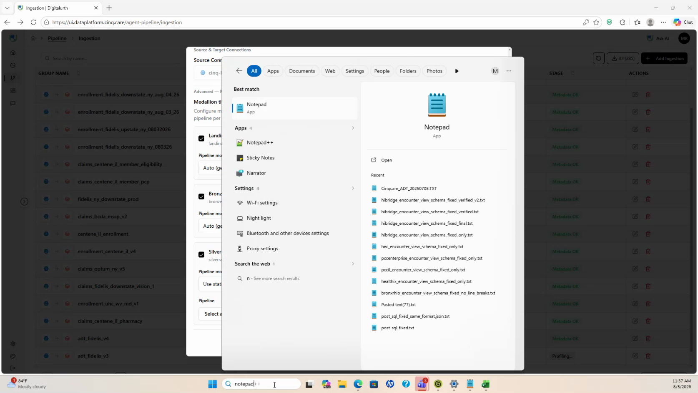

*04:01 — Asked and answered: this is a one-time setup*

**for the machine** — Tier configuration is persisted on the ingestion, not chosen per run.

### B10 — Gold does not exist yet  `04:26`
Asked whether there is an ODS-to-Gold hop, Monica is straightforward: not yet. It is being worked on, and once the gold layer is settled there will be a tier for it here too.

> “ODS to gold — I'm not sure. I think they're working on that. Once the gold layer is fixed on something, then we might be having a gold layer over here also.”
>
> — Monica Ram, 04:26

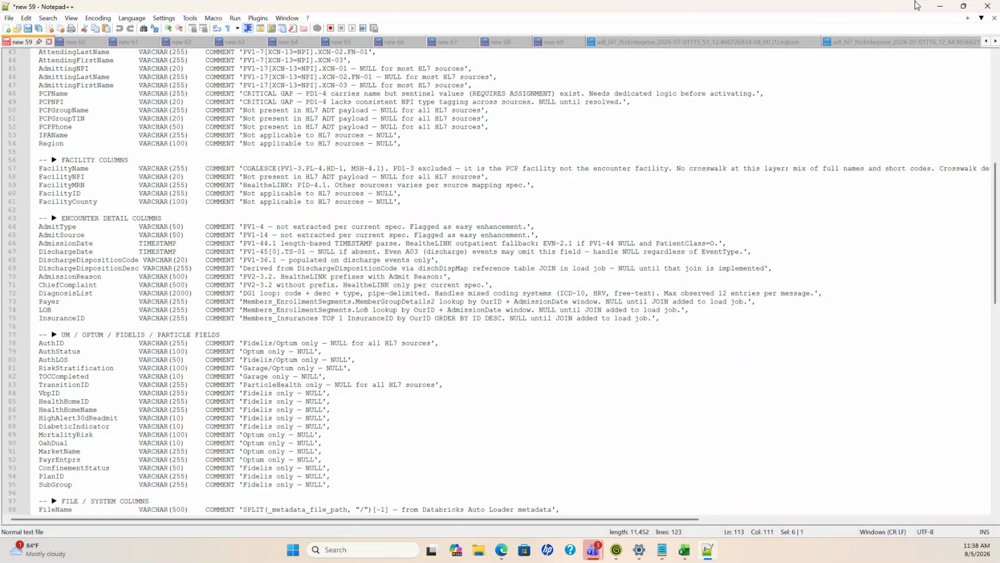

*04:26 — Gold does not exist yet*

**for the machine** — No gold tier in the medallion lifecycle as of Aug 2026.

### B11 — Update  `04:57`
That completes the ingestion definition. **Update** saves it and moves on.

*04:57 — Update*

## C · Point it at the file
*The platform asks where the file lives. The answer comes from Azure.*

### C1 — It asks where the file is  `05:11`
Opening the ingestion for the first time prompts for a location — the exact path the file arrives at. The answer is not in Digitalurth; it has to be fetched from Azure.

> “Normally when you open it, it asks you for the location — like where exactly is the location.”
>
> — Monica Ram, 05:11

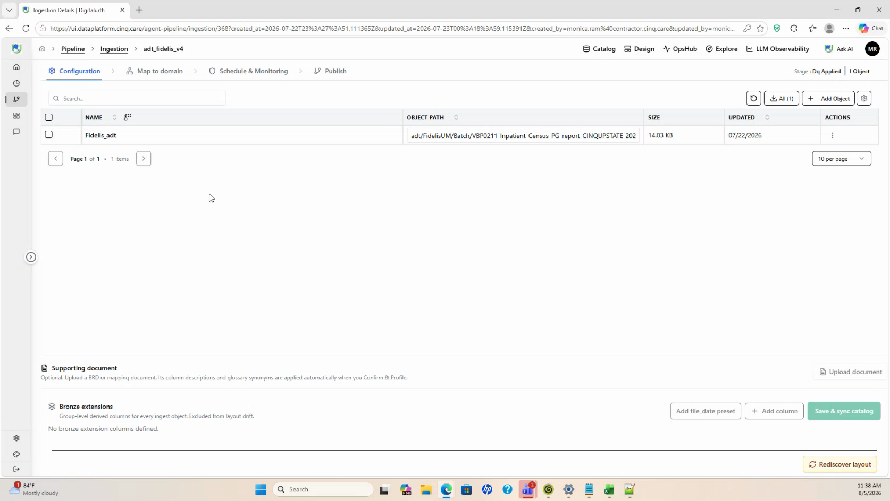

*05:11 — It asks where the file is*

### C2 — Azure blob storage, the landing container  `05:52`
Monica opens the Azure portal's Storage Browser and navigates into the landing container.
She notes an aside worth keeping: she only has Azure open because she was doing seeding work. This step is a lookup, not a daily habit.

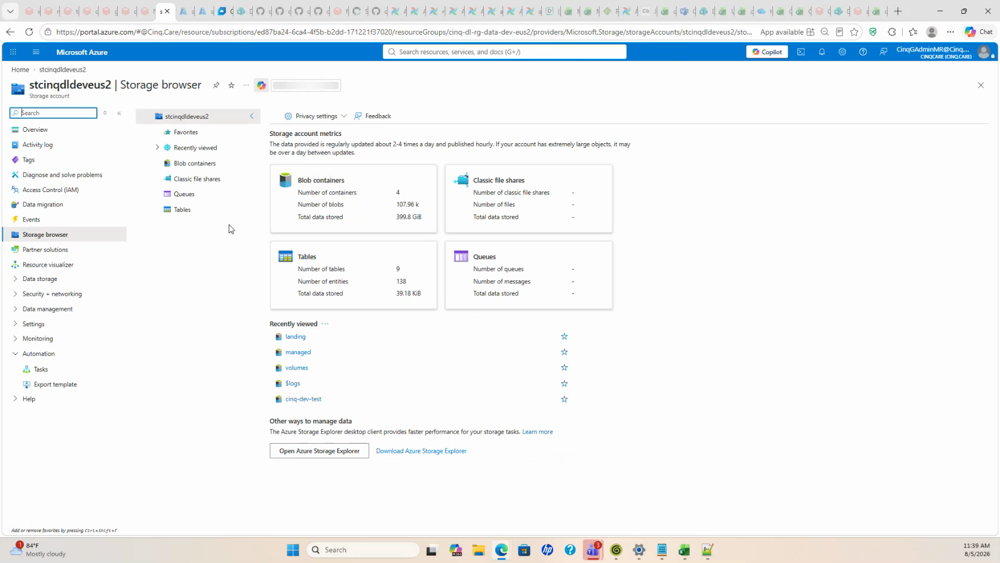

*05:52 — Azure blob storage, the landing container*

**for the machine** — Storage account: the landing blob container behind `cinq-landing-blob-storage`.

### C3 — The batch folder  `05:56`
Inside the feed's path she created a folder called `batch`. That is where a file lands every fifteen minutes, and that is what the pipeline will watch.

> “In the landing… I created a file called batch over here to have every 15 minutes the file should be coming here, and that file will be processing over there.”
>
> — Monica Ram, 05:56

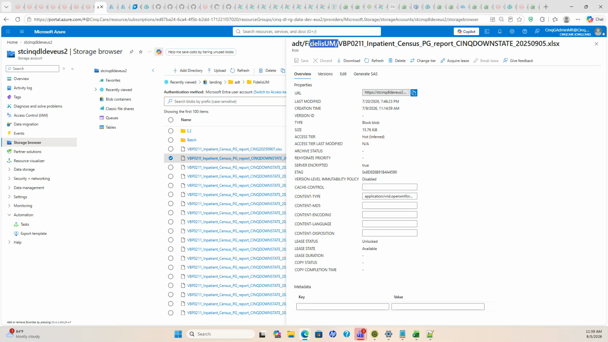

*05:56 — The batch folder*

**for the machine** — Landing layout is per-feed; the watched folder is a child directory, not the container root.

### C4 — Properties → copy everything before the file name  `06:17`
Right-click the file, open **Properties**, and read the full path. The part to copy is everything *up to but not including* the file name. That prefix is the location Digitalurth wants.

> “You go to here and click on the properties… Before the file name, whatever you have, you select that — that is your location.”
>
> — Monica Ram, 06:17

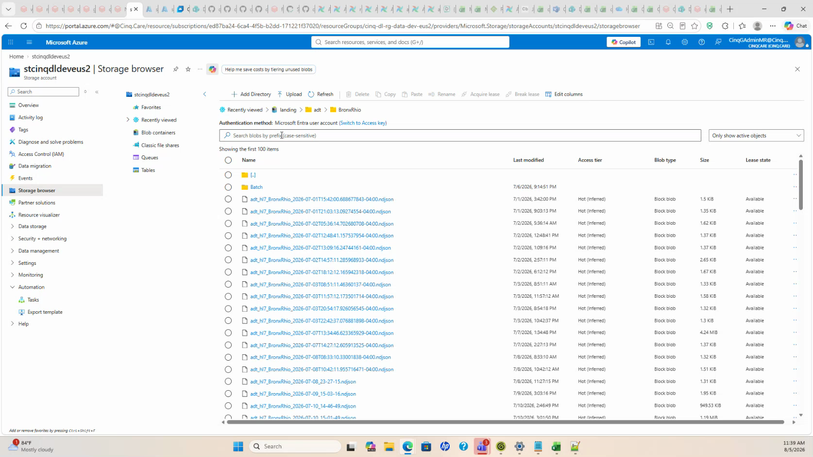

*06:17 — Properties → copy everything before the file name*

**for the machine** — `file_path_prefix` = directory only. The file name itself is matched later by regex, not by literal path.

### C5 — Paste it back, and pick the file  `06:36`
With the location attached, Digitalurth lists every file at that path. Select the one this ingestion is for, then open **Actions → Configure** on that row.

> “When you attach the location there and click on OK, it will show you what all files are there in that location. In that you have to select what file you're working on. After you select that, you have an option called Actions… Configure.”
>
> — Monica Ram, 06:36

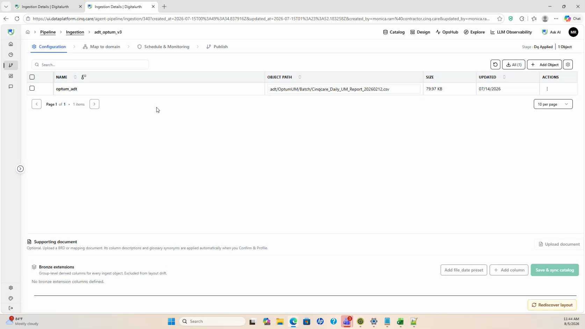

*06:36 — Paste it back, and pick the file*

**for the machine** — The object table is the per-file registry for the ingestion: NAME · OBJECT PATH · SIZE · UPDATED · ACTIONS.

## D · Configure the object
*Per-file settings: how to read it, and where to write it.*

### D1 — File type and header  `07:12`
The configure panel opens on the object's identity and read settings. Two things must be checked by eye: the **file type** and whether it **has a header**.
Fidelis arrives as Excel, so she sets Excel and header = yes. A CSV feed would say CSV. Monica is explicit that these are not defaults to trust — you check them yourself.

> “You have to just check yourself if the file type is Excel or CSV. Mine was — Fidelis was Excel, so I put it as Excel, and has header yes, and everything. These all items you have to check once.”
>
> — Monica Ram, 07:12

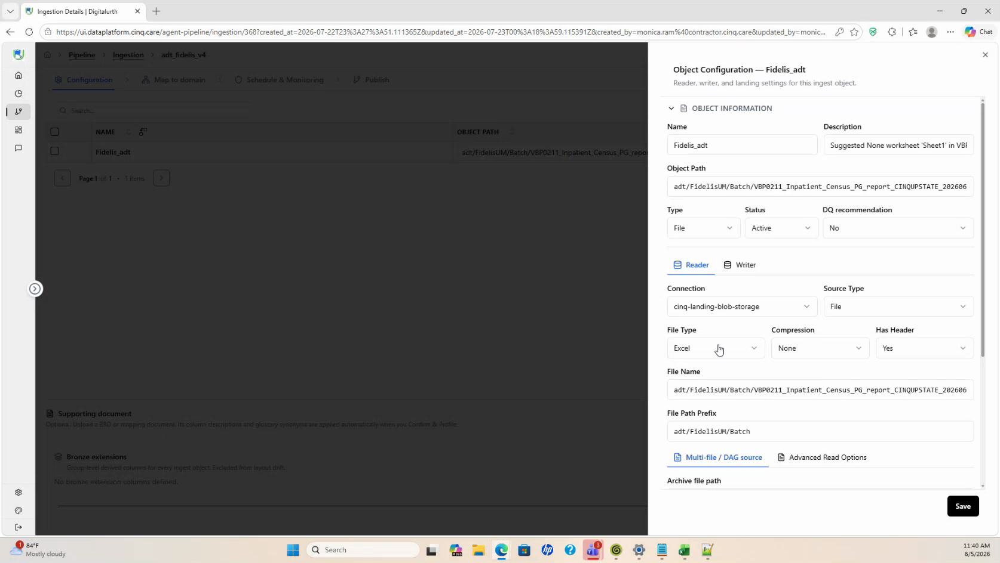

*07:12 — File type and header*

**for the machine** — Reader fields: `file_type` (Excel · CSV · NDJSON · raw text), `compression`, `has_header`, `file_name`, `file_path_prefix`, `archive_file_path`.

### D2 — The file-name regular expression  `07:24`
This is the field that makes the feed repeatable. Files arrive over and over with only the date changing — sometimes only the month. The regex is what matches them all.
Monica's case is harder than most: Fidelis upstate and downstate both land in the same folder, so her expression has to match both, with the trailing digits standing for the date.
If you cannot write the expression, there is a **generate regular expression** action that proposes one from the file name you selected.

> “It's just that the date might be different, or they might have something like only month… Even if you don't know how to create the regular expression, you can click on generate a regular expression. It will suggest you according to your file name.”
>
> — Monica Ram, 07:24

*07:24 — The file-name regular expression*

**for the machine** — Regex is evaluated at DAG runtime against the directory contents — see step I3. A wrong regex fails the run at stage one, not at load.

### D3 — Advanced feed options → the reader  `08:08`
Beyond the basics sits **Advanced Read Options**. Everything about how the bytes are parsed is set here.

*08:08 — Advanced feed options → the reader*

### D4 — The writer: schema and table name  `08:26`
Switch to the **Writer** half. Two values matter.
The **schema name** is the destination for the first hop — landing goes to bronze, so this is the bronze schema. The **table name** is yours to invent: she names hers after the feed, e.g. `Fidelis_adt`.
This table name is load-bearing. It becomes the source of the mapping step later.

> “In the writer part you have to give the schema name. The first thing, from this landing zone to the next one we are going, is to the bronze layer — so give the bronze schema name over here, and you can create the table name of your own… like Fidelis ADT or anything you wish to.”
>
> — Monica Ram, 08:26

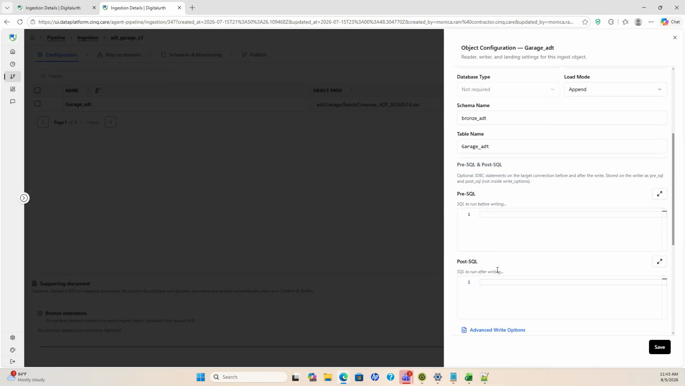

*08:26 — The writer: schema and table name*

**for the machine** — Writer fields: `database_type`, `load_mode` (Append), `schema_name` (e.g. `bronze_adt`), `table_name`, `pre_sql`, `post_sql`.

### D5 — NDJSON is the exception, in three places  `08:57`
Everything above covers CSV, Excel and text. NDJSON differs at exactly three points, and Monica walks each one.
**One** — in Configuration, set the file type to NDJSON rather than CSV or Excel. The ingestion workflow still stays *CSV — full pipeline*.
**Two** — in the reader options, the format must be **raw text**, not Excel.
**Three** — in the writer, NDJSON needs a view built over it, and that view is created by a **Post SQL** script.

> “Whenever it is an NDJSON file, [it is] selected as raw text… and after that, in the writer section — what Bhargavi and they are doing, they are creating a view from the NDJSON files.”
>
> — Monica Ram, 08:57

*08:57 — NDJSON is the exception, in three places*

**for the machine** — NDJSON delta: `file_type=NDJSON`, reader format `raw text`, writer `post_sql` = CREATE VIEW script. `ingestion_workflow` unchanged.

### D6 — Post SQL comes from GitHub  `09:30`
The Post SQL is not written in the browser. It is a SQL script the team keeps in GitHub, pasted in.
Monica's summary of this whole panel is worth keeping as the checklist: in the writer, change the table name, the schema name, and the Post SQL if you are working on JSON.

> “It's a SQL script that we have. So we put that and that is it… in the writer: change the table name, schema name, and post SQL if you're working on any JSON.”
>
> — Monica Ram, 09:30

*09:30 — Post SQL comes from GitHub*

### D7 — Save &amp; sync catalog  `11:00`
One button commits the object configuration and pushes the result into the catalog.

*11:00 — Save & sync catalog*

### D8 — Confirm the inferred data types  `11:08`
The platform now shows what it read: the data domain and the type it inferred for every field, and asks you to confirm.
Monica gives the pragmatic escape hatch. Check them all if you want to — or set everything to string and fix the types later.

> “It's like checking everything with you, if this is a data type that is there in the field. And if you want, you can check everything — or if you don't like anything, you can just put everything as string and work on it later.”
>
> — Monica Ram, 11:08

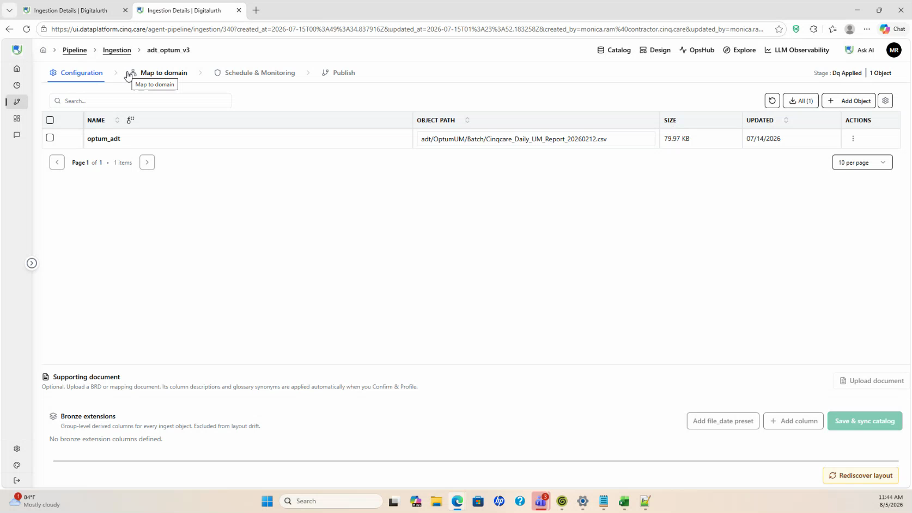

*11:08 — Confirm the inferred data types*

**for the machine** — Type inference is a proposal, not a contract. Overriding to string is an accepted path.

## E · Map bronze to silver raw
*The only step where the AI does the work and a human reviews it.*

### E1 — Map to domain: source and target  `11:28`
The **Map to domain** tab is where bronze becomes silver raw.
The source is the bronze table you just named. The target is the silver raw table. Fathullah checks this explicitly and Monica confirms: this mapping covers **bronze → silver raw only**. Nothing else.

> “This is the bronze table name you gave before… and this will be your silver raw table. — So this mapping only maps anything from bronze to silver raw? — Yes.”
>
> — Monica Ram, 11:28

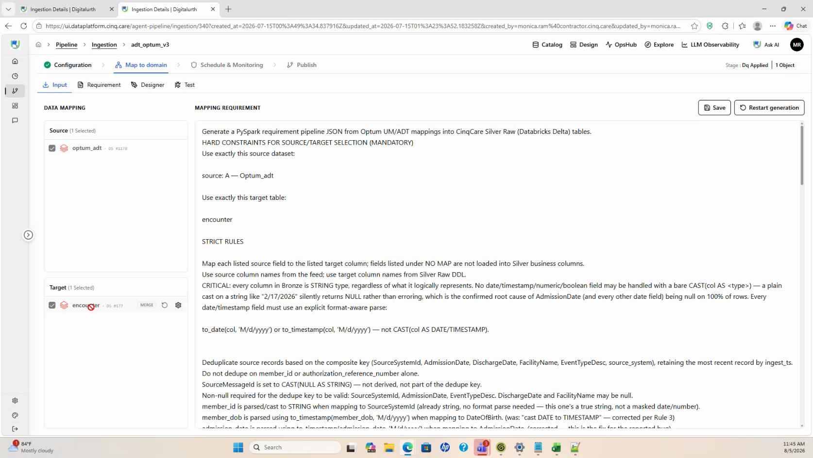

*11:28 — Map to domain: source and target*

**for the machine** — Mapping scope is exactly one hop. Landing→bronze is a straight load; silver raw→ODS is the imported static pipeline.

### E2 — The mapping is written as an instruction  `11:46`
The mapping is not drawn in a grid. It is written as a script — a block of instructions that states the source dataset, the target table, and the rules: hard constraints on source and target selection, cast rules, dedupe logic, which columns must not be null.
The screen shows a real one. It opens with *HARD CONSTRAINTS FOR SOURCE/TARGET SELECTION (MANDATORY)* and continues into strict per-field rules — including a recorded root cause for why one date column had been null on 100% of rows.

> “You have to give it in a script, this kind of script — like this is what it does, dedupe logic or anything like that.”
>
> — Monica Ram, 11:46

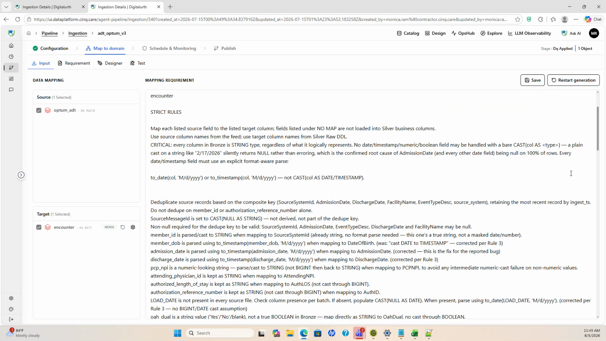

*11:46 — The mapping is written as an instruction*

**for the machine** — Free-text requirement + selected source and target datasets. The requirement is the prompt; the platform generates the mapping from it.

### E3 — Generate, or bring your own — she brings her own  `12:04`
There is a **generate mapping** action that will produce the requirement for you. Monica's advice is to not rely on it.
Her actual practice: draft the mapping description in ChatGPT or Claude, then paste it in. The platform generates the field-level mapping from that instruction.

> “There is an option called generate mapping… but it's better to have our own mapping. So you can take a help of ChatGPT or Claude to get the details and all the map, description, everything.”
>
> — Monica Ram, 12:04

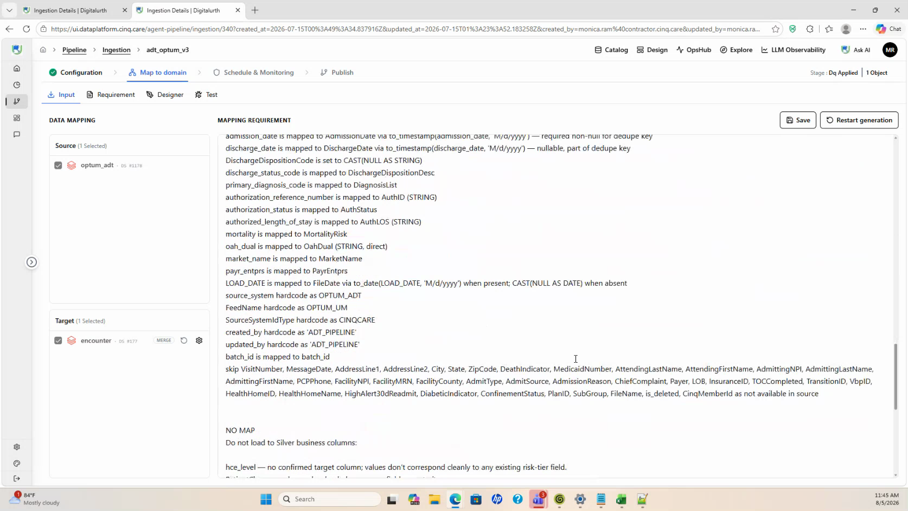

*12:04 — Generate, or bring your own — she brings her own*

**for the machine** — Two authoring paths for the requirement text. The generation step downstream is the same either way.

### E4 — Submit review  `12:28`
The action is in the header. Submitting starts the generation, and Monica warns it is slow.

> “You'll have an option called — in the header column — submit review.”
>
> — Monica Ram, 12:28

*12:28 — Submit review*

### E5 — What comes back  `12:42`
The result is a table: target table, target column, and the mapping requirement derived for each one. The screen shows the real counters — **0 Pending · 0 SME Review · 39 Completed · 46 Skipped**.
Each row states what was decided, in words. Some read *direct copy as STRING (already string, no format parse needed)*. Some read *no source field: PatientId is always null for this pipeline*. Many read *Skipped per user request*.

> “It gives you some mapping like this. This is the target table and this is a target column, and how the column is mapping.”
>
> — Monica Ram, 12:42

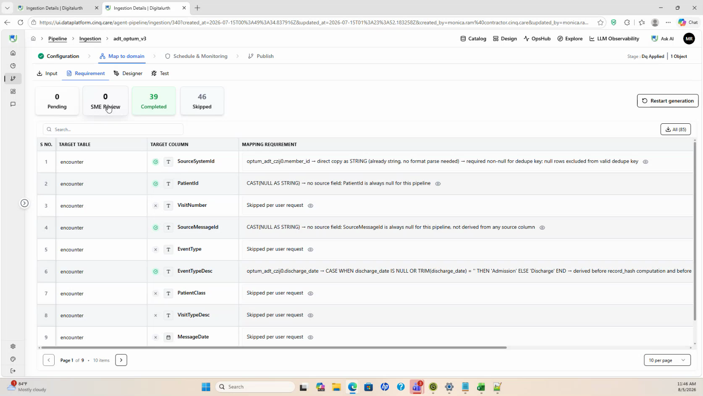

*12:42 — What comes back*

**for the machine** — Per-column outcome states: Completed · Skipped · SME Review · Pending. Skipped is an explicit user decision, not a failure.

### E6 — SME Review — the human-in-the-loop  `12:47`
When the model cannot tell what was meant, the row goes to **SME review** rather than guessing.
The question it asks is specific: *this target column — where do you want me to map it?* It offers options you can pick from, or you type the instruction in your own words.
This is the one place in the whole flow where the platform asks permission before proceeding. It is worth noticing that it does not ask anywhere else.

> “Sometimes you might get an SME review saying review the mapping, because the AI didn't understand what exactly do you want the mapping to be… It gives you options, you can choose from the options, or you can just type it in your own words — I want this to do this exactly.”
>
> — Monica Ram, 12:47

*12:47 — SME Review — the human-in-the-loop*

**for the machine** — SME Review is a blocking per-column state resolved by selection or free text. It is the only approval gate in the onboarding path.

## F · The script library
*Nothing above is typed from scratch. It is copied from GitHub.*

### F1 — Everything above is copied from GitHub  `13:45`
Asked where the mappings come from, Monica's answer reframes the whole exercise: they are already written, in the `datalake-ddl` repository, one folder per domain.
You are not authoring from scratch. You are finding the nearest existing script and adapting it.

> “I think Bhargavi gave all the mappings in the GitHub. She already pasted all the mappings.”
>
> — Monica Ram, 13:45

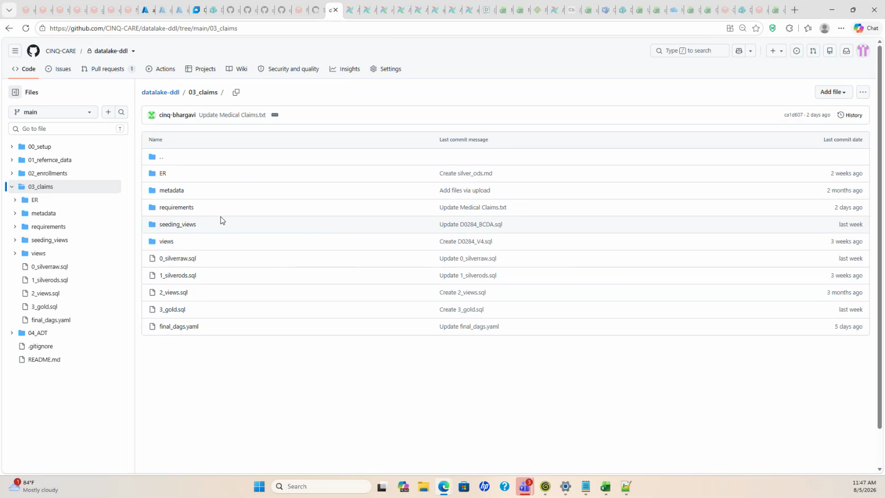

*13:45 — Everything above is copied from GitHub*

**for the machine** — Repo: `CINQ-CARE/datalake-ddl`. Folders `00_setup` · `01_reference_data` · `02_enrollments` · `03_claims` · `04_ADT`.

### F2 — views/ — the SQL, and the minified one-liner  `14:28`
Under a domain, `views/` holds the SQL that builds the views. Beside each script sits a **minified** version — the same SQL collapsed to one line.
That one-liner exists for exactly one reason: it is what you paste into the Post SQL field back in the writer.

> “Views is the SQL part which I was talking to you about… they put it in a minified version. It's in a one-line script that you put it in the post SQL.”
>
> — Monica Ram, 14:28

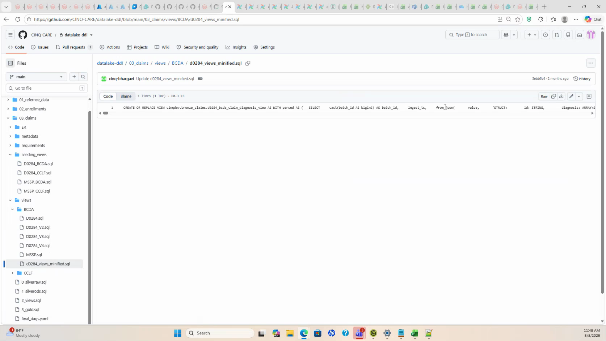

*14:28 — views/ — the SQL, and the minified one-liner*

**for the machine** — e.g. `03_claims/views/BCDA/d0284_views_minified.sql` beside `D0284_V4.sql`.

### F3 — requirements/ — the mapping scripts  `15:22`
The mapping instructions — the text that goes into Map to domain — live under `requirements/`, separately from the views.
Fathullah nearly gets this wrong on the call: he looks for Centene under views and does not find it. Monica corrects him — views only exist for the NDJSON feeds, because only those need a view built. The mappings are elsewhere.

> “For the mappings, the script is in the requirements.”
>
> — Monica Ram, 15:22

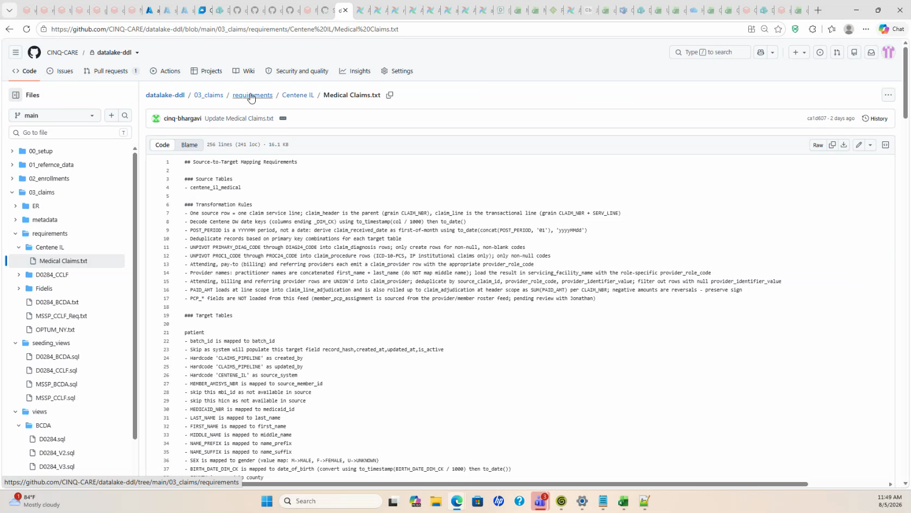

*15:22 — requirements/ — the mapping scripts*

**for the machine** — views/ ≠ requirements/. views/ is per-NDJSON-feed SQL; requirements/ is per-feed mapping text.

## G · Schedule, controls, alerts, publish
*When it runs, what is checked, who gets told — then commit.*

### G1 — Schedule &amp; Monitoring → Feed Identity  `16:02`
The last tab before publishing. Feed identity comes first: feed name, domain, source system, timezone, effective-from date, and an active toggle.

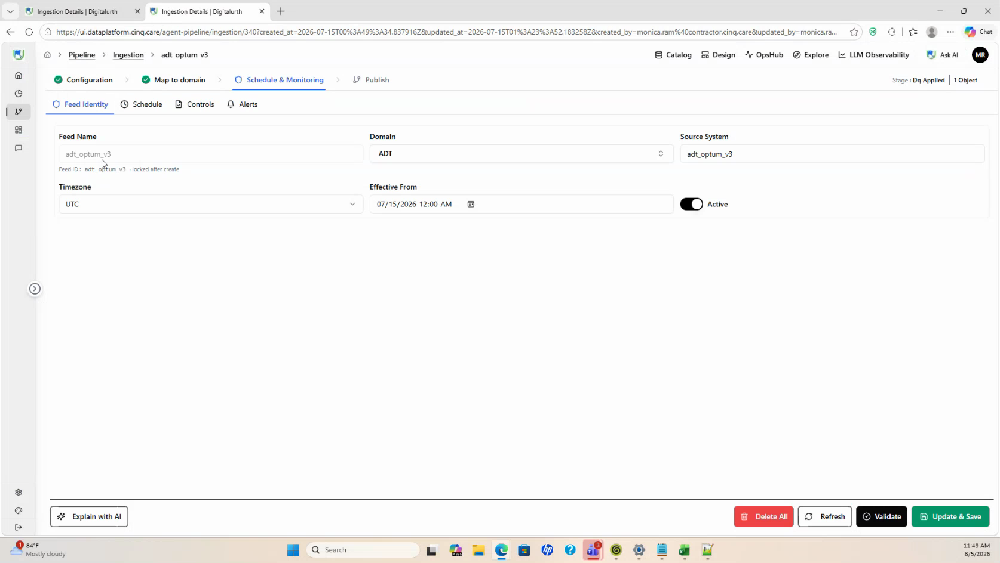

*16:02 — Schedule & Monitoring → Feed Identity*

**for the machine** — Fields: `feed_name` · `domain` · `source_system` · `timezone` (UTC) · `effective_from` · `active`.

### G2 — Schedule  `16:06`
Monica's ADT feed runs every fifteen minutes — the cadence that drove the compute choice back in step B. Fathullah's enrollment feeds are monthly.
The screen offers preset chips (daily, every 15 minutes, weekly, monthly), a manual cron field, and an **AI Cron Generator** that takes plain English or speech.

> “For me it's normally every daily run, for every 15 minutes… but I think for you it is monthly. So if it is going to schedule monthly, then it should be monthly when you guys start doing it.”
>
> — Monica Ram, 16:06

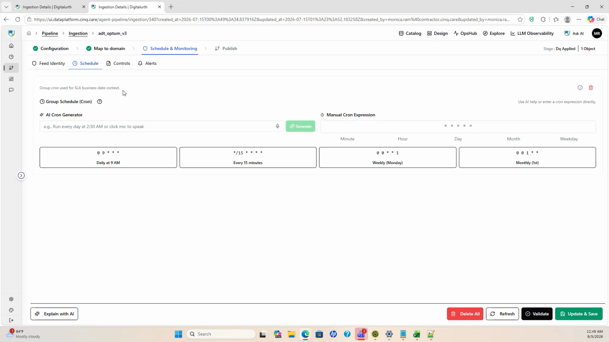

*16:06 — Schedule*

**for the machine** — Cron is per group. The AI generator accepts NL ("Run every day at 2:30 AM") and is backed by `/api/v1/tools/schedule.cron_from_nl/invoke` — visible in LLM Observability.

### G3 — Controls: pick three  `16:26`
Under Controls, Monica selects three every time: **on-time arrival**, **structural validation**, and **schema drift**.
Controls are grouped by what they guard — schedule and monitoring, inbound validation, pipeline outcomes — and each toggles independently.

> “In the controls you just have to select on-time arrival, structural validation and schema drift.”
>
> — Monica Ram, 16:26

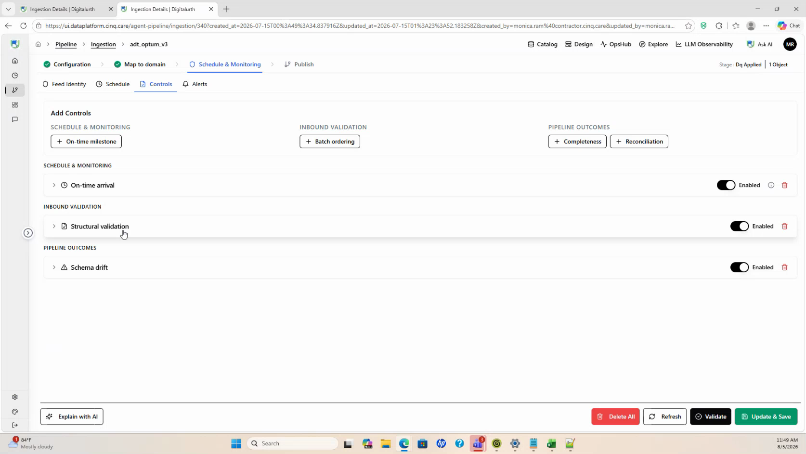

*16:26 — Controls: pick three*

**for the machine** — Control catalogue: on-time milestone · batch ordering · completeness · reconciliation · on-time arrival · structural validation · schema drift.

### G4 — Evaluation mode: periodic cut-off vs freshness  `16:31`
On-time arrival has an evaluation mode, and the choice is not cosmetic.
The normal setting is **periodic cut-off** — did the file arrive by the deadline. Monica uses **freshness** instead, because every ADT delivery is new entries, and what she needs to know is whether this delivery is one she has already seen.
Remember this choice. It is the direct cause of the re-run trap in step J5.

> “The evaluation mode — normally it will be periodic cut-off; for me [it's] freshness, because I'll be getting all new entries. So for me the freshness, like, is it the duplicate one? Did I already get this one?”
>
> — Monica Ram, 16:31

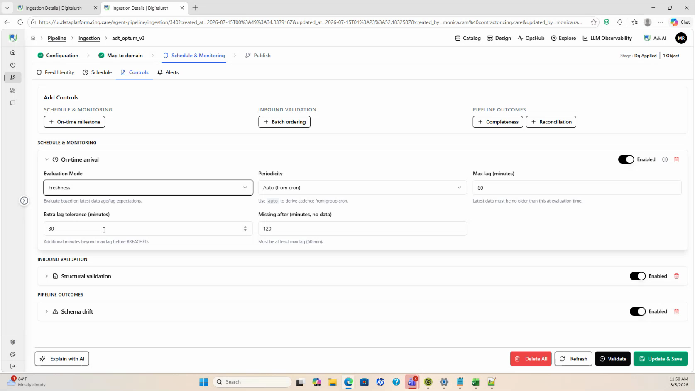

*16:31 — Evaluation mode: periodic cut-off vs freshness*

**for the machine** — `evaluation_mode`: Freshness · Periodic cut-off. With Freshness: `periodicity` auto from cron, `max_lag_minutes`=60, `extra_lag_tolerance`=30, `missing_after`=120.

### G5 — Alerts  `16:53`
Each control routes to a notification channel by breach severity, with a default fallback for anything left empty. Monica points at a Teams channel — the one on screen is `notification-testing`. Then Save.

> “Then the alert — you can select the default notification as like team channel over here. Notification testing… and you can just click on save.”
>
> — Monica Ram, 16:53

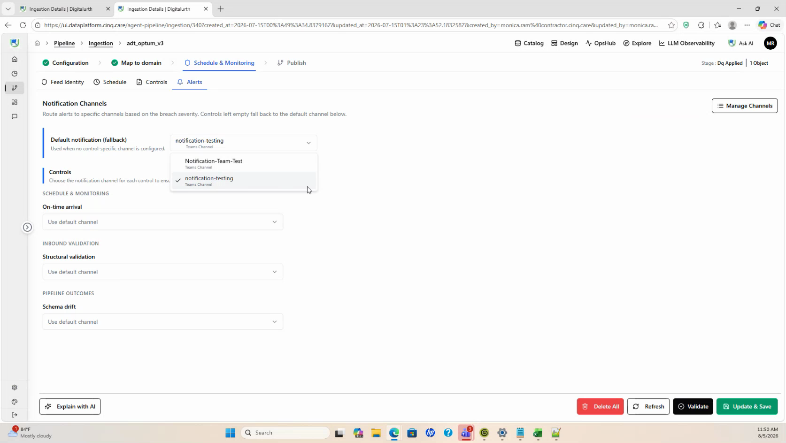

*16:53 — Alerts*

**for the machine** — Channels are managed centrally; per-control overrides fall back to the default channel.

### G6 — Publish — which is a git commit  `17:07`
Saving raises a publish prompt. You give it a name, and Monica is precise about what that name is: a **commit subject**.
The Publish tab keeps the history — branch, version, stage, author — and the action is literally *Publish to GitHub*. Configuring a feed in this UI produces a commit.

> “You will be having a publish option… you can just put it as whatever name you're gonna give, like just a commit subject. This is git commit.”
>
> — Monica Ram, 17:07

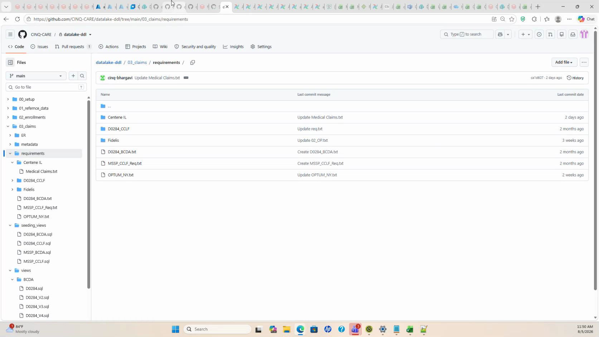

*17:07 — Publish — which is a git commit*

**for the machine** — Publish writes to a branch in `CINQ-CARE/dl-dev-project`. Publish History shows BRANCH · VERSION · STAGE · AUTHOR.

## H · Publish reaches GitHub, Airflow and Databricks
*The commit is the beginning of a deployment chain.*

### H1 — The commit lands in dl-dev-project/flows  `17:28`
The commit appears in a second repository — `dl-dev-project` — under `flows/`, organised by project id.
This is the boundary where the product hands off to ordinary engineering tooling.

> “Once you commit this, what will happen is — in the GitHub, if you go to the DL Dev project, here you'll be having flows.”
>
> — Monica Ram, 17:28

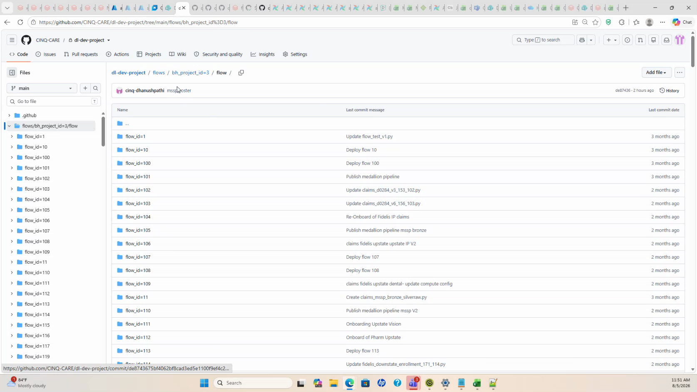

*17:28 — The commit lands in dl-dev-project/flows*

**for the machine** — Repo: `CINQ-CARE/dl-dev-project`. Paths: `flows/bh_project_id=N/…` and `pipelines/bh_project_id=N/…`.

### H2 — The DAG is a Python file — copy its name  `18:16`
In the flow folder, the DAG is a Python file, e.g. `claims_fidelis_downstate_dental_v3_344_237.py`. Copy the file name; it is needed twice more.

> “In the [flow] you select the Python file over here. You just select the name over here.”
>
> — Monica Ram, 18:16

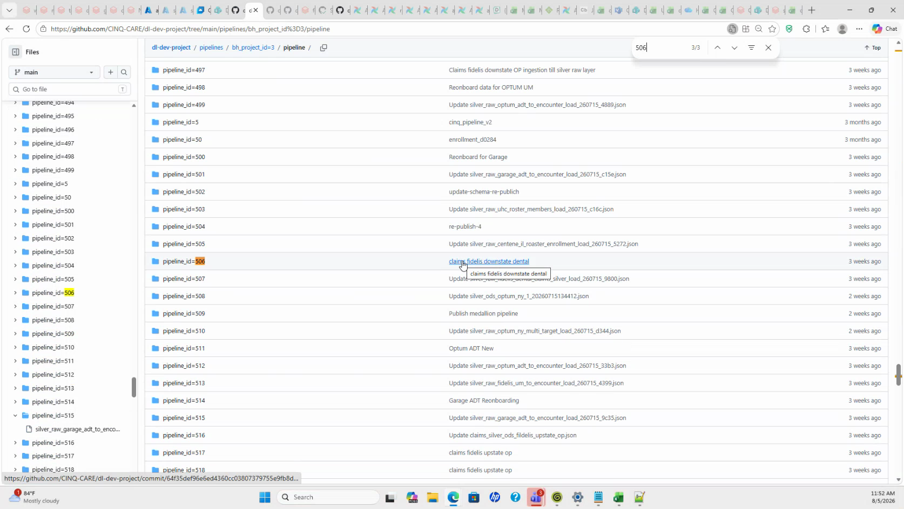

*18:16 — The DAG is a Python file — copy its name*

**for the machine** — DAG name = file name minus `.py`. It embeds the ingestion id and a version suffix.

### H3 — Find the pipeline IDs  `18:33`
Inside the DAG file are the pipeline IDs it calls — on the call, 506 and 507. Those are lookups into `pipelines/`.
Monica's reason for doing this is a habit worth naming: before running anything, she reads the generated pipelines to see whether they will break — or hands them to an AI to check.

> “If you want to check if the pipeline is not going to break, or you want to give to the AI to verify if the pipeline is going to work or not — you can check for the pipeline number. So you can see 506 and 507.”
>
> — Monica Ram, 18:33

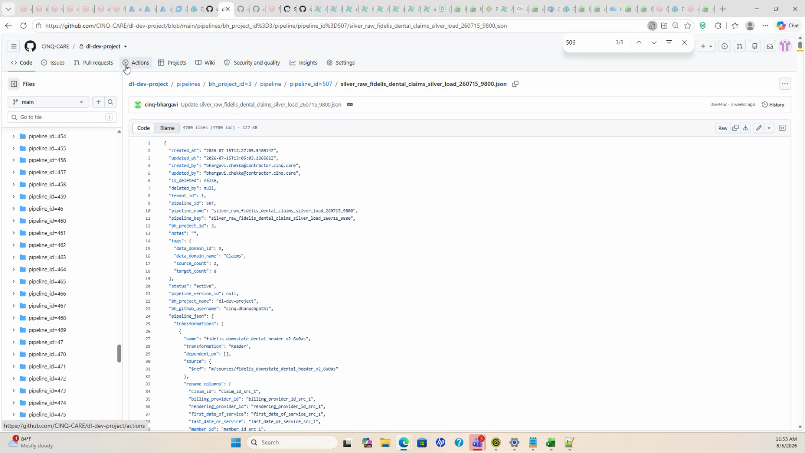

*18:33 — Find the pipeline IDs*

**for the machine** — Pipelines are versioned JSON under `pipelines/bh_project_id=N/`, referenced by numeric id from the DAG.

### H4 — 506 is landing→bronze, 507 is bronze→silver raw  `18:58`
The two IDs are the two generated hops. The first is the straight load into bronze. The second is the mapping — *how the terms will be changed*.
So the mapping authored back in step E is readable here, as a JSON pipeline, before it ever runs.

> “This is basically landing to bronze. And then 507 will be bronze to silver raw… 507 will be the mapping, like how the terms will be changed.”
>
> — Monica Ram, 18:58

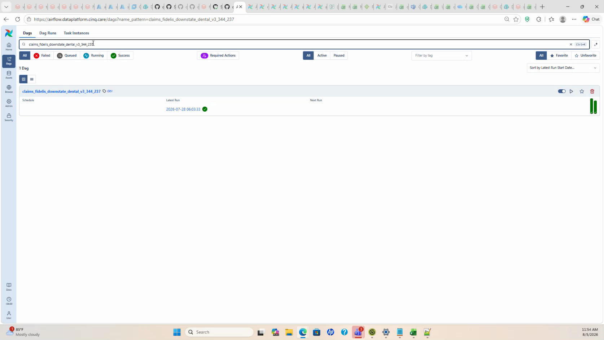

*18:58 — 506 is landing→bronze, 507 is bronze→silver raw*

**for the machine** — One pipeline JSON per medallion hop. Reviewing 507 is the cheapest way to verify a mapping.

### H5 — Actions → sync the DAG to Airflow  `19:57`
Back in `flows/`, with the file name copied, go to the repository's **Actions** tab. There is a workflow that syncs DAGs to Airflow.
Run it, choose the list, paste the DAG name, run the workflow. It takes about a minute.

> “You can click on actions over here and basically sync that to Azure Airflow… when you click on the run flow, you have to click the list, and then you just have to paste whatever DAG you have. It's going to take like one minute to sync the DAG.”
>
> — Monica Ram, 19:57

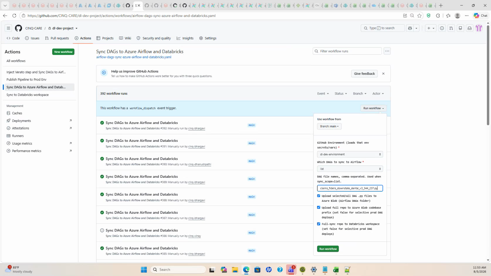

*19:57 — Actions → sync the DAG to Airflow*

**for the machine** — GitHub Actions workflow `airflow-dags-sync`, manually dispatched with the DAG name as input.

### H6 — And sync to the Databricks workspace  `20:31`
A second workflow pushes whatever is in GitHub into the Databricks workspace. Monica runs it deliberately even though it is meant to be automatic.
Her phrasing — *for my assurance* — is the honest version: the automation exists, and she does not fully trust it.

> “That should be doing the sync databricks. But for me, just for my assurance, I'll click on sync to Databricks workspace… Automatically, whatever is in the GitHub, it automatically syncs with the databricks.”
>
> — Monica Ram, 20:31

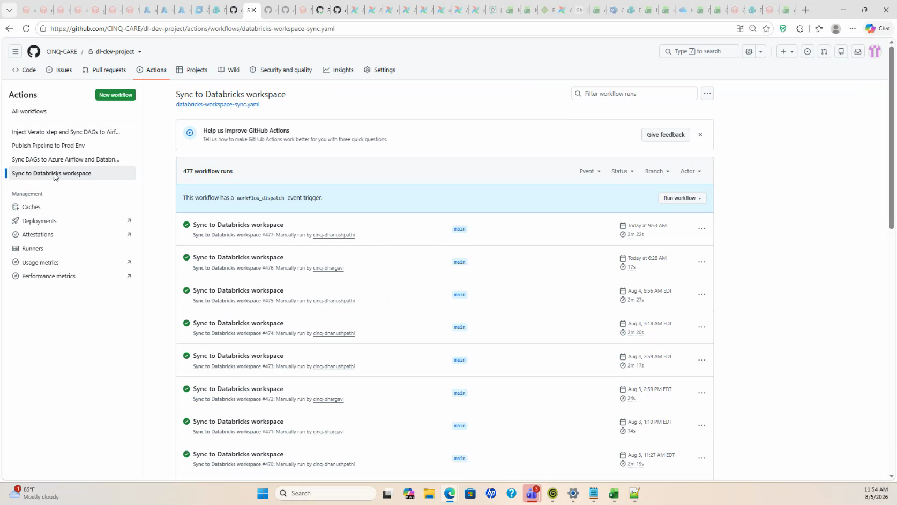

*20:31 — And sync to the Databricks workspace*

**for the machine** — Workflow `databricks-workspace-sync`. **GitHub is the source of truth; Databricks is a replica.** This fact drives step J3.

## I · Run it
*Six stages, in order, every time.*

### I1 — Find the DAG in Airflow  `21:07`
Open Airflow, paste the file name into the search, and remove the `.py`. The DAG appears — on the call, `claims_fidelis_downstate_dental`.
A newly synced DAG has no run history. The grid will be empty.

> “You just have to paste the file name, just remove PY at the end… It's a new one that you're going to run — it will be empty over here.”
>
> — Monica Ram, 21:07

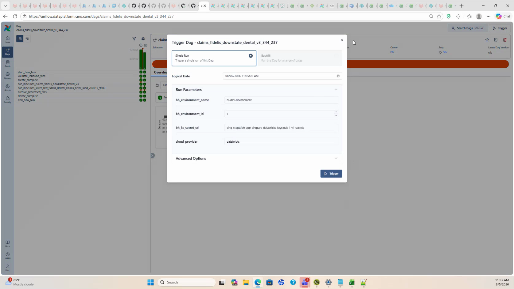

*21:07 — Find the DAG in Airflow*

**for the machine** — Airflow at `airflow.dataplatform.cinq.care`, searched by `name_pattern`.

### I2 — Trigger  `21:36`
Trigger the DAG. The dialog carries run parameters — environment name, environment id, a secret URL, a cinq parameter — and none of them need changing.

> “You just have to click on Trigger and trigger. It will start running.”
>
> — Monica Ram, 21:36

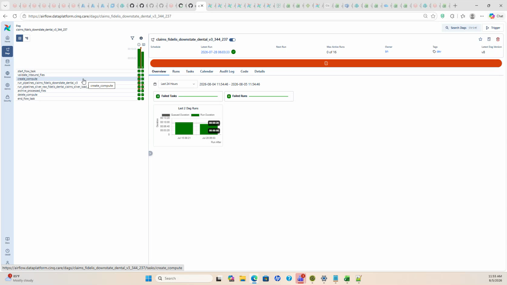

*21:36 — Trigger*

**for the machine** — Run params observed: `bh_environment_name`, `bh_environment_id`, `bh_bh_secret_url`, `cinq_parameter`.

### I3 — Stage 1 — find the file  `21:39`
The first task goes to the location configured in step C and matches the directory contents against the regular expression from step D.
If a matching file is there, the stage passes. This is where a wrong regex fails — at the very first task, before any compute is created.

> “The first step is it checks the place where you gave the file name… it will check with the regular expression that we have given it. If it is there, then this stage will be passed.”
>
> — Monica Ram, 21:39

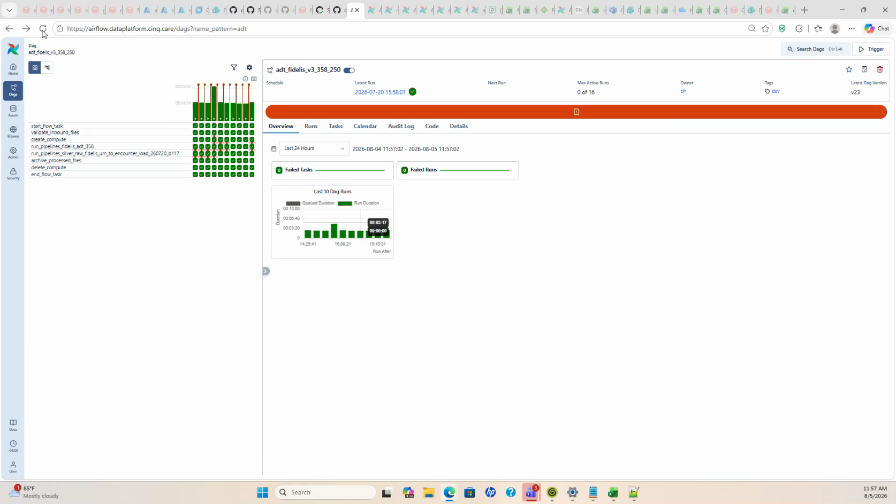

*21:39 — Stage 1 — find the file*

**for the machine** — Stage 1 is a validation gate. Failure here means location or regex, never data.

### I4 — Stage 2 — create compute  `22:04`
The cluster is created, or leased. Slow the first time; thirty to forty seconds when a cluster is already up. This is the payoff of the single-node-v2 choice from step B.

> “This create compute — it's going to take a little time in the starting. If some compute is already started running, it will take the help of that and it can run in 30 seconds or 40 seconds.”
>
> — Monica Ram, 22:04

*22:04 — Stage 2 — create compute*

### I5 — Stages 3 and 4 — landing→bronze, bronze→silver raw  `22:23`
The two generated pipelines run in order. If a silver ODS pipeline is configured, it appears as a further step after these.

> “The next pipeline is landing to bronze. This pipeline will be landing to bronze and this pipeline will be bronze to silver raw. If you have the silver ODS pipeline, there will be silver ODS pipeline also over here in the next step.”
>
> — Monica Ram, 22:23

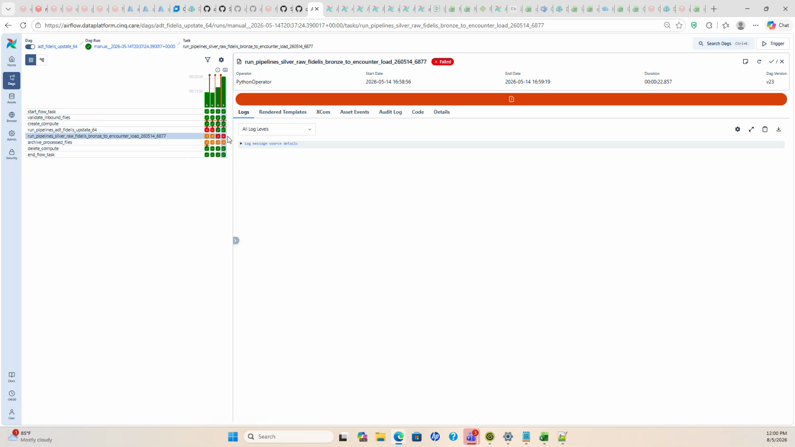

*22:23 — Stages 3 and 4 — landing→bronze, bronze→silver raw*

### I6 — Stage 5 — archive  `22:37`
Once the layers are done, the files in landing are moved to the archive folder. The landing folder is left clean for the next delivery.

> “After all these processes are done, you can see the files which are in the landing will be moved to the archive folders.”
>
> — Monica Ram, 22:37

*22:37 — Stage 5 — archive*

**for the machine** — Archive path is configured per object in the reader panel (`archive_file_path`).

### I7 — Stage 6 — delete compute, end  `22:51`
The compute is torn down and the flow ends. Drop another file in the same location and trigger again — the same DAG handles it.

> “Then the compute will be deleted and the flow will be ending. So again, you can put a different file in the same location and you can run the trigger again.”
>
> — Monica Ram, 22:51

*22:51 — Stage 6 — delete compute, end*

## J · When it fails
*Where the error actually is, and the two traps.*

### J1 — "There is some issue" — where do you look?  `23:05`
Fathullah asks the operator's real question. Monica's answer starts with what does *not* work.
Airflow's failed filter only tells you whether the most recent run failed. It does not give you a list of which runs failed, and it does not tell you where in the run the error was.

> “It basically checks for the last one, I guess. So it will show you if the last one is failed or not. It doesn't show you which one.”
>
> — Monica Ram, 23:05

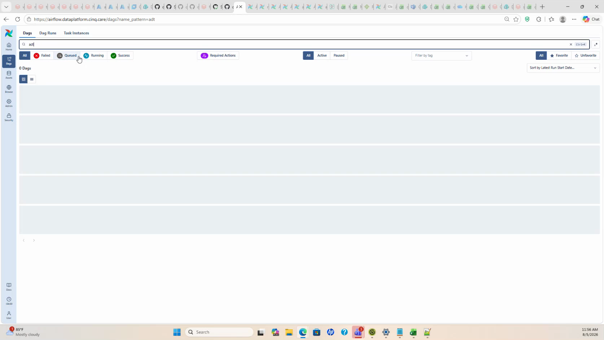

*23:05 — "There is some issue" — where do you look?*

**for the machine** — Airflow is the scheduler view. It is not the diagnostic surface.

### J2 — Databricks → Runs → the error message  `24:11`
The error lives in Databricks. Open Runs; it shows what is running, what passed and what failed, and carries the actual error message.
That message is what you read to make the fix.

> “Normally it doesn't exactly show where the error is. What you can do is you can go to the databricks… in the runs, it shows you everything, if it is a fail or pass. The error message will be over here.”
>
> — Monica Ram, 24:11

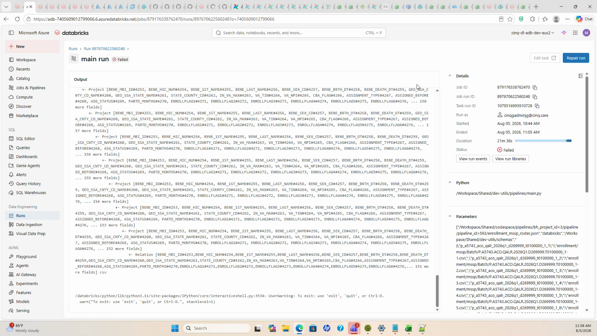

*24:11 — Databricks → Runs → the error message*

**for the machine** — Two systems for one failure: Airflow says *that* it failed, Databricks says *why*.

### J3 — Trap one — fixing it in Databricks  `24:46`
What people do, Monica says, is edit the pipeline directly in Databricks and re-trigger the Airflow DAG. That works, because Airflow runs whatever pipeline is in Databricks.
It works right up until somebody runs the Databricks sync. Then GitHub overwrites Databricks and the fix is gone. She calls it a double job.

> “They change things in the databricks and directly run the Airflow DAG… But what happens is, when someone clicks on the sync to databricks, whatever is in the GitHub again replaces in the databricks — so that will be a double job for you.”
>
> — Monica Ram, 24:46

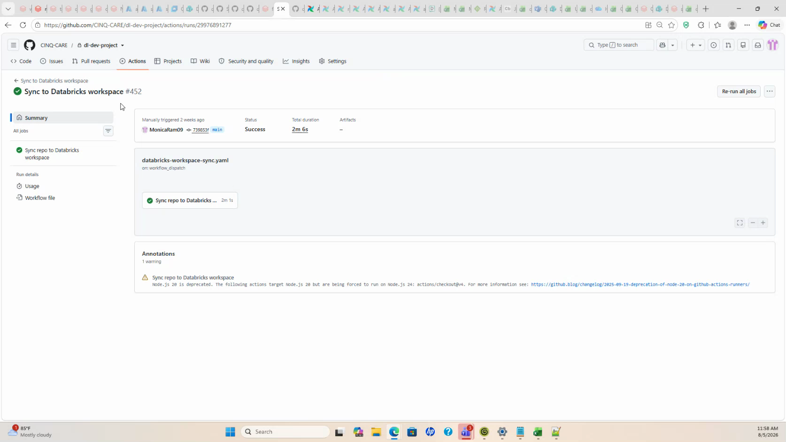

*24:46 — Trap one — fixing it in Databricks*

**for the machine** — **Databricks edits are not durable.** Any subsequent `databricks-workspace-sync` discards them.

### J4 — Monica's practice — fix in GitHub, commit, sync  `25:14`
Her own routine avoids the trap entirely: change the pipeline in GitHub, commit, then run sync-to-Databricks-workspace. The change is now in both places, and the next Airflow trigger runs the new pipeline.
She is emphatic that the sync is not optional. Skip it and Airflow re-runs the old pipeline.

> “What I do personally is, in the GitHub itself I'll change the things and commit, and then I'll click on sync to Databricks workspace… You for sure have to sync. If you don't sync it, then it's going to run the same pipeline again — the previous pipeline.”
>
> — Monica Ram, 25:14

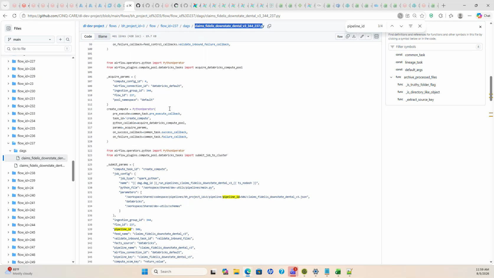

*25:14 — Monica's practice — fix in GitHub, commit, sync*

**for the machine** — Correct fix loop: edit pipeline JSON in GitHub → commit → run `databricks-workspace-sync` → trigger the Airflow DAG.

### J5 — Trap two — the re-run fails at a layer that already worked  `26:22`
This is the subtlest thing on the call, and it follows directly from the freshness control chosen in step G4.
Suppose the run broke at silver raw, but bronze had already completed. You fix silver raw and re-trigger. The DAG now fails at **bronze** — because the freshness control sees that this file has already been processed, and refuses it as a duplicate.
The control that protects you from double-loading is the same control that blocks your retry.

> “It automatically fails in the bronze layer itself, because it says this file has already been processed.”
>
> — Monica Ram, 26:22

*26:22 — Trap two — the re-run fails at a layer that already worked*

**for the machine** — Freshness is evaluated against the input/control tables, not against the failed stage. A partial success poisons the retry.

### J6 — The fix — clear the previous run from the control table  `27:01`
The way through is to delete the rows belonging to the previous DAG run from the control table — the input registry. Then the file is unseen again and the DAG can run clean.
Monica keeps a script for this. It is run by hand, in the Databricks SQL editor.

> “What we do is we have to delete the files which are related to the previous DAG in the control table, or in the input table.”
>
> — Monica Ram, 27:01

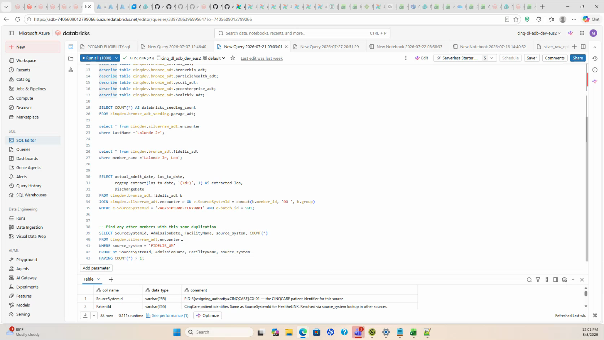

*27:01 — The fix — clear the previous run from the control table*

**for the machine** — Manual DELETE against the control/input registry, executed in the Databricks SQL editor. There is no UI action for this.

## K · Who owns this
*The part of the call that is not about buttons.*

### K1 — Who fixes the platform itself  `27:22`
Fathullah raises the question the whole call has been circling: when the vendor team leaves, who does any of this?
Monica draws the line clearly. If a *pipeline* breaks, that is theirs to fix. If the *UI* breaks, it is not — they have no access to it, even while working in it daily. The vendor's backend team owns it, and she names an offshore team.
She has hit this before and had to escalate rather than fix.

> “Even if I'm working for Digitalurth, I don't own the UI. The people who are working on the backend, they have to make the changes for the UI.”
>
> — Monica Ram, 27:22

*27:22 — Who fixes the platform itself*

**for the machine** — Support boundary: pipelines and mappings = client. UI and platform = vendor. No client access to the UI codebase.

### K2 — What this call was worth  `29:26`
Fathullah's closing assessment is the clearest statement of the problem the platform exists to solve — and of what is still missing around it.
He also names the limit: this is one feed's process. Enrollment, claims and ADT each have a different script, a different mapping, and a different process.

> “What, 30 minutes you shared, would take me a couple of days to understand and process a couple of files… On the enrollment it's a different script, different mapping. On the ADT it's a different script, different mapping, different process. So individual process is different.”
>
> — Monica Ram, 29:26

**for the machine** — The onboarding path is generic; the mapping and post-SQL per domain are not. Domain-specific knowledge remains tribal.

---

## What was mis-heard
The auto-transcript garbles names consistently. Corrected throughout above; the mapping is here so quotes trace back to the VTT.

| Actual | As transcribed | What it is |
|---|---|---|
| **ingestion** | `ignition / injection` | The onboarding object. One per feed group. |
| **Fidelis** | `Federalist / Fed LS` | The payer. Fidelis NY, upstate and downstate. |
| **ADT** | `ADPs / A.D.T.` | Admission-discharge-transfer feeds, 15-minute cadence. |
| **NDJSON** | `adjacent / ND Jason` | Newline-delimited JSON — the BCDA/FHIR shape. |
| **Airflow** | `8 flow / a flow / sirflow` | The scheduler at airflow.dataplatform.cinq.care. |
| **ODS** | `audience / audio` | Silver ODS, the canonical layer. |
| **sink** | `sync there` | The target connection. |
| **blob storage** | `block storage` | Azure landing container. |
| **Dhanushpathi** | `Danishpati` | A colleague; appears as a trace user in LLM Observability. |
| **check** | `cheque` | Transcription artefact throughout. |

---

*Quotes are lightly condensed for readability — filler, false starts and the listener's acknowledgements removed, mis-transcribed proper nouns corrected per the table above. No claim, number or instruction has been changed.*
