# DigitalUrth Demo Walkthrough

_Extracted from `Datalake Sprint Review and Demo-20260429_093538-Meeting Recording.mp4` (29 Apr 2026, 53:49). Product: BigHammer **DigitalUrth** agent workbench (`ui.dev.az.bighammer.ai`). Presenter: Bhargavi Chekka. Datasets: Centene GA Risk enrollment (CSV) and D0284 claims (FHIR NDJSON). Runtime: Azure Blob landing → Databricks Unity Catalog._

Interactive version with all 334 frames: `digitalurth-demo-walkthrough.html` (same folder). Key screenshots: `frames/`. Transcript: `transcript.md`.

## Workflow map

One **ingestion group** = one source path + one data domain + one template set. Inside a group the tab strip is the workflow and tabs unlock as the stage advances (`allowed_next_steps` from the server):

```
Ingestion list ─ Add New Ingestion ─▶ Configuration (Discover → Reader/Writer → Confirm & Profile)
   ─▶ Profile (field profiles, quality score) ─▶ Data source review (PK · nullable · PII · Mark reviewed → Confirm metadata & materialize)
   ─▶ Map to domain (Input requirement → LLM Requirement spec → Designer DAG) ─▶ Publish (landing_bronze · bronze_silverraw)
   ─▶ runs on Databricks ─▶ verify in Catalog Explorer ─▶ Bronze Layer Validation Report (Python harness)
```

Stage values seen: `NOT STARTED` → `DATASOURCE SUBMITTED` → `Profiling…` → `Metadata OK` → `landing bronze`

## Demo timeline

| Time | Chapter | What happens |
|---|---|---|
| 00:00 | Pre-demo framing | Scope: two datasets (Centene GA enrollment CSV, D0284 claims NDJSON), landing → silver raw; files placed in landing manually. |
| 01:58 | Agenda & architecture | Medallion overview slide; silver-raw enrollment model slide. |
| 04:21 | Create ingestion group | Home → Ingestion list → Add New Ingestion (project, Enrollment domain, CSV workflow, Databricks compute, Multi Pipeline Flow V2, File to DB Ingestion V3, azure_blob → azure_unity_catalog). |
| 10:27 | Configure & discover | Base path → Discover → object Reader/Writer (bronze_enrollment.centene_ga_risk_enrollment_1, Append) → Confirm & Profile. |
| 14:28 | Profile | Analyzing objects → field profiles → LOB (score 70) and MEMBER_CITY (score 100) drill-downs. |
| 17:07 | Data source review | Agent-recommended PK/nullability/PII/descriptions; Mark review complete; Confirm fails with DB_6001 (vector type missing). |
| 19:45 | Map to domain | Input requirement → Requirement spec (56 completed / 33 skipped) → Designer DAG #543; discussion of 'skipped' semantics. |
| 28:36 | Publish & Databricks | Publish history (landing_bronze, bronze_silverraw); bronze table with metadata/partitions; silver members & members_addresses; ZIP and name-suffix questions. |
| 36:53 | Claims variant | Claims D0248 config (3 NDJSON objects); bronze raw JSON + flattened d0284 views; silverraw_claims header/adjudication; BCDA vs CCLF discussion. |
| 48:16 | Validation report | Bronze Layer Validation Report: counts pass, presence & field values fail on numeric-vs-string typing. |
| 50:53 | Wrap-up | Environment plan (dev → prod), BA training, baseline feed for QA; thanks. |

## Context slides

Agenda, medallion architecture and the silver-raw target model shown before the live demo.

### 02:05 · Agenda slide

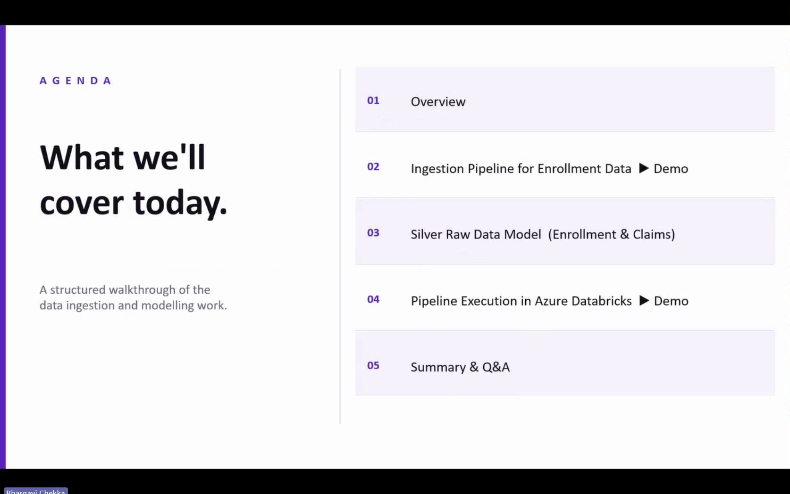

- **Where:** `PowerPoint (shared screen)`  ·  **Type:** slide  ·  frame `t0125`
- **What is on screen:** Opening slide of the sprint review deck listing the four demo parts: an overview of the medallion architecture, creating a new ingestion pipeline for Enrollment (Centene GA Risk, CSV) and Claims (D0284, NDJSON), a walk through the silver-raw data model, and executing the authored pipelines on Azure Databricks.
- **Visible elements:** Title 'Agenda'; Four numbered items covering architecture, ingestion pipeline creation, silver data model, Databricks execution and Q&A
- **Role in the flow:** Sets the frame for the whole session: the demo covers landing → bronze → silver-raw only. Files are placed in the landing zone manually today; SFTP → landing automation is out of scope.
- **Said in the demo:** [02:22] “For enrollment I'll be taking Centene Georgia Risk as a source, which is CSV, and for claims D0284 because it is NDJSON — I wanted to cover different data types.”
- **Note:** Silver ODS and gold are not demoed; presenter confirms scope is 'landing to silver raw'.

### 03:13 · Medallion architecture overview

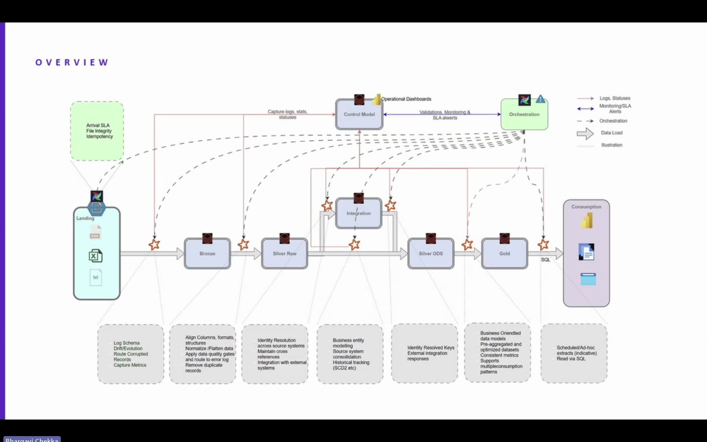

- **Where:** `PowerPoint (shared screen)`  ·  **Type:** slide  ·  frame `t0193`
- **What is on screen:** End-to-end architecture diagram: Landing (CSV/XLS/TXT with arrival SLA, file integrity, idempotency) → Bronze → Silver Raw → Integration → Silver ODS → Gold → Consumption (Power BI, extracts, SQL). A Control Model captures logs, stats and statuses and feeds Operational Dashboards; an Orchestration block issues validations, monitoring and SLA alerts. Each layer has a responsibilities call-out (log schema drift, normalize/flatten, identity resolution, SCD2 history, business-oriented models, scheduled/ad-hoc extracts).
- **Visible elements:** Layer boxes Landing → Bronze → Silver Raw → Silver ODS → Gold → Consumption; Control Model + Orchestration boxes; Legend: logs/statuses, monitoring/SLA alerts, orchestration, data load; Per-layer responsibility notes
- **Role in the flow:** This is the target-state map. The DigitalUrth UI shown afterwards authors the first two hops (landing→bronze, bronze→silver raw); the Control Model corresponds to the bronze metadata columns and publish history seen later.
- **Said in the demo:** [03:12] “I have already placed the files in Azure Blob Storage, which is our landing zone. From landing to bronze I'll be creating a pipeline… and from bronze to silver another pipeline, and I'll show how the data looks at each layer.”
- **Note:** Useful as the canonical vocabulary for stage names used in the UI: 'landing_bronze' and 'bronze_silverraw' publish stages.

### 04:16 · Silver Raw data model — Enrollment

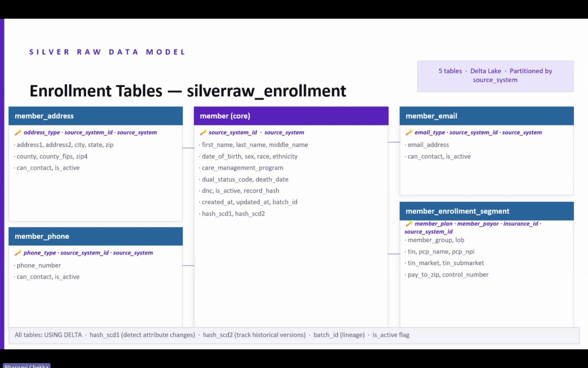

- **Where:** `PowerPoint (shared screen)`  ·  **Type:** slide  ·  frame `t0256`
- **What is on screen:** Entity diagram for schema silverraw_enrollment: five Delta tables partitioned by source_system. member (core) keyed by source_system_id + source_system with names, DOB, sex, race, ethnicity, care_management_program, dual_status_code, death_date, dnc, is_active, record_hash, created_at/updated_at/batch_id, hash_scd1/hash_scd2. Satellites: member_address (address_type key; address1/2, city, state, zip, county, county_fips, zip4, can_contact, is_active), member_phone (phone_type; phone_number), member_email (email_type; email_address), member_enrollment_segment (member_plan, member_payor, insurance_id; member_group, lob, tin, pcp_name, pcp_npi, tin_market, tin_submarket, pay_to_zip, control_number).
- **Visible elements:** 5 table cards with key rows; Footer: USING DELTA · hash_scd1 (detect attribute changes) · hash_scd2 (track historical versions) · batch_id (lineage) · is_active flag
- **Role in the flow:** These five tables are exactly the TARGET list selected later in Map to domain (members, members_phones, members_emails, members_enrollment_segments, members_addresses) and the tables inspected in Databricks at the end.
- **Said in the demo:** [04:00] “This is the silver data model — I'll come back to this slide later.”
- **Note:** Note zip4 exists as a column; the ZIP 5 vs 9 standardisation question raised at 33:58 was left open ('we will get back to you').

## 1 · Create an ingestion group

Home → Pipeline › Ingestion → Add New Ingestion. One-time authoring setup that binds project, domain, templates and connections.

### 04:21 · DigitalUrth home

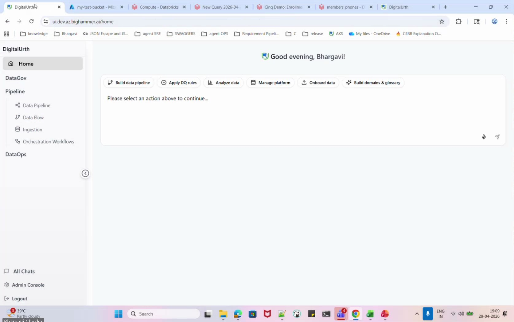

- **Where:** `ui.dev.az.bighammer.ai/home`  ·  **Type:** DigitalUrth UI  ·  frame `t0261`
- **What is on screen:** Landing page of the DigitalUrth agent workbench. A conversational panel greets the signed-in user ('Good evening, Bhargavi!') and offers action chips — Build data pipeline, Apply DQ rules, Analyze data, Manage platform, Onboard data, Build domains & glossary — above a prompt box with mic and send icons ('Please select an action above to continue…'). Left nav groups: DataGov; Pipeline (Data Pipeline, Data Flow, Ingestion, Orchestration Workflows); DataOps; footer links All Chats, Admin Console, Logout.
- **Visible elements:** Action chips (6); Prompt input with voice + send; Sidebar: Home · DataGov · Pipeline › Data Pipeline / Data Flow / Ingestion / Orchestration Workflows · DataOps; All Chats · Admin Console · Logout
- **Role in the flow:** Entry point. The demo bypasses the chat agent and navigates Pipeline › Ingestion directly; the chips reveal the product's broader agent surface (DQ rules, glossary, platform management) that were not demoed.
- **Said in the demo:** [04:50] “Before creating an ingestion pipeline, we have to choose a project… and a domain.”
- **Note:** The collapsed icon rail seen on later screens maps to these same sidebar entries (Ingestion is the highlighted database icon).

### 04:49 · Ingestion groups list

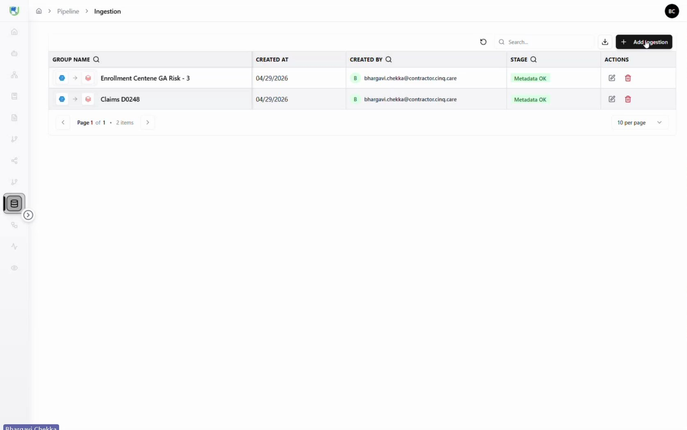

- **Where:** `/agent-pipeline/ingestion`  ·  **Type:** DigitalUrth UI  ·  frame `t0289`
- **What is on screen:** Table of ingestion groups with columns GROUP NAME, CREATED AT, CREATED BY, STAGE, ACTIONS (edit, delete). Two pre-built groups exist: 'Enrollment Centene GA Risk - 3' and 'Claims D0248', both created 04/29/2026 by bhargavi.chekka@contractor.cinq.care, both at stage 'Metadata OK'. Toolbar: refresh, search, download, '+ Add Ingestion'. Pagination '10 per page'.
- **Visible elements:** Group rows with source→target connection icons; STAGE pill (Metadata OK / Profiling…); Add Ingestion button; Row actions edit/delete
- **Role in the flow:** An 'ingestion group' is the unit of work: one source path + one domain + one pipeline template set. Clicking a row opens the tabbed group workspace (Configuration → Profile → Data source review → Map to domain → Catalog → Publish → OpsHub → Explore). The STAGE column is the state machine surfaced in the list.
- **Said in the demo:** [04:21] “Before this demo I have already created one for enrollment and one for claims. For our understanding I'll create one more time.”
- **Note:** Observed stage values across the demo: NOT STARTED → DATASOURCE SUBMITTED → Profiling… → Metadata OK → landing bronze.

### 05:23 · Add New Ingestion — project & domain

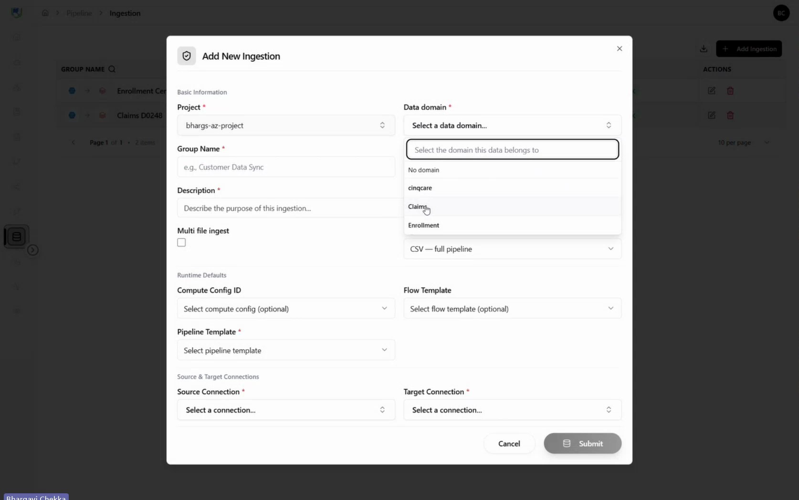

- **Where:** `/agent-pipeline/ingestion (modal)`  ·  **Type:** DigitalUrth UI  ·  frame `t0323`
- **What is on screen:** Modal 'Add New Ingestion'. Basic Information: Project (bhargs-az-project), Data domain (dropdown open: No domain, cinqcare, Claims, Enrollment), Group Name (placeholder 'e.g., Customer Data Sync'), Description, Multi file ingest checkbox, Ingestion workflow (CSV — full pipeline). Runtime Defaults: Compute Config ID, Flow Template, Pipeline Template. Source & Target Connections: Source Connection, Target Connection. Cancel / Submit.
- **Visible elements:** Project select; Data domain select with search 'Select the domain this data belongs to'; Group Name, Description; Multi file ingest; Ingestion workflow; Compute Config ID, Flow Template, Pipeline Template; Source/Target Connection
- **Role in the flow:** Domain is the context carrier: rules configured at domain level (e.g. member_key is the primary key for Enrollment) are inherited by every data source tagged with that domain and used later when the engine recommends rules and mappings.
- **Said in the demo:** [04:50] “A project is where the data sources are, and it links to a connection. The domain gives context — e.g. claims rules for the claims domain… whatever rule we give at domain level is inherited by all data sources tagged with that domain.”
- **Note:** Project is a required binding to connections; domains available: cinqcare, Claims, Enrollment.

### 06:57 · Landing zone — Azure Blob container

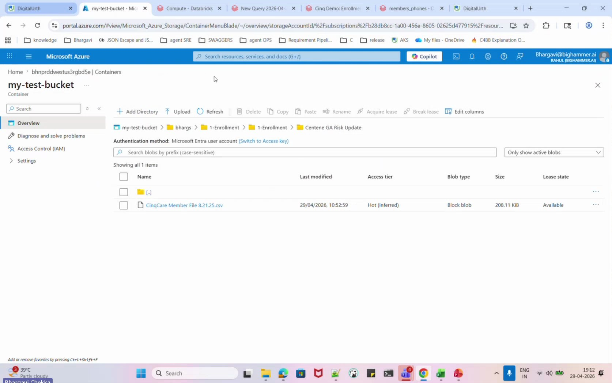

- **Where:** `Azure portal › Storage container 'my-test-bucket'`  ·  **Type:** external  ·  frame `t0417`
- **What is on screen:** Azure Storage container view showing the landing-zone folder with the source CSV 'CinqCare Member File 8.21.25.csv' (208.11 KB) and its metadata columns (Name, Modified, Access tier, Blob type, Size, Lease state). Path structure bhargs/1-Enrollment/1-Enrollment/Centene GA Risk Update/.
- **Visible elements:** Container breadcrumb; Blob list with size/tier; Upload / Add Directory toolbar
- **Role in the flow:** Shows where 'Base Path' in the Configuration tab points. Today the file is dropped here manually; SFTP-to-landing automation is a later step.
- **Said in the demo:** [06:36] “Here I will be loading only one single file… so I'm not going to choose multi file, and since the file type is CSV I'm choosing the CSV profile.”
- **Note:** Landing = Azure Blob (connection 'azure_blob'); target = Databricks Unity Catalog (connection 'azure_unity_catalog').

### 07:24 · Add New Ingestion — runtime templates

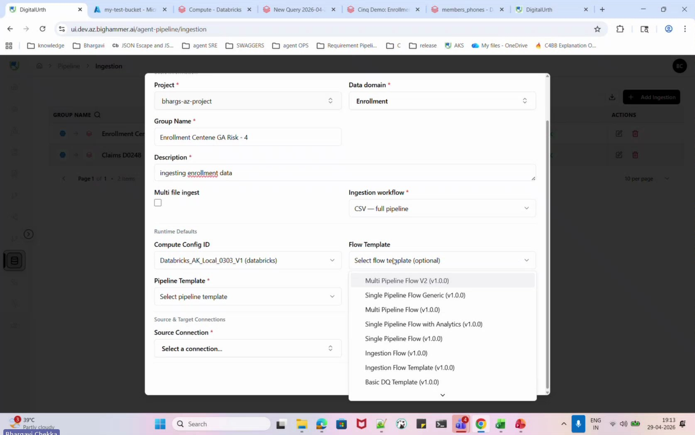

- **Where:** `/agent-pipeline/ingestion (modal)`  ·  **Type:** DigitalUrth UI  ·  frame `t0444`
- **What is on screen:** Same modal, now filled: Data domain = Enrollment, Group Name = 'Enrollment Centene GA Risk - 4', Description 'ingesting enrollment data', Ingestion workflow 'CSV — full pipeline', Compute Config ID 'Databricks_AK_Local_0303_V1 (databricks)'. Flow Template dropdown open listing: Multi Pipeline Flow V2 (v1.0.0), Single Pipeline Flow Generic, Multi Pipeline Flow, Single Pipeline Flow with Analytics, Single Pipeline Flow, Ingestion Flow, Ingestion Flow Template, Basic DQ Template.
- **Visible elements:** Compute Config ID (Databricks cluster config used for profiling on an ~8 MB sample); Flow Template list (8 versions); Pipeline Template (required)
- **Role in the flow:** Flow template = orchestration of the run (create cluster → run job → terminate cluster). Pipeline template = orchestration of Spark transformations inside the job (which transform runs first, then next). Both are reusable building blocks, versioned.
- **Said in the demo:** [07:24] “Any data pipeline… we create a cluster, run the pipeline, and once the job is completed terminate the cluster. The multi-pipeline flow template does that. The pipeline template drives the orchestration of the Spark job transformations.”
- **Note:** Profiling runs on a sample of ~8 MB on the chosen Databricks cluster.

### 09:06 · Add New Ingestion — completed form

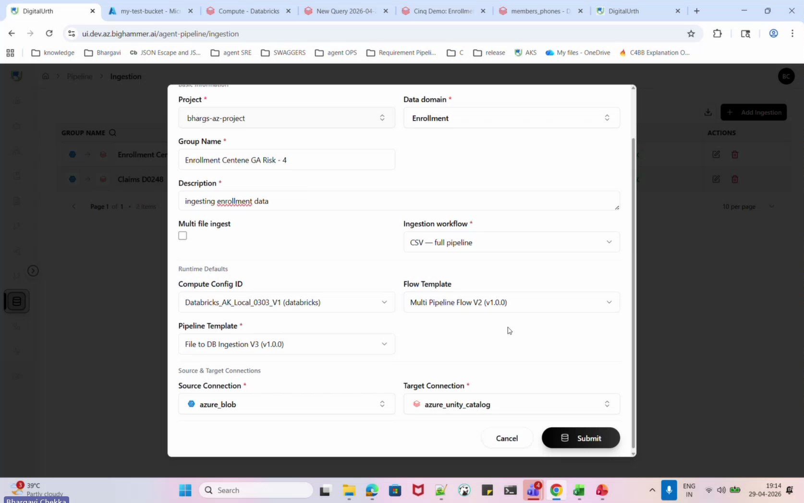

- **Where:** `/agent-pipeline/ingestion (modal)`  ·  **Type:** DigitalUrth UI  ·  frame `t0546`
- **What is on screen:** All fields set: Project bhargs-az-project · Domain Enrollment · Group 'Enrollment Centene GA Risk - 4' · CSV — full pipeline · Compute Databricks_AK_Local_0303_V1 · Flow Template 'Multi Pipeline Flow V2 (v1.0.0)' · Pipeline Template 'File to DB Ingestion V3 (v1.0.0)' · Source Connection azure_blob · Target Connection azure_unity_catalog. Submit button active.
- **Visible elements:** Pipeline Template = File to DB Ingestion V3; Source azure_blob (blob icon); Target azure_unity_catalog (Databricks icon); Submit
- **Role in the flow:** Submitting creates the group and opens its workspace at stage NOT STARTED. This is the one-time authoring setup; once published, the pipeline runs on a schedule in production.
- **Said in the demo:** [09:08] Q (Shandy): “In production all of this runs automated — is this a one-time setup?” A: “Yes… at the end there is a publish where we configure the schedule. This is an authoring UI.”
- **Note:** Connections carry secrets: blob container name + secret for source; workspace URL, workspace ID and token for the Unity Catalog target.

### 09:14 · Preparing ingestion details

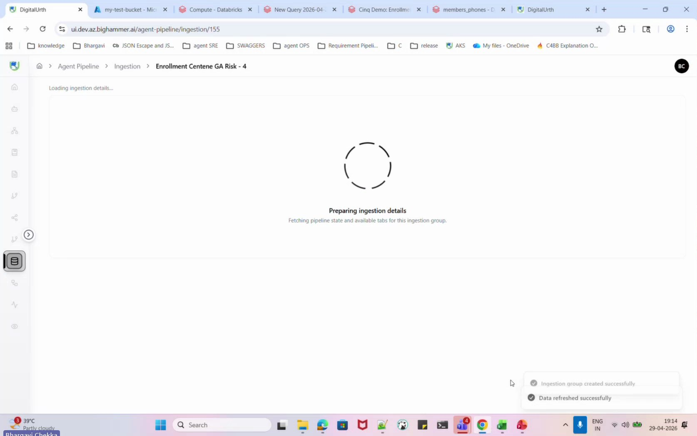

- **Where:** `/agent-pipeline/ingestion/155`  ·  **Type:** DigitalUrth UI  ·  frame `t0554`
- **What is on screen:** Transitional state after Submit: full-page spinner with 'Preparing ingestion details…' followed by a toast 'Ingestion group created successfully'. The URL now carries the new group id (155).
- **Visible elements:** Spinner; Success toast
- **Role in the flow:** Bridges creation → Configuration tab of the new group.
- **Said in the demo:** [09:08] “While this is being created, if anyone has any questions I can take them.”

## 2 · Configure · discover objects

Configuration tab: point at the landing-zone path, discover files, set reader/writer per object, confirm & profile.

### 10:27 · Configuration — Discover objects (empty)

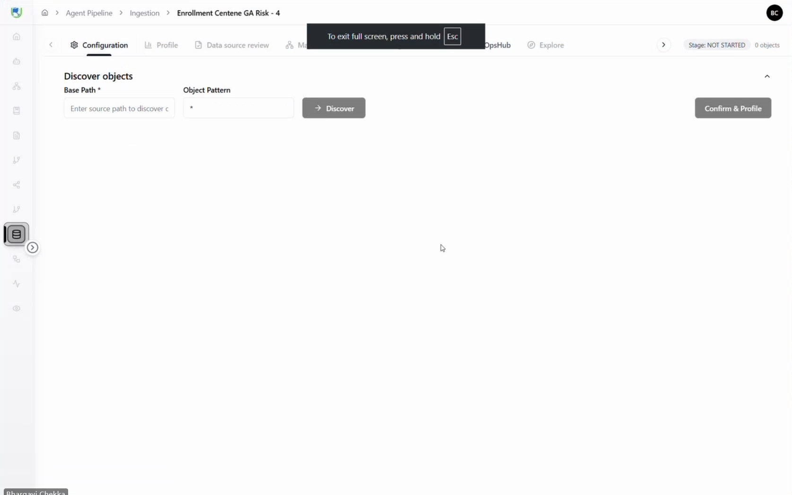

- **Where:** `/agent-pipeline/ingestion/155 · Configuration`  ·  **Type:** DigitalUrth UI  ·  frame `t0627`
- **What is on screen:** Group workspace for 'Enrollment Centene GA Risk - 4'. Tab strip: Configuration · Profile · Data source review · Map to domain · Catalog · Publish · OpsHub · Explore; right side shows 'Stage: NOT STARTED · 0 objects'. The Configuration panel 'Discover objects' has Base Path* (bhargs/1-Enrollment/…), Object Pattern (*), a black 'Discover' button, 'Reset' and a disabled 'Confirm & Profile'. Below, an empty objects table with Search, download and '+ Add Object'.
- **Visible elements:** Tab strip (8 tabs, later ones disabled until stage advances); Stage chip; Base Path / Object Pattern / Discover / Reset / Confirm & Profile; Objects table + Add Object
- **Role in the flow:** Step 1 of configuration: tell the agent where the files are. Discover lists matching files; each becomes an 'object' that gets a reader and writer configuration.
- **Said in the demo:** [10:46] “She's giving the location of the landing zone to say 'I have a file available here, can you onboard it'. The agent starts discovering what files are available.”
- **Note:** Tabs are gated by the server's allowed_next_steps (see Data source review footnote).

### 11:28 · Discovered objects

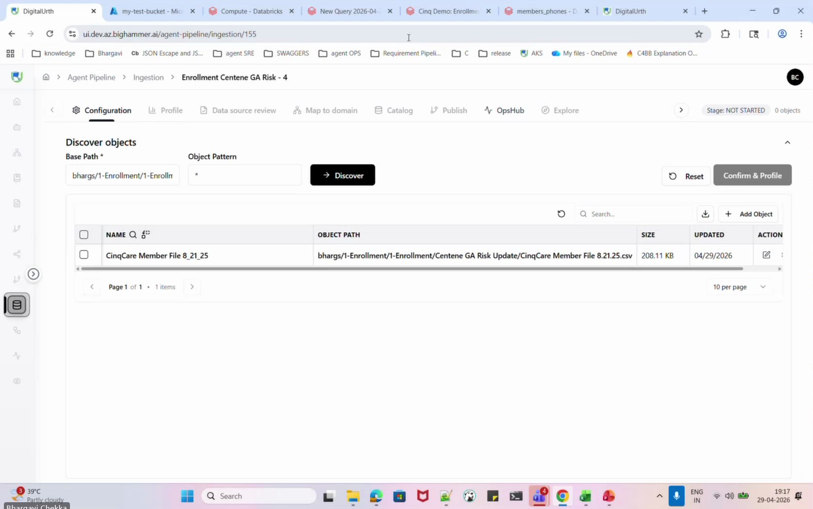

- **Where:** `/agent-pipeline/ingestion/155 · Configuration`  ·  **Type:** DigitalUrth UI  ·  frame `t0688`
- **What is on screen:** After Discover: the objects table lists one row — 'CinqCare Member File 8_21_25' with OBJECT PATH bhargs/1-Enrollment/1-Enrollment/Centene GA Risk Update/…, SIZE, UPDATED and ACTIONS (edit, settings ⚙, delete). Checkbox column for bulk selection; 'Confirm & Profile' becomes available once objects are configured.
- **Visible elements:** Object row with path; Per-row settings (opens Object Configuration); Page 1 of 1 · 1 item
- **Role in the flow:** Each discovered file = one object. The ⚙ action opens the Reader/Writer drawer where the agent's inferred file properties are shown and the bronze target is named.
- **Said in the demo:** [10:46] “It identified that there is one file available here — the CinqCare member file. Click the settings icon to see more about the file.”

### 11:41 · Object Configuration — Reader

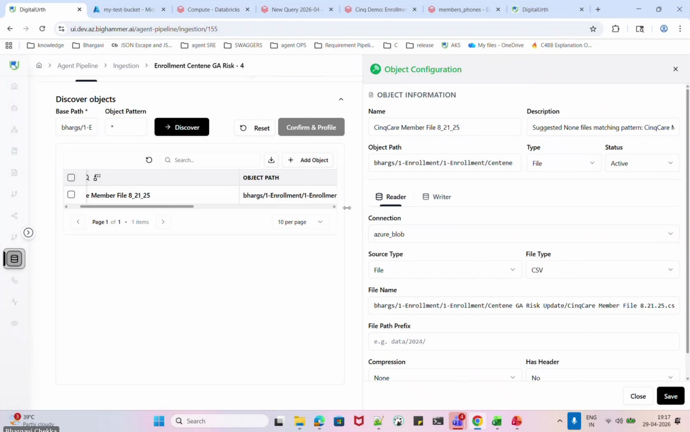

- **Where:** `/agent-pipeline/ingestion/155 · Configuration › Object Configuration drawer`  ·  **Type:** DigitalUrth UI  ·  frame `t0701`
- **What is on screen:** Right-hand drawer 'Object Configuration'. OBJECT INFORMATION: Name 'CinqCare Member File 8_21_25', Description 'Suggested None files matching pattern…', Object Path, Type File, Status Active. Tabs Reader | Writer. Reader: Connection azure_blob; Source Type File; File Type CSV; File Name (full blob path to CinqCare Member File 8.21.25.csv); File Path Prefix (e.g. data/2024/); Compression None; Has Header No. Footer Close / Save.
- **Visible elements:** Object info block; Reader: Connection, Source Type, File Type, File Name, File Path Prefix, Compression, Has Header
- **Role in the flow:** The agent pre-fills reader settings from discovery (CSV, header detection). The human can override any inferred property before profiling.
- **Said in the demo:** [11:37] “It identifies the CSV file and what the header is — this will be done by the agent. Then you configure your bronze location.”
- **Note:** 'Has Header: No' was the inferred value here even though the file has a header row — an example of why the override exists.

### 12:14 · Object Configuration — Writer

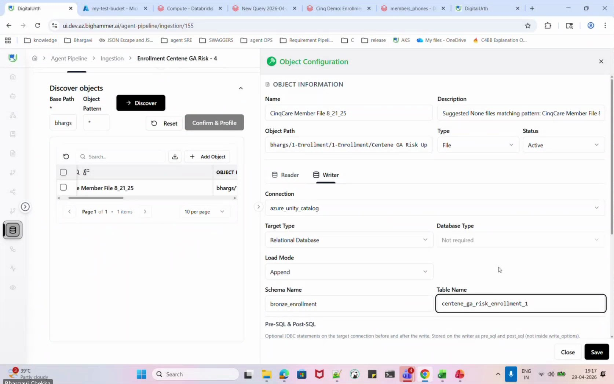

- **Where:** `/agent-pipeline/ingestion/155 · Configuration › Object Configuration drawer`  ·  **Type:** DigitalUrth UI  ·  frame `t0734`
- **What is on screen:** Writer tab: Connection azure_unity_catalog; Target Type Relational Database; Database Type 'Not required'; Load Mode Append; Schema Name bronze_enrollment; Table Name centene_ga_risk_enrollment_1 (being typed). Section 'Pre-SQL & Post-SQL — optional JDBC statements on the target connection before and after the write, stored on the writer as pre_sql and post_sql (not inside write_options)' with two code editors and Expand buttons.
- **Visible elements:** Connection, Target Type, Database Type; Load Mode (Append); Schema Name / Table Name; Pre-SQL / Post-SQL editors
- **Role in the flow:** Names the bronze table the landing→bronze pipeline will create. Append mode is deliberate: bronze is append-only history partitioned by ingest year/month/day. Post-SQL is the hook used in the claims flow to create flattening views over raw JSON.
- **Said in the demo:** [11:37] “You say this dataset is going to bronze with this table name. You don't need to create anything — the bronze agent takes care of it automatically. Save, then submit the request.” [38:03] “In the UI we support Post-SQL; on top of the three bronze claims tables we create views that flatten the JSON.”
- **Note:** Save produces toast 'Object configuration updated locally' — changes are staged client-side until Confirm & Profile.

### 12:16 · Object Configuration — Writer (Pre/Post-SQL)

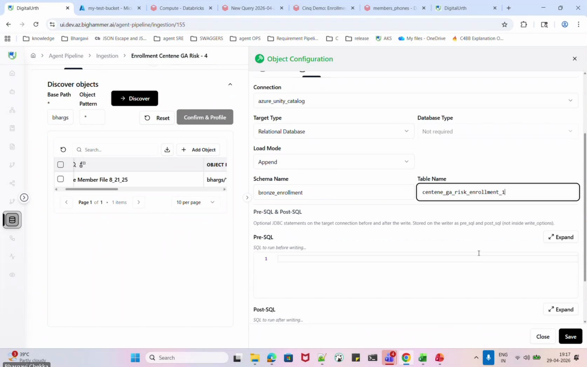

- **Where:** `/agent-pipeline/ingestion/155 · Configuration › Object Configuration drawer`  ·  **Type:** DigitalUrth UI  ·  frame `t0736`
- **What is on screen:** Lower half of the Writer tab showing the Pre-SQL editor (line-numbered, 'SQL to run before writing…') and Post-SQL ('SQL to run after writing…'), each with an Expand control, and the Close / Save footer.
- **Visible elements:** Pre-SQL editor; Post-SQL editor; Save
- **Role in the flow:** Extension point for target-side DDL/DML around the write.

### 13:12 · Configuration after profiling (group at 'landing bronze')

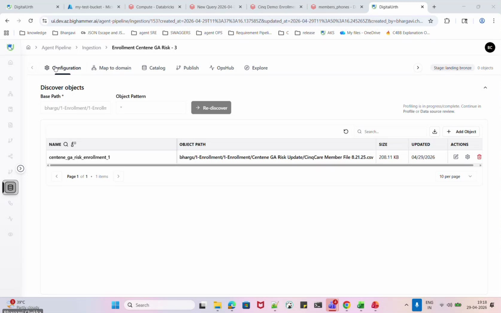

- **Where:** `/agent-pipeline/ingestion/153 · Configuration`  ·  **Type:** DigitalUrth UI  ·  frame `t0792`
- **What is on screen:** Same Configuration view for the earlier group 'Enrollment Centene GA Risk - 3', already advanced: Stage 'landing bronze', Base Path locked, button reads 'Re-discover', and a hint 'Profiling is in progress/complete. Continue in Profile or Data source review.' Tabs now: Configuration · Map to domain · Catalog · Publish · OpsHub · Explore (Profile and Data source review tabs no longer shown once metadata is confirmed).
- **Visible elements:** Re-discover; Profiling hint; Reduced tab set
- **Role in the flow:** Illustrates how the tab strip mutates with stage: post-confirmation groups expose Map to domain / Publish, and hide the review tabs.
- **Said in the demo:** [12:24] “Once the request is submitted we do data profiling… identify data types, lengths, nullability, uniqueness, primary key.”

## 3 · Profile the data

Profile tab: automated EDA on a sample — nulls, uniqueness, quality score, per-field insights.

### 14:28 · Analyzing objects (profiling progress)

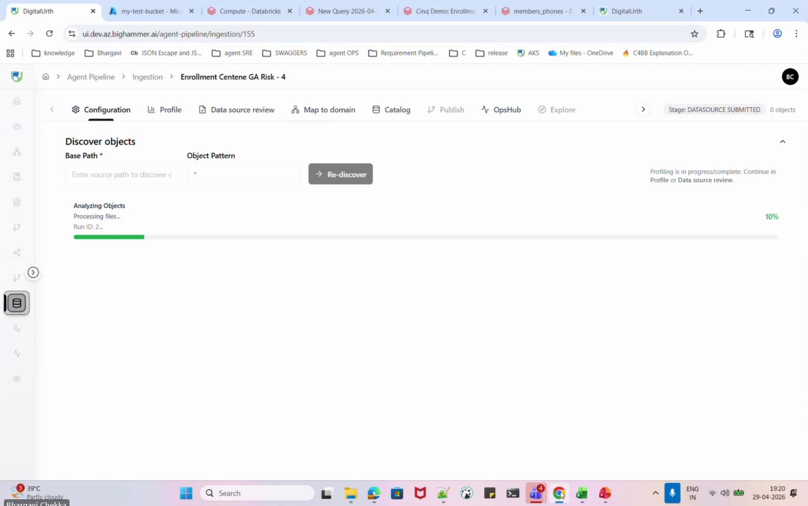

- **Where:** `/agent-pipeline/ingestion/155 · Profile`  ·  **Type:** DigitalUrth UI  ·  frame `t0868`
- **What is on screen:** Progress card 'Analyzing Objects' with a bar ('Processing files… 10%') for CinqCare Member File 8_21_25. Stage chip now 'DATASOURCE SUBMITTED'. Filters bar visible above (Categorical, Quality, Data type).
- **Visible elements:** Progress bar; Stage: DATASOURCE SUBMITTED
- **Role in the flow:** Profiling runs a Spark job on the configured Databricks compute over a ~8 MB sample; typically 2–3 minutes.
- **Said in the demo:** [14:03] “Profiling generally takes two to three minutes. Once it completes you see the complete information about the data.”

### 14:48 · Profile — Field profiles

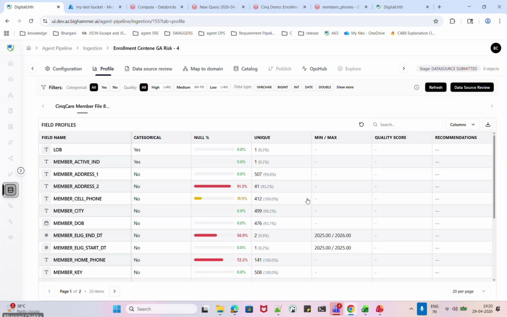

- **Where:** `/agent-pipeline/ingestion/155?tab=profile`  ·  **Type:** DigitalUrth UI  ·  frame `t0888`
- **What is on screen:** Filters: Categorical All/Yes/No · Quality All/High (≥80)/Medium (60–79)/Low (<60) · Data type VARCHAR, BIGINT, INT, DATE, DOUBLE, Show more; buttons Refresh and 'Data Source Review'. Object tabs (CinqCare Member File 8…). FIELD PROFILES table: FIELD NAME (type glyph), CATEGORICAL, NULL % (bar), UNIQUE (count and %), MIN / MAX, QUALITY SCORE, RECOMMENDATIONS. Rows: LOB (Yes, 0.0%, 1 unique), MEMBER_ACTIVE_IND, MEMBER_ADDRESS_1 (507, 99.8%), MEMBER_ADDRESS_2 (91.3% null), MEMBER_CELL_PHONE (18.9% null, 412 unique), MEMBER_CITY, MEMBER_DOB (date), MEMBER_ELIG_END_DT (56.9% null, min/max 2025/2026), MEMBER_ELIG_START_DT, MEMBER_HOME_PHONE (72.2% null), MEMBER_KEY (508 unique, 100%). 20 items per page, 2 pages.
- **Visible elements:** Filter chips; Field profile grid (7 columns); Columns picker, download, search; Data Source Review CTA
- **Role in the flow:** Exploratory data analysis that feeds the next agent step: 100%-unique, non-null MEMBER_KEY becomes the primary-key recommendation; categorical flags drive glossary/DQ suggestions.
- **Said in the demo:** [13:12] “It opens the actual file and does profiling — EDA: column names, data types, min/max length, nullability, uniqueness, primary key. That's what the agent uses in the next step to automate the pipeline.”
- **Note:** 508 rows in the sample file (MEMBER_KEY 508 unique = 100%).

### 15:15 · Field profile drawer — LOB

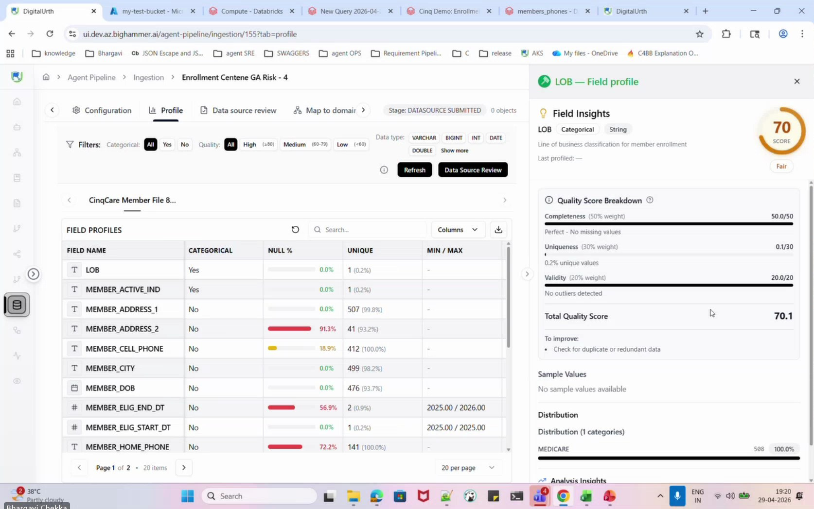

- **Where:** `/agent-pipeline/ingestion/155?tab=profile (drawer)`  ·  **Type:** DigitalUrth UI  ·  frame `t0915`
- **What is on screen:** Drawer 'LOB — Field profile'. Field Insights: LOB · Categorical · String; description 'Line of business classification for member enrollment'; score dial 70 'Fair'. Quality Score Breakdown: Completeness (50% weight) 50.0/50 'Perfect – no missing values'; Uniqueness (30% weight) 0.1/30 '0.2% unique values'; Validity (20% weight) 20.0/20 'No outliers detected'; Total 70.1. To improve: 'Check for duplicate or redundant data'. Sample Values: none available. Distribution (1 category): MEDICARE 508 · 100.0%. Sections below: Analysis Insights, Derived Insights.
- **Visible elements:** Score dial + grade; Weighted breakdown (50/30/20); To improve; Distribution bar
- **Role in the flow:** Per-field drill-down of the profile. The weighting formula (completeness 50, uniqueness 30, validity 20) explains why a perfectly filled constant column scores only 'Fair'.
- **Said in the demo:** [14:55] “Click on LOB — you see that all the rows contain the value Medicare.”

### 15:31 · Field profile drawer — MEMBER_CITY

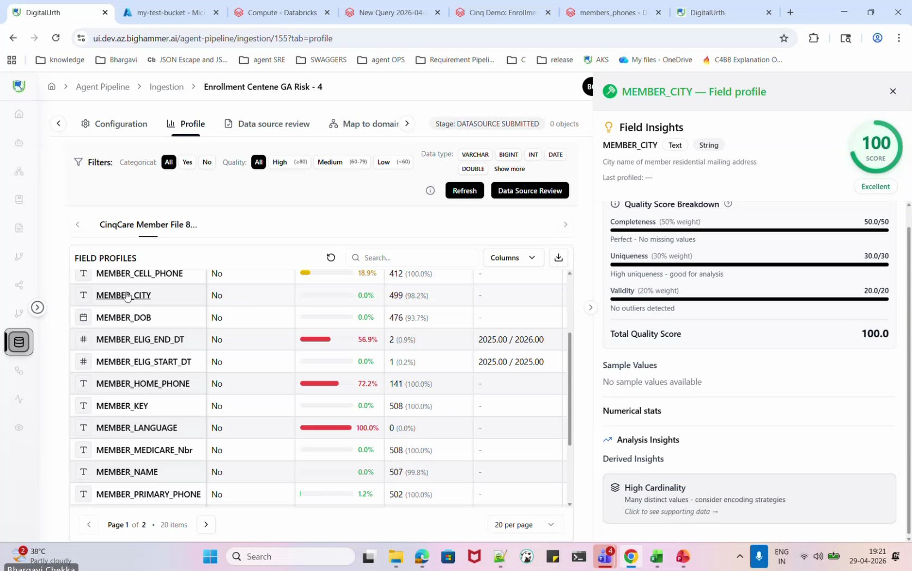

- **Where:** `/agent-pipeline/ingestion/155?tab=profile (drawer)`  ·  **Type:** DigitalUrth UI  ·  frame `t0931`
- **What is on screen:** Same drawer for MEMBER_CITY: score 100 'Excellent'; Completeness 50/50, Uniqueness 30/30 (98.2% unique), Validity 20/20; Analysis Insights flag 'High Cardinality' and a long-tail distribution of city values.
- **Visible elements:** Score 100 Excellent; High Cardinality insight; Distribution list
- **Role in the flow:** Contrast case to LOB — demonstrates how uniqueness weight rewards high-cardinality fields.
- **Said in the demo:** [14:55] “Click member city — you see it is high cardinality. In any mapping it is important that you profile the data first.”
- **Note:** Q (Shandy) at 15:43: 'is the left side the mapping document?' — A: no, this is understanding the data; mapping is the next step.

## 4 · Data source review

Human-in-the-loop review of agent-recommended metadata (PK, nullability, PII, descriptions) then confirm & materialize.

### 17:07 · Data source review

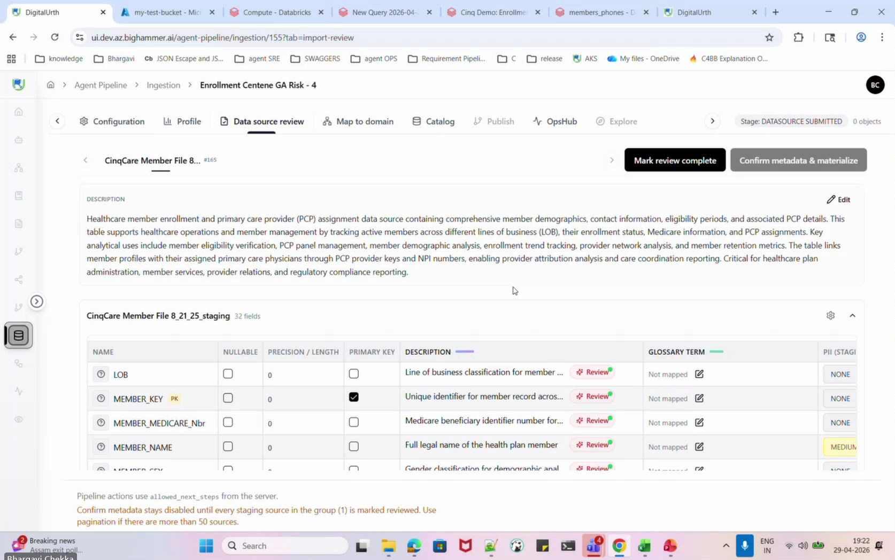

- **Where:** `/agent-pipeline/ingestion/155?tab=import-review`  ·  **Type:** DigitalUrth UI  ·  frame `t1027`
- **What is on screen:** Header row: object 'CinqCare Member File 8… #165' with buttons 'Mark review complete' (active) and 'Confirm metadata & materialize' (disabled). DESCRIPTION card (AI-generated, with Edit): 'Healthcare member enrollment and primary care provider (PCP) assignment data source containing comprehensive member demographics, contact information, eligibility periods…'. Staging table card 'CinqCare Member File 8_21_25_staging · 32 fields' with columns NAME, NULLABLE, PRECISION / LENGTH, PRIMARY KEY, DESCRIPTION (with 'Review' chips), GLOSSARY TERM ('Not mapped' + edit), PII (STAGING). Rows: LOB (PII NONE), MEMBER_KEY (PK ticked), MEMBER_MEDICARE_Nbr, MEMBER_NAME (PII MEDIUM), MEMBER_SEX… Footer: 'Pipeline actions use allowed_next_steps from the server. Confirm metadata stays disabled until every staging source in the group (1) is marked reviewed. Use pagination if there are more than 50 sources.'
- **Visible elements:** Mark review complete / Revert review; Confirm metadata & materialize; Editable description; Field grid: nullable, length, PK, description, glossary term, PII level
- **Role in the flow:** Human-in-the-loop gate. Agent recommendations (PK = MEMBER_KEY, nullability, PII tagging, field descriptions) can be accepted or overridden; only after every staging source is marked reviewed does 'Confirm metadata & materialize' unlock, which creates the data source and advances the stage.
- **Said in the demo:** [17:16] “The agent recommended the primary key… identified nullability… and PII — member name is potentially PII. This is what you use for your HITRUST certification.” [18:02] “You have an option to override. The agent can make a mistake — it is always human-in-the-loop that decides.”
- **Note:** PII levels seen: NONE, LOW, MEDIUM, HIGH.
- **Note:** Glossary Term column is 'Not mapped' for all fields — glossary linkage exists but was not exercised.

### 19:08 · Review marked complete

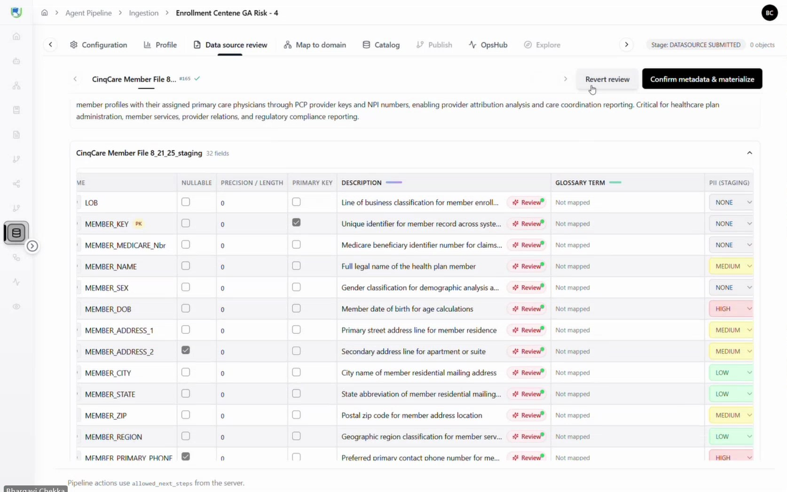

- **Where:** `/agent-pipeline/ingestion/155?tab=import-review`  ·  **Type:** DigitalUrth UI  ·  frame `t1148`
- **What is on screen:** After clicking 'Mark review complete': the object title shows a green check, the button flips to 'Revert review', and 'Confirm metadata & materialize' becomes enabled. Field grid unchanged; MEMBER_ADDRESS_2 shows NULLABLE ticked (91% null from profiling).
- **Visible elements:** Green check on object; Revert review; Confirm metadata & materialize (enabled)
- **Role in the flow:** Second half of the gate; clicking Confirm sends the metadata to the catalog and materializes the staging structure.
- **Said in the demo:** [18:49] “Mark review complete, then confirm and create — the next steps.”

### 19:22 · Confirm metadata — server error toast

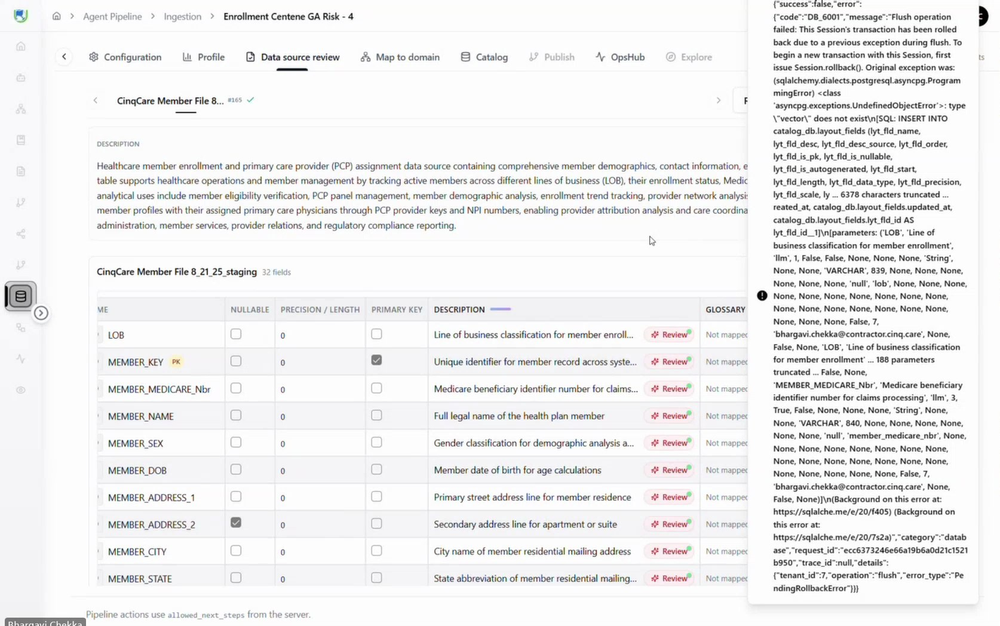

- **Where:** `/agent-pipeline/ingestion/155?tab=import-review`  ·  **Type:** DigitalUrth UI  ·  frame `t1162`
- **What is on screen:** On Confirm the UI showed 'Submitting confirm request…' then a red error toast with the raw API payload: success:false, code DB_6001 'Flush operation failed: This Session's transaction has been rolled back due to a previous exception during flush… asyncpg UndefinedObjectError: type "vector" does not exist [SQL: INSERT INTO catalog_db.layout_fields (lyt_fld_name, lyt_fld_desc, lyt_fld_desc_source, lyt_fld_order, lyt_fld_is_pk, lyt_fld_is_nullable, …)]', category database, tenant_id 7, operation flush, error_type PendingRollbackError.
- **Visible elements:** Error toast with full exception text; Field grid still visible
- **Role in the flow:** Failure path of Confirm. The presenter switched to the pre-built group (…GA Risk - 3) to continue the demo.
- **Note:** Root cause visible in the toast: Postgres pgvector extension ('vector' type) missing in the catalog_db used by this environment.
- **Note:** UX note: raw stack traces surface directly in the toast — unfiltered error propagation.
- **Note:** Insert target catalog_db.layout_fields reveals the catalog data model (layout → fields with pk/nullable/data type/precision/scale, desc_source = 'llm').

## 5 · Map to domain

Input the English mapping requirement → LLM-generated requirement spec → auto-generated pipeline DAG in the Designer.

### 11:02 · Mapping requirement document (cinq.txt)

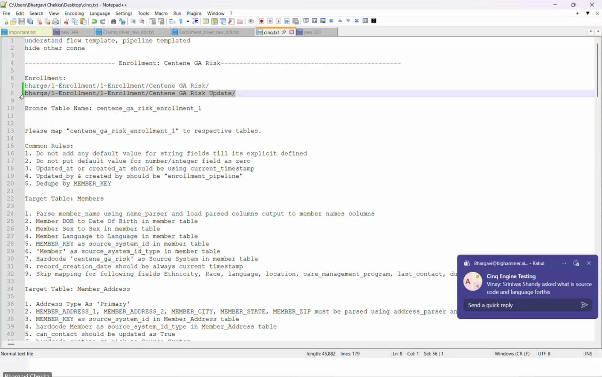

- **Where:** `Notepad++ (presenter's desktop)`  ·  **Type:** external  ·  frame `t0662`
- **What is on screen:** Plain-English requirement used as input to the mapping agent. Header: Enrollment: Centene GA Risk, landing paths, 'Bronze Table Name: centene_ga_risk_enrollment_1', 'Please map centene_ga_risk_enrollment_1 to respective tables.' Common Rules: no default values for strings; no zero defaults for numbers; updated_at/created_at = current_timestamp; updated_by/created_by = 'enrollment_pipeline'; dedupe by MEMBER_KEY. Target Table Members: parse member_name via name_parser; DOB→date_of_birth; Sex; Language; MEMBER_KEY as source_system_id; 'Member' as source_system_id_type; hardcode 'centene_ga_risk' as source system; record_creation_date = current timestamp; line 9 'Skip mapping for following fields Ethnicity, Race, language, location, care_management_program, last_contact, du…'. Target Table Member_Address: address type 'Primary'; MEMBER_ADDRESS_1/2, CITY, STATE, ZIP parsed with address_parser; can_contact = True…
- **Visible elements:** Common Rules (5); Per-target-table rules; Explicit skip list (line 9)
- **Role in the flow:** This text is what gets pasted into 'MAPPING REQUIREMENT' on the Map to domain › Input tab. The more explicit the skip list, the fewer fields fall into SME Review and the fewer LLM tokens are spent.
- **Said in the demo:** [22:44] “Line 9 — the reason we say skip these fields is to save tokens; we are using an LLM in the back end. If you don't give a clear requirement it goes into the review scenario and you have to review each column.”
- **Note:** Other tabs open in Notepad++: Claims_silver_raw_ddl.txt, Enrollment_silver_raw_ddl.txt — DDL for the silver-raw schemas.
- **Note:** Debate at 25:06–27:42: 'Skipped per user request' wording is misleading when the payer simply never sends the field; agreed it is only authoring-time documentation (a comment), not a runtime log.

### 19:45 · Map to domain — Input

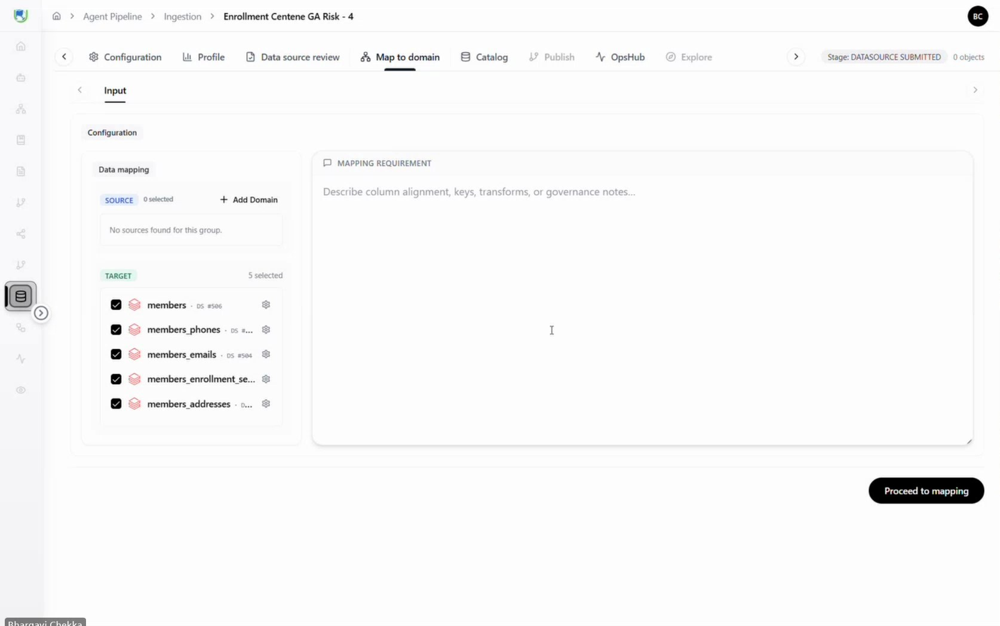

- **Where:** `/agent-pipeline/ingestion/155?tab=map-to-domain · Input`  ·  **Type:** DigitalUrth UI  ·  frame `t1185`
- **What is on screen:** Sub-tabs Input · Requirement · Designer (Input active). Configuration › Data mapping: SOURCE (0 selected, '+ Add Domain', 'No sources found for this group.'), TARGET (5 selected): members · DS #506, members_phones, members_emails · DS #504, members_enrollment_se…, members_addresses — each with a ⚙. Right: 'MAPPING REQUIREMENT' textarea ('Describe column alignment, keys, transforms, or governance notes…'). Button 'Proceed to mapping'.
- **Visible elements:** Source/Target selectors bound to domain data sets; Mapping requirement textarea; Proceed to mapping
- **Role in the flow:** The Enrollment domain pre-populates the five silver-raw target tables. The user pastes the English requirement (cinq.txt) and proceeds; the LLM agent produces the column-level requirement spec.
- **Said in the demo:** [19:36] “This data is part of the Enrollment domain… Here is where we key in the actual request. We take the mapping requirement and key it into the UI, and the next step happens based on the mapping spec.”
- **Note:** Target list = the 5 tables from the Silver Raw data model slide.

### 20:05 · Map to domain — Requirement (LLM-generated spec)

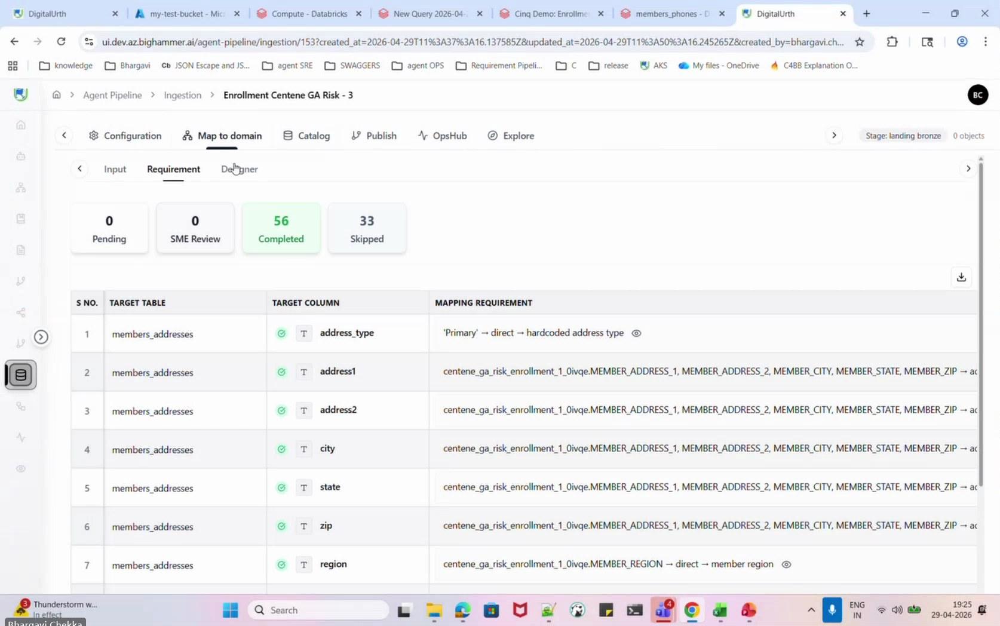

- **Where:** `/agent-pipeline/ingestion/153 · Map to domain › Requirement`  ·  **Type:** DigitalUrth UI  ·  frame `t1205`
- **What is on screen:** For group GA Risk - 3: status tiles Pending 0 · SME Review 0 · Completed 56 · Skipped 33. Table S NO., TARGET TABLE, TARGET COLUMN (type glyph + status icon), MAPPING REQUIREMENT. Rows: members_addresses.address_type ← ''Primary' → direct → hardcoded address type'; address1/address2/city/state/zip ← 'centene_ga_risk_enrollment_1_0ivqe.MEMBER_ADDRESS_1, MEMBER_ADDRESS_2, MEMBER_CITY, MEMBER_STATE, MEMBER_ZIP → address parser'; region ← 'MEMBER_REGION → direct → member region'; can_contact ← 'true → direct → hardcoded can contact flag'; county_ssa ← 'Skipped per user request'. Download icon; Page 1 of 9, 10 per page.
- **Visible elements:** Status tiles (Pending / SME Review / Completed / Skipped); Per-column requirement with transform notation source → method → target; Eye icon per row for detail; Export
- **Role in the flow:** The generated mapping specification: 89 target columns total, 56 mapped, 33 skipped. Columns lacking a clear rule would land in SME Review; a detailed input avoids that. This spec is the contract from which the Designer DAG is generated.
- **Said in the demo:** [20:22] “Here is the actual mapping document — based on the request it identified and created a mapping spec. The mapping spec is used to create the actual pipeline.” [21:57] Q: “What does 33 skipped mean?” A: “Metadata columns and fields the source doesn't send, e.g. county SSA only comes from CMS data.”
- **Note:** Source table is referenced with a suffix (centene_ga_risk_enrollment_1_0ivqe) — the staging/versioned alias of the bronze table.
- **Note:** Green icon = mapped; grey X = skipped.

### 21:17 · Map to domain — Designer (generated pipeline DAG)

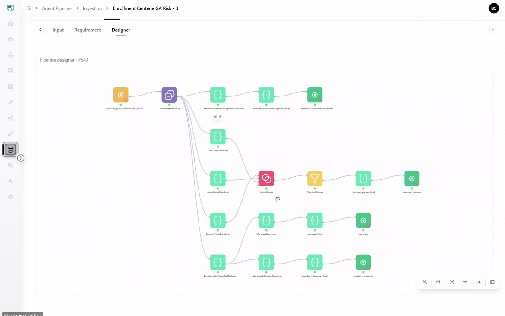

- **Where:** `/agent-pipeline/ingestion/153 · Map to domain › Designer`  ·  **Type:** DigitalUrth UI  ·  frame `t1277`
- **What is on screen:** 'Pipeline designer · #543' canvas. Source node centene_ga_risk_enrollment_1_0ivqe → DedupByMemberKey (purple) → fan-out to transform nodes ({ } icons): MembersEnrollmentSegmentsTransform → members_enrollment_segments_final → members_enrollment_segments (target); CellPhoneTransform, HomePhoneTransform, PrimaryPhoneTransform → UnionPhones (pink union) → FilterNullPhones (yellow filter) → members_phones_final → members_phones; MembersTransform → members_final → members; MembersAddressTransform → members_addresses_final → members_addresses. Zoom/fit/layout controls bottom-right.
- **Visible elements:** Source node; Dedup node; Transform nodes ({ }); Union and Filter operators; Target sink nodes; Canvas controls
- **Role in the flow:** The pipeline generated from the requirement spec, matching the common rules (dedupe by MEMBER_KEY first) and the per-target rules. Nodes are editable (edit/delete icons on hover) — this is what gets published as the bronze→silver-raw pipeline.
- **Said in the demo:** [21:12] “All the pipeline has been created. The first step is deduplication as per your spec. Once we dedupe we map the data to enrollment segment, phone, address tables — the pipeline agent takes care of mapping to the various target tables.”
- **Note:** Three phone transforms unioned then null-filtered = one row per phone type in members_phones.

### 21:46 · Designer — zoomed on phone/member branches

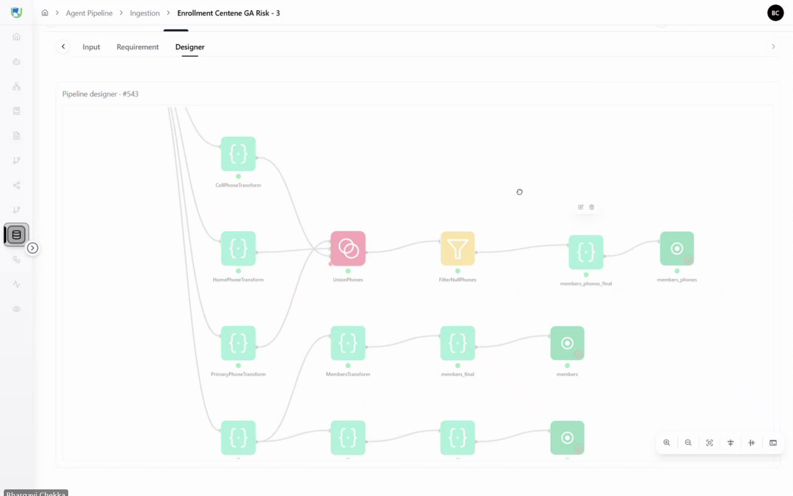

- **Where:** `/agent-pipeline/ingestion/153 · Map to domain › Designer`  ·  **Type:** DigitalUrth UI  ·  frame `t1306`
- **What is on screen:** Zoomed canvas showing CellPhoneTransform, HomePhoneTransform, PrimaryPhoneTransform feeding UnionPhones → FilterNullPhones → members_phones_final → members_phones, and MembersTransform → members_final → members; node hover reveals edit/delete.
- **Visible elements:** Node labels; Hover actions
- **Role in the flow:** Detail of the generated graph.

## 6 · Publish & execute

Publish landing→bronze and bronze→silver-raw pipeline versions; execution runs on Databricks.

### 28:36 · Publish — history

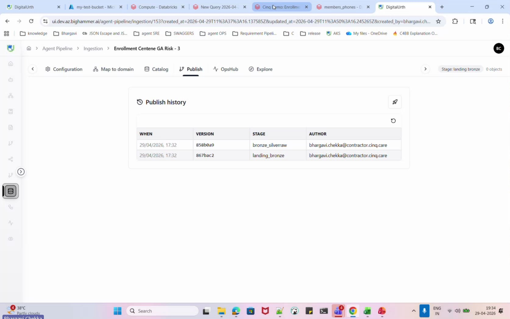

- **Where:** `/agent-pipeline/ingestion/153 · Publish`  ·  **Type:** DigitalUrth UI  ·  frame `t1716`
- **What is on screen:** 'Publish history' card with a rocket (publish) button and refresh. Table WHEN · VERSION · STAGE · AUTHOR: 29/04/2026 17:32 · 858b0a9 · bronze_silverraw · bhargavi.chekka@contractor.cinq.care; 29/04/2026 17:32 · 867bac2 · landing_bronze · same author. Stage chip 'landing bronze'.
- **Visible elements:** Publish (rocket); Version hashes; Stage names landing_bronze / bronze_silverraw
- **Role in the flow:** Two pipelines are published per group: landing→bronze (from Configuration) and bronze→silver-raw (from the Designer). Publishing produces versioned artefacts that Databricks jobs execute on a schedule.
- **Said in the demo:** [27:42] “Whatever we have created, we will be publishing two pipelines — one for landing to bronze and one for bronze to silver.”
- **Note:** Versions are short git-style hashes, suggesting pipelines are stored as code/config in a repo.

### 28:37 · Databricks — pipeline run notebook/log

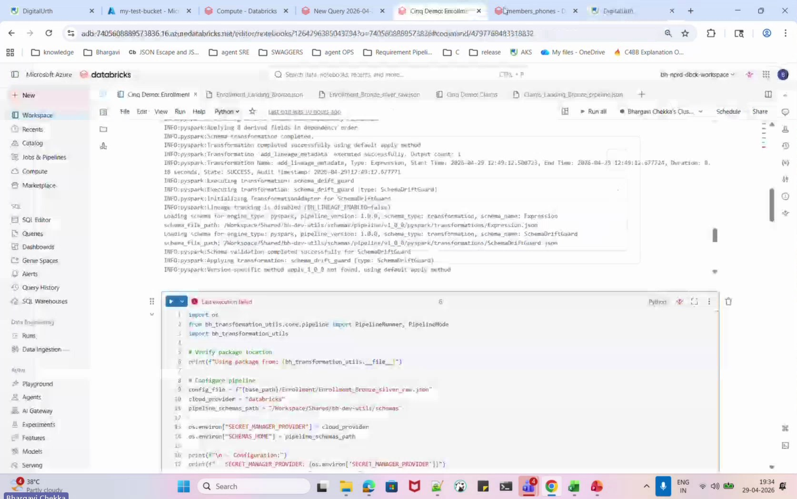

- **Where:** `Azure Databricks workspace · notebook run`  ·  **Type:** external  ·  frame `t1717`
- **What is on screen:** Databricks notebook 'Cinq Demo: Enrollment' with driver log lines (INFO pyspark transformation… ingest_year/month/day partitions, schema_drift_guard, PipelineRunner) and a code cell importing bh_transformation_utils.core.pipeline PipelineRunner with config_file '/Workspace/…/enrollment/bronze_silver_raw.json', cloud_provider 'databricks', SECRET_MANAGER_PROVIDER.
- **Visible elements:** Log output; Runner code cell
- **Role in the flow:** Execution surface for the published pipeline JSON (bronze_silver_raw.json) — the runtime counterpart of the Designer.
- **Said in the demo:** [28:34] “Before this call I already executed the pipeline, so let me show the sample data.”
- **Note:** Confirms pipelines are serialized to JSON config executed by a PipelineRunner library (bh_transformation_utils).

## 7 · Verify in Databricks

Bronze append-only tables with ingest metadata; silver-raw parsed member tables; claims (NDJSON) bronze/silver.

### 28:42 · Databricks Catalog — bronze table centene_ga_risk_6

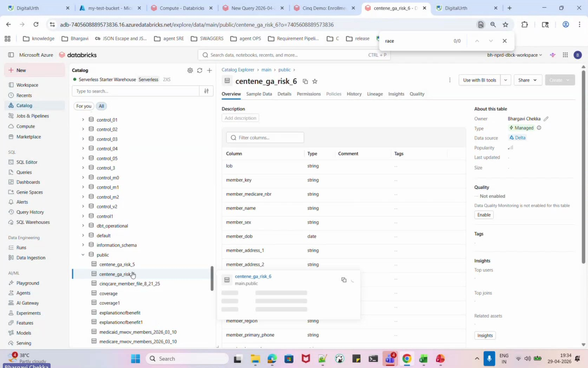

- **Where:** `Azure Databricks · Catalog Explorer › main.public.centene_ga_risk_6 · Sample Data`  ·  **Type:** external  ·  frame `t1722`
- **What is on screen:** Unity Catalog explorer, schema 'public' with tables centene_ga_risk_5/6, cinqcare_member_file_8_21_25, coverage, explanationofbenefit, medicaid/medicare_mwov_members_2026_03_10, members, members_addresses, members_enrollment_segments, members_phones, patient… Sample Data shows source columns as-is: lob, member_key, member_medicare_nbr, member_name, member_sex, member_dob, member_address_1…
- **Visible elements:** Catalog tree; Overview / Sample Data / Details / Permissions / Policies / History / Lineage / Insights / Quality tabs; AI sample questions bar
- **Role in the flow:** Bronze = file stored as-is in append mode; every file (even full refreshes) accumulates, giving full history for audit.
- **Said in the demo:** [28:34] “At this level we store the data as it is without dropping anything… in append mode, so every file will be the full history.”
- **Note:** Demo environment is BigHammer's own offshore Databricks (bh-nprd-dbck-workspace); CINQCARE dev environment was being set up.

### 29:21 · Bronze metadata & partition columns

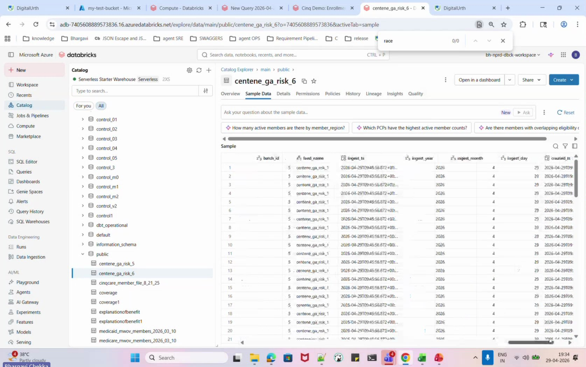

- **Where:** `Azure Databricks · centene_ga_risk_6 · Sample Data (scrolled right)`  ·  **Type:** external  ·  frame `t1761`
- **What is on screen:** Pipeline-added columns on the bronze table: batch_id (5), feed_name (centene_ga_risk_1), ingest_ts (2026-04-29T09:45:56…), ingest_year (2026), ingest_month (4), ingest_day (29), created_ts, updated_ts; also corrupt_record and lob.
- **Visible elements:** batch_id, feed_name, ingest_ts, ingest_year/month/day, created_ts, updated_ts, corrupt_record
- **Role in the flow:** These nine columns are the 'Control Model' footprint in bronze; ingest year/month/day partition the append-only table for efficient reads and audit slicing.
- **Said in the demo:** [29:21] “We add metadata — batch id, feed name, when it was ingested; we use ingested year and month to partition the data.” [30:06] “Bronze is always partitioned by batch year, month and day. This is append-only data, usable for any audit.”
- **Note:** Matches the validation report's '9 pipeline-added columns'.

### 30:02 · Bronze table overview (AI description + columns)

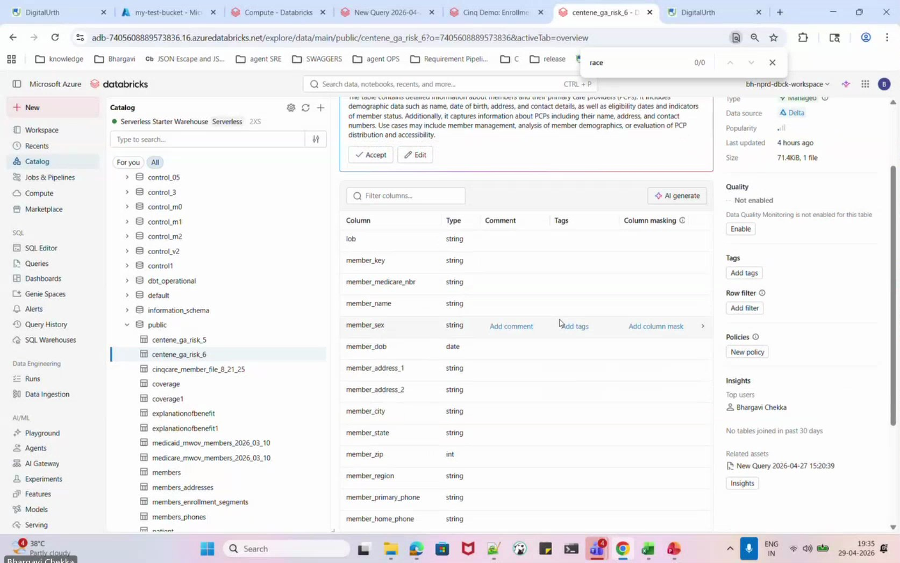

- **Where:** `Azure Databricks · centene_ga_risk_6 · Overview`  ·  **Type:** external  ·  frame `t1802`
- **What is on screen:** Overview tab with Databricks AI-suggested table description (member and PCP demographic data), owner, Delta type, size 71.4 KB / 1 file, and the column list with types (lob string, member_key string, member_medicare_nbr string, member_name string, member_sex string, member_dob date, member_address_1/2, city, state, zip int, region, phones…, pcp_* fields, corrupt_record, batch_id bigint, feed_name, ingest_ts timestamp, ingest_year/month/day int, created_ts).
- **Visible elements:** Column list with types; Table metadata panel
- **Role in the flow:** Shows type inference at bronze: member_zip landed as int — the class of issue the validation report later flags (numbers vs strings for codes/zips).
- **Said in the demo:** [30:52] Q: “Is this real data?” A: “De-identified data based on real data.”

### 32:00 · Silver raw — members

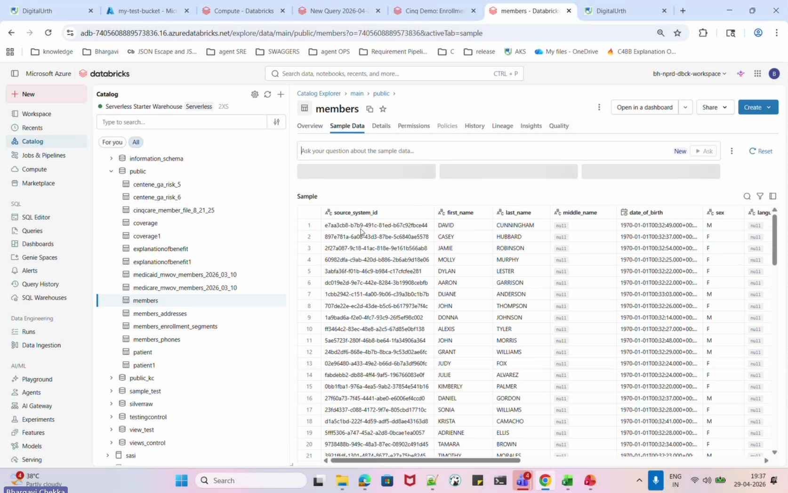

- **Where:** `Azure Databricks · main.public.members · Sample Data`  ·  **Type:** external  ·  frame `t1920`
- **What is on screen:** Silver-raw members table: source_system_id, first_name, last_name, middle_name, date_of_birth, sex, language, record_creation_date, source_system_id_type ('Member'), source_system ('centene_ga_risk'), created_by ('enrollment_pipeline'), created_at, updated_by, updated_at. Names are split (DAVID / CUNNINGHAM) from the source MEMBER_NAME full-name field.
- **Visible elements:** Parsed name columns; source_system / source_system_id_type constants; Audit columns
- **Role in the flow:** Result of MembersTransform: name parsing via a standard Python name-parser, hard-coded source system per requirement, audit columns per the common rules.
- **Said in the demo:** [31:37] “Five silver-raw tables. In members the address parsing and name parsing are done — full name split into first name and last name using a standard Python API.” [35:36] Q: suffix support? A: “Yes, we have a suffix column and the parser supports name suffix.”
- **Note:** A sample Excel of the source file (CinqCare Member File 8.21.25.csv) was opened alongside at 32:14 to show MEMBER_NAME as a single field.

### 33:08 · Silver raw — members_addresses

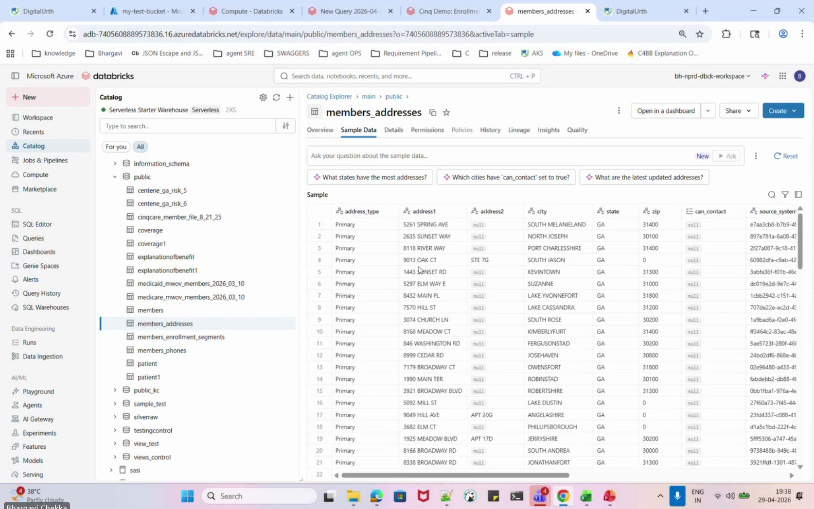

- **Where:** `Azure Databricks · main.public.members_addresses · Sample Data`  ·  **Type:** external  ·  frame `t1988`
- **What is on screen:** members_addresses: address_type ('Primary'), address1, address2, city, state (GA), zip, can_contact (true), source_system_id, source_system, created_by/created_at/updated_by/updated_at. One row per member address; multiple rows if a member has several addresses.
- **Visible elements:** address_type; Parsed address fields; can_contact flag
- **Role in the flow:** Result of MembersAddressTransform: US address parsing (USPS-style) of MEMBER_ADDRESS_1/2, CITY, STATE, ZIP into normalized columns; address_type hardcoded 'Primary' per the requirement.
- **Said in the demo:** [33:11] “We parsed the address as per US parsing and populate address type; if he has multiple addresses there will be multiple entries.”
- **Note:** Open question (33:58, Steve): ZIP 5 vs ZIP+4 standardisation — 'we have zip4 as a column'; exact handling to be confirmed; system must not reject 9-digit zips.

## 8 · Claims (NDJSON) variant

Same flow for D0284 FHIR/BCDA claims: raw JSON kept whole in bronze, flattened via views into silver-raw claim tables.

### 36:53 · Ingestion list with three groups

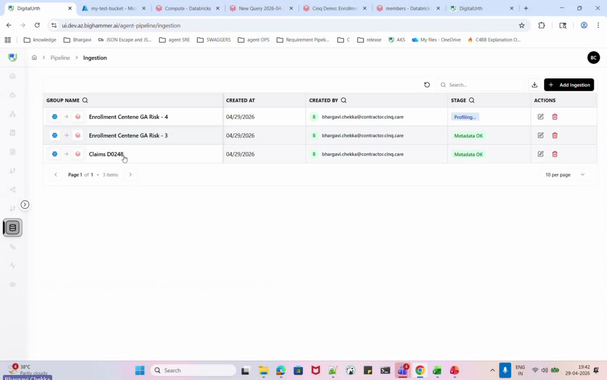

- **Where:** `/agent-pipeline/ingestion`  ·  **Type:** DigitalUrth UI  ·  frame `t2213`
- **What is on screen:** List now shows Enrollment Centene GA Risk - 4 (stage 'Profiling…', blue pill), Enrollment Centene GA Risk - 3 (Metadata OK), Claims D0248 (Metadata OK).
- **Visible elements:** Stage pills: Profiling… vs Metadata OK
- **Role in the flow:** Confirms the group created live is still in profiling; the presenter opens Claims D0248 for the NDJSON variant.
- **Said in the demo:** [36:24] “MSSP also I have loaded — three different types of files: Coverage, ExplanationOfBenefit and Patient NDJSON.”

### 36:56 · Claims D0248 — Configuration (NDJSON objects)

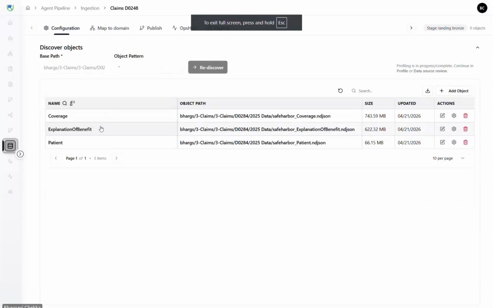

- **Where:** `/agent-pipeline/ingestion/146 · Configuration`  ·  **Type:** DigitalUrth UI  ·  frame `t2216`
- **What is on screen:** Discover objects for the claims group: Base Path bhargs/3-Claims/3-Claims/D0284…, three objects — Coverage (…/2025 Data/safeharbor_Coverage.ndjson, 743.59 MB), ExplanationOfBenefit (622.32 MB), Patient (66.15 MB), updated 04/21/2026. Stage 'landing bronze'. Tabs: Configuration · Map to domain · Publish · OpsHub · Explore.
- **Visible elements:** Three NDJSON objects with sizes; Re-discover; Row actions
- **Role in the flow:** Multi-object group: one bronze table per file. NDJSON is stored raw (single JSON column + metadata) in bronze; flattening happens in Post-SQL views consumed by the bronze→silver pipeline.
- **Said in the demo:** [37:11] “I accepted these files and confirmed; in bronze I'll have three tables, one for each.”
- **Note:** Group is named 'Claims D0248' while paths say D0284 — naming inconsistency in the demo data.

### 37:48 · Databricks — bronze_claims.coverage (raw JSON)

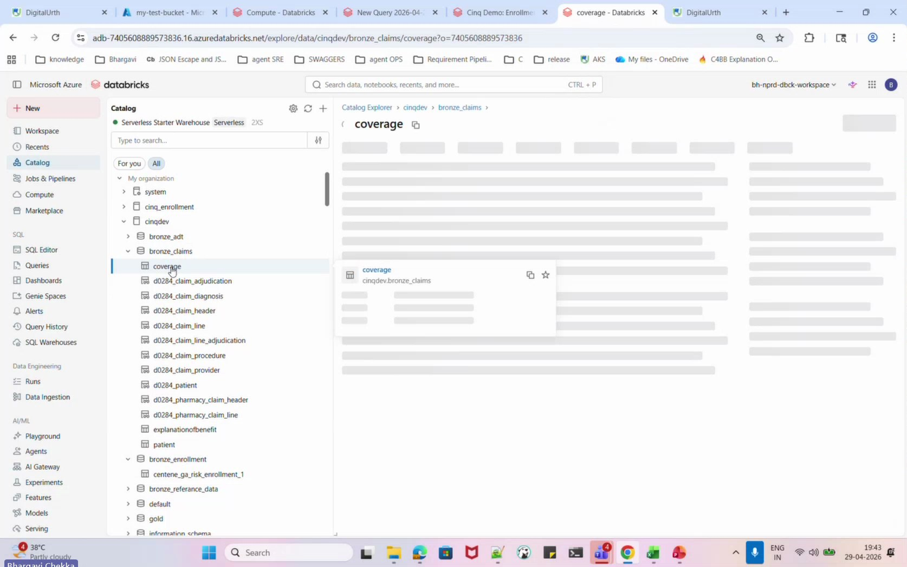

- **Where:** `Azure Databricks · cinqdev.bronze_claims.coverage · Sample Data`  ·  **Type:** external  ·  frame `t2268`
- **What is on screen:** Catalog cinqdev, schema bronze_claims with tables coverage, d0284_claim_adjudication, d0284_claim_diagnosis, d0284_claim_header, d0284_claim_line, d0284_claim_line_adjudication, d0284_claim_procedure, d0284_claim_provider, d0284_patient, d0284_pharmacy_claim_header, d0284_pharmacy_claim_line, explanationofbenefit, patient; also bronze_enrollment and bronze_reference_data schemas. coverage sample: a single 'value' column holding the whole FHIR Coverage JSON, plus batch_id, feed_name (safeharbor_coverage_ndjson), ingest_ts, ingest_year/month/day, created_ts.
- **Visible elements:** Raw JSON 'value' column; Metadata columns; d0284_* view/table family
- **Role in the flow:** Bronze keeps the full record; the d0284_claim_* objects are the flattened relational views created via Post-SQL and used as sources for bronze→silver-raw.
- **Said in the demo:** [37:11] “Since MSSP is JSON, we store the entire raw data in a single column and the rest are metadata columns.” [38:03] “We do not want to lose any data… on top of the three bronze tables we create views which flatten these into a relational format, and the next pipeline uses these views as sources.”

### 39:01 · Databricks — d0284_claim_header (flattened view)

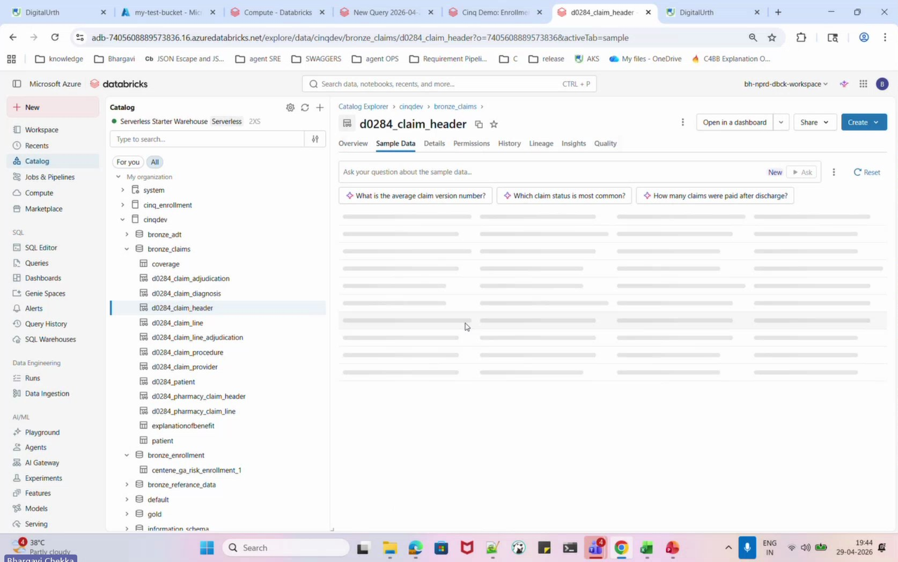

- **Where:** `Azure Databricks · cinqdev.bronze_claims.d0284_claim_header`  ·  **Type:** external  ·  frame `t2341`
- **What is on screen:** Flattened claim header: is_deleted, created_by, created_at, updated_by, updated_at, source_system (FHIR_EOB), source_claim_id, claim_type (UNKNOWN), source_resource_id, source_resource_type (ExplanationOfBenefit), source_format (FHIR_R4_JSON), patient_id…
- **Visible elements:** source_system FHIR_EOB; source_resource_type ExplanationOfBenefit; source_format FHIR_R4_JSON
- **Role in the flow:** Extraction of claim id, resource id and type from the EOB JSON — the relational source for silver-raw claim_header.
- **Said in the demo:** [39:01] “From the JSON we extracted the claim ID, source resource ID, source system and resource type.”
- **Note:** Long discussion 39:47–43:20 on BCDA EOB vs CCLF claim files: team agreed to load an industry-standard claim model in silver and produce CCLF-shaped output in gold if needed; action to confirm with David Mosley whether CCLF is used for reconciliation.

### 44:34 · Silver raw — silverraw_claims.claim_header

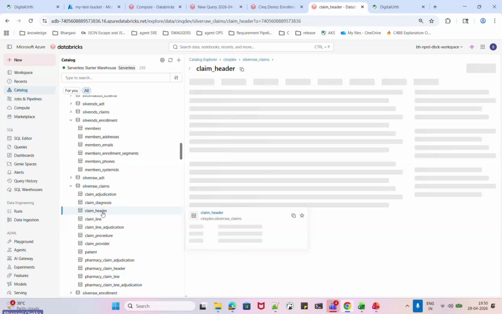

- **Where:** `Azure Databricks · cinqdev.silverraw_claims.claim_header`  ·  **Type:** external  ·  frame `t2674`
- **What is on screen:** Schema silverraw_claims with claim_adjudication, claim_diagnosis, claim_header, claim_line, claim_line_adjudication, claim_procedure, claim_provider, patient, pharmacy_claim_adjudication, pharmacy_claim_header, pharmacy_claim_line, pharmacy_claim_line_adjudication; plus silverraw_enrollment (members, members_addresses, members_emails, members_enrollment_segments, members_phones, members_systemids) and silverraw_adt. claim_header sample: batch_id, record_hash, is_deleted, created_by (d0284_claims), created_at, updated_by, updated_at, source_system FHIR_EOB, source_claim_id, claim_type, source_resource_id/type, source_format, patient_id, billing_provider_id, billing_provider_npi…
- **Visible elements:** silverraw_claims table family; silverraw_enrollment table family; record_hash / is_deleted
- **Role in the flow:** Direct mapping from each flattened view to its silver table (header, adjudication, diagnosis, procedure, line, provider, pharmacy).
- **Said in the demo:** [44:13] “Direct mapping from each view to the silver table — claim header reads from the views and publishes header information.”
- **Note:** Same pipeline serves both MSSP (D0284) and the other BCDA feed; only feed_name differs (45:48).

### 45:00 · Silver raw — claim_adjudication

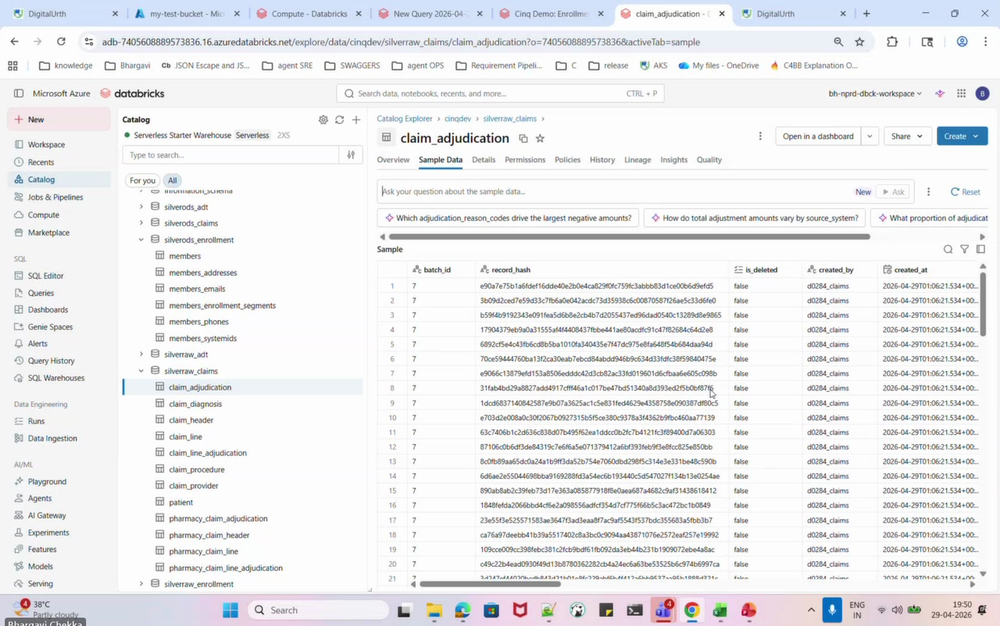

- **Where:** `Azure Databricks · cinqdev.silverraw_claims.claim_adjudication`  ·  **Type:** external  ·  frame `t2700`
- **What is on screen:** claim_adjudication sample: batch_id, record_hash, is_deleted, audit columns, source_system, source_claim_id, adjudication_type, adjudication_category_code/system (http://terminology.hl7.org/CodeSystem/adjudication… drugcost, other), adjudication_reason_code/system (pc/nT/org/hl7/…/C4BBPayerAdjudicationStatus), amount (0.0000, 160.2200, 544.1700…), currency USD, value.
- **Visible elements:** adjudication_category_* (HL7 code system); amount / currency
- **Role in the flow:** Where cost/amount information lands (drug cost etc.); diagnosis, procedure codes go to their own tables.
- **Said in the demo:** [44:59] “This is where the totals come into play — drug cost, whatever cost… the amounts come in adjudication.”
- **Note:** Q (Shandy) 45:48: can this run on a secure QA env with real MSSP data? Dev environment for CINQCARE is being stood up; then replicated to production (two environments).

## 9 · Bronze validation report

Python test harness output: record count, field count, data presence, field-value comparison.

### 48:16 · Bronze Layer Validation Report — summary

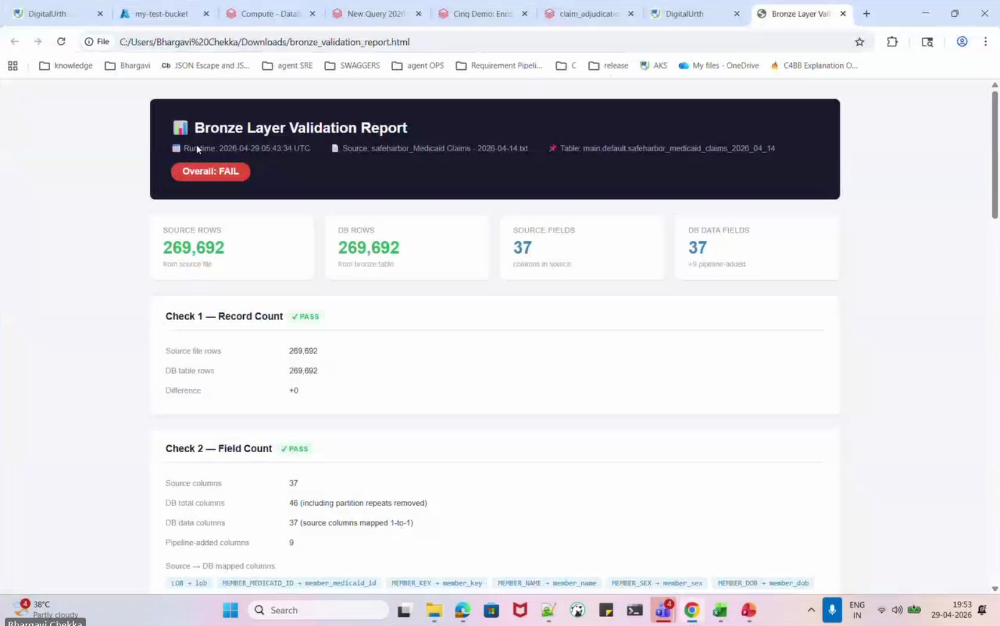

- **Where:** `file:///…/Downloads/bronze_validation_report.html`  ·  **Type:** report  ·  frame `t2896`
- **What is on screen:** Dark header: 'Bronze Layer Validation Report', run time 2026-04-29 05:43:34 UTC, source safeharbor_Medicaid Claims - 2026-04-14.txt, table main.default.safeharbor_medicaid_claims_2026_04_14, badge 'Overall: FAIL'. KPI tiles: SOURCE ROWS 269,692 · DB ROWS 269,692 · SOURCE FIELDS 37 · DB DATA FIELDS 37 (+9 pipeline-added). Check 1 — Record Count ✓ PASS (difference +0). Check 2 — Field Count ✓ PASS (source 37; DB total 46 including partition repeats removed; 37 mapped 1-to-1; 9 pipeline-added) with the Source → DB mapped column chips (LOB → lob, MEMBER_MEDICAID_ID → member_medicaid_id…).
- **Visible elements:** Overall status badge; 4 KPI tiles; Check 1 Record Count; Check 2 Field Count with column mapping chips
- **Role in the flow:** Automated Python test harness comparing source file to bronze table after a load. Presented as the testing approach that will later be pointed at the CINQCARE Databricks to compare against production.
- **Said in the demo:** [48:17] “Input file contained 269k records; in the database we loaded all the data — count-based everything looks good. Next, field count — all columns loaded.”
- **Note:** Report subject is a different feed (safeharbor Medicaid claims txt) than the two demo groups.

### 48:35 · Validation — Check 3 Data Presence (FAIL)

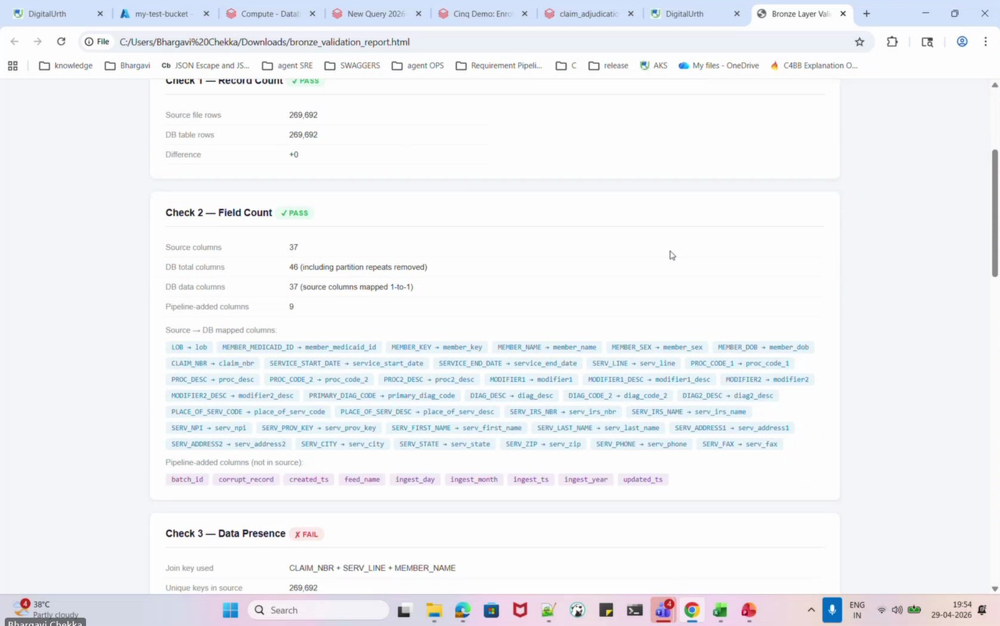

- **Where:** `bronze_validation_report.html`  ·  **Type:** report  ·  frame `t2915`
- **What is on screen:** Check 3 — Data Presence ✗ FAIL: join key CLAIM_NBR + SERV_LINE + MEMBER_NAME; unique keys in source 269,692; unique keys in DB 119,284; keys matched in both 119,284 (44.2%); keys only in source (missing from DB) 180,408; keys only in DB 0. Pipeline-added columns listed: batch_id, corrupt_record, created_ts, feed_name, ingest_day, ingest_month, ingest_ts, ingest_year, updated_ts.
- **Visible elements:** Join key definition; Key match statistics; Pipeline-added column chips
- **Role in the flow:** Key-level reconciliation. The mismatch is attributed to type handling of the key components (codes stored as numbers) rather than missing rows, since row counts matched.
- **Said in the demo:** [48:17] “Here is where we are identifying defects… two areas: procedure codes handled as number instead of string, and same with pin codes.”

### 48:39 · Validation — Check 4 Field Value Comparison (FAIL)

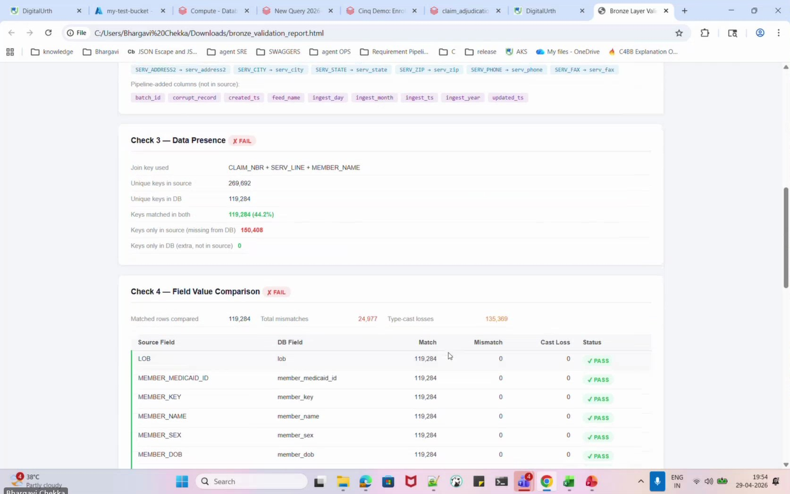

- **Where:** `bronze_validation_report.html`  ·  **Type:** report  ·  frame `t2919`
- **What is on screen:** Check 4 — Field Value Comparison ✗ FAIL: matched rows compared 119,284; total mismatches 24,977; type-cast losses 126,369. Per-field table Source Field · DB Field · Match · Mismatch · Cast Loss · Status: LOB, MEMBER_MEDICAID_ID, MEMBER_KEY, MEMBER_NAME, MEMBER_SEX, MEMBER_DOB… all ✓ PASS at 119,284.
- **Visible elements:** Aggregate mismatch metrics; Per-field pass/fail table
- **Role in the flow:** Column-level value reconciliation between source and bronze.
- **Said in the demo:** [49:11] “Certain columns we should consider as string but we're considering as number. We already identified the solution, just couldn't get it in for the demo.”

### 50:00 · Validation — failing fields detail

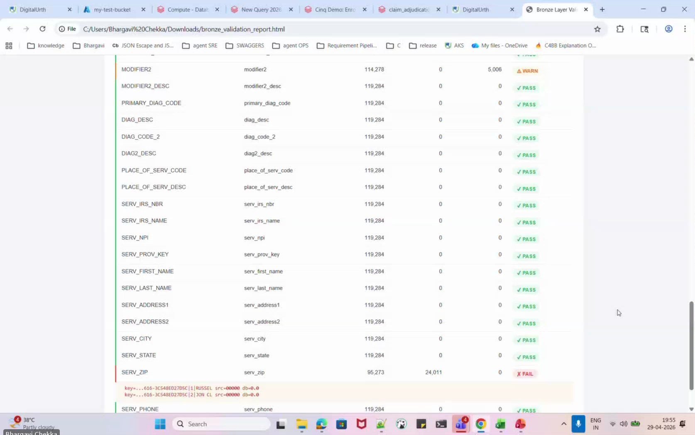

- **Where:** `bronze_validation_report.html`  ·  **Type:** report  ·  frame `t3000`
- **What is on screen:** Scrolled Check 4 rows: PROC_CODE_1 → proc_code_1 match 97,258 · mismatch 965 · cast loss 21,061 ✗ FAIL (example keys shown with src vs db values); PROC_CODE_2 mismatch 1 / cast loss 125 ✗ FAIL; MODIFIER1 cast loss 33,535 ⚠ WARN; MODIFIER2 cast loss 5,006 ⚠ WARN; SERV_ZIP match 95,273 / mismatch 24,011 ✗ FAIL (e.g. src 30060 vs db 3.006e4-style numeric); SERV_FAX cast loss 75,642 ⚠ WARN. Footnote: 'Cast Loss = source had a value but DB stored NULL because the pipeline schema defines the column as integer (e.g. MODIFIER1 = HXYX → null). This is a pipeline schema issue, not data loss.'
- **Visible elements:** Failing rows with example key/src/db triples; WARN vs FAIL semantics; Cast-loss footnote
- **Role in the flow:** Pinpoints the defect class for the sprint: alphanumeric codes (procedure codes, modifiers, ZIPs, fax) inferred as numeric at bronze. Fix identified: treat these as strings.
- **Said in the demo:** [49:11] “It is an automatic script — tomorrow we can use this script to compare with the CINQ DB.” Shandy: “This is the test harness… super good.”
- **Note:** Closing remarks 50:48–53:12: next steps are standing up the CINQCARE dev environment, training BAs next week, and choosing a baseline feed (e.g. an existing enrollment file) to QA against production before MSSP.

## Data model observed

- **Bronze · `bronze_enrollment.centene_ga_risk_enrollment_1`** — Source CSV columns as-is (LOB, MEMBER_KEY, MEMBER_MEDICARE_Nbr, MEMBER_NAME, MEMBER_SEX, MEMBER_DOB, MEMBER_ADDRESS_1/2, CITY, STATE, ZIP, REGION, phones, ELIG_START/END, PCP_* …) + control columns. _Load mode Append · partitioned by ingest_year / ingest_month / ingest_day._
- **Bronze · `control columns (9)`** — batch_id, feed_name, ingest_ts, ingest_year, ingest_month, ingest_day, created_ts, updated_ts, corrupt_record. _Identical set reported as 'pipeline-added' by the validation harness._
- **Bronze · `bronze_claims.coverage / explanationofbenefit / patient`** — Single JSON value column per NDJSON line + control columns. _Flattened via Post-SQL views d0284_claim_header, _line, _adjudication, _diagnosis, _procedure, _provider, d0284_patient, d0284_pharmacy_claim_header/_line._
- **Silver raw · `silverraw_enrollment.members`** — source_system_id, first/last/middle name, date_of_birth, sex, language, record_creation_date, source_system_id_type, source_system, created_by/at, updated_by/at (+ race, ethnicity, care_management_program, dual_status_code, death_date, dnc, is_active, record_hash, hash_scd1/2 per slide). _Name parser splits MEMBER_NAME; suffix supported._
- **Silver raw · `silverraw_enrollment.members_addresses · _phones · _emails · _enrollment_segments · _systemids`** — Satellites keyed by type + source_system_id + source_system; address parser (USPS-style); phone rows per type via Union + FilterNull. _zip4 column exists; 5 vs 9-digit handling open._
- **Silver raw · `silverraw_claims.*`** — claim_header, claim_line, claim_adjudication, claim_line_adjudication, claim_diagnosis, claim_procedure, claim_provider, patient, pharmacy_claim_header/_line/_adjudication/_line_adjudication. _source_system FHIR_EOB · source_format FHIR_R4_JSON · record_hash · is_deleted._

## Questions raised during the demo

| Time | Asked by | Question | Answer / outcome |
|---|---|---|---|
| 09:08 | Shandy | Is this a one-time setup? Production runs automated? | Yes — authoring UI; publish configures the schedule; runs automatically afterwards. |
| 15:43 | Shandy | Is the profile screen the mapping document? | No — profiling is understanding the data first; mapping is the next step (Map to domain). |
| 16:10 | Bernie | How does data get from SFTP to landing? | Out of scope today; files are placed in landing manually for now. |
| 21:57 | Shandy | What does '33 skipped' mean? | Metadata columns and fields the source never sends (e.g. county_ssa from CMS only); documented as skipped so the LLM doesn't push them to SME review. |
| 25:06 | Steve | 'Skipped per user request' is misleading — nobody requested it; the payer just doesn't send it. Are we logging this every run? | It is authoring-time documentation only (like a SQL comment); nothing is logged at runtime. Wording could say 'data not available'. |
| 30:52 | — | Is this real data? | De-identified data based on real data (provided by Monica). |
| 33:58 | Steve | ZIP standardisation — 5 vs 9 digits? Where does the split happen? | zip4 exists as a column; exact handling to be confirmed; system must not reject 9-digit ZIPs. |
| 34:47 | — | Are middle name and suffix (Jr, III) supported? | Yes — suffix column exists and the name parser supports suffixes. |
| 39:47 | Shandy / Steve / Kiran | Is EOB data the same as CMS claims (CCLF)? What does David Mosley use? | BCDA delivers claims in FHIR EOB form; CCLF is a converted format used today for reconciliation. Plan: industry-standard claim model in silver, CCLF-shaped output in gold if needed; confirm with David Mosley. |
| 45:48 | Shandy | Can this run on a secure QA env with real MSSP data now? | CINQCARE dev environment is being set up; then replicated to prod. Demo ran on BigHammer's offshore environment with de-identified data. |
| 49:57 | Shandy | Is this the test harness? | Yes — a Python report; testing strategy to be a separate conversation. |

## All 334 distinct frames (index)

Frames sampled at 1 fps from the screen-share window (02:00–51:05), de-duplicated at a 3% change threshold, OCR-classified.

| Time | Frame | Application | Screen | URL (if visible) |
|---|---|---|---|---|
| 01:58 | t0118 | Slides | Agenda |  |
| 02:05 | t0125 | Slides | Agenda |  |
| 02:09 | t0129 | Slides | Agenda |  |
| 02:13 | t0133 | Slides | Agenda |  |
| 02:50 | t0170 | Slides | Agenda |  |
| 02:55 | t0175 | Slides | Agenda |  |
| 03:13 | t0193 | Slides | Medallion architecture overview |  |
| 04:05 | t0245 | Slides | Medallion architecture overview |  |
| 04:16 | t0256 | Slides | Silver raw data model — Enrollment |  |
| 04:17 | t0257 | Slides | Silver raw data model — Enrollment |  |
| 04:18 | t0258 | Slides | Silver raw data model — Enrollment |  |
| 04:21 | t0261 | DigitalUrth | Home |  |
| 04:22 | t0262 | DigitalUrth | Home |  |
| 04:37 | t0277 | Desktop | Wallpaper / transition |  |
| 04:49 | t0289 | DigitalUrth | Ingestion list |  |
| 05:23 | t0323 | DigitalUrth | Add New Ingestion (modal) |  |
| 06:25 | t0385 | DigitalUrth | Add New Ingestion (modal) |  |
| 06:33 | t0393 | DigitalUrth | Ingestion list |  |
| 06:37 | t0397 | DigitalUrth | Ingestion list |  |
| 06:39 | t0399 | DigitalUrth | Ingestion list |  |
| 06:57 | t0417 | Azure Blob | Landing zone container |  |
| 07:01 | t0421 | DigitalUrth | Add New Ingestion (modal) |  |
| 07:07 | t0427 | DigitalUrth | Add New Ingestion (modal) |  |
| 07:08 | t0428 | DigitalUrth | Add New Ingestion (modal) |  |
| 07:24 | t0444 | DigitalUrth | Add New Ingestion (modal) |  |
| 08:19 | t0499 | DigitalUrth | Add New Ingestion (modal) |  |
| 08:44 | t0524 | DigitalUrth | Add New Ingestion (modal) |  |
| 09:06 | t0546 | DigitalUrth | Add New Ingestion (modal) |  |
| 09:07 | t0547 | DigitalUrth | Add New Ingestion (modal) |  |
| 09:14 | t0554 | DigitalUrth | Preparing ingestion |  |
| 10:27 | t0627 | DigitalUrth | Configuration › Discover objects |  |
| 10:53 | t0653 | Notepad++ | Pipeline log / notes |  |
| 10:54 | t0654 | Slides | Silver raw data model — Enrollment |  |
| 10:57 | t0657 | Notepad++ | Pipeline log / notes |  |
| 10:58 | t0658 | Notepad++ | Pipeline log / notes |  |
| 10:59 | t0659 | Notepad++ | Mapping requirement (cinq.txt) |  |
| 11:02 | t0662 | Notepad++ | Mapping requirement (cinq.txt) |  |
| 11:06 | t0666 | Notepad++ | Mapping requirement (cinq.txt) |  |
| 11:08 | t0668 | DigitalUrth | Configuration › Discover objects |  |
| 11:28 | t0688 | DigitalUrth | Configuration › Discover objects |  |
| 11:29 | t0689 | DigitalUrth | Configuration › Discover objects |  |
| 11:37 | t0697 | DigitalUrth | Configuration › Discover objects |  |
| 11:41 | t0701 | DigitalUrth | Configuration › Object Configuration drawer |  |
| 12:09 | t0729 | Notepad++ | Mapping requirement (cinq.txt) |  |
| 12:12 | t0732 | Notepad++ | Mapping requirement (cinq.txt) |  |
| 12:14 | t0734 | DigitalUrth | Configuration › Object Configuration drawer |  |
| 12:16 | t0736 | DigitalUrth | Configuration › Object Configuration drawer |  |
| 12:22 | t0742 | DigitalUrth | Configuration › Object Configuration drawer |  |
| 12:29 | t0749 | DigitalUrth | Configuration › Object Configuration drawer |  |
| 12:35 | t0755 | DigitalUrth | Configuration › Discover objects |  |
| 12:38 | t0758 | DigitalUrth | Configuration › Discover objects |  |
| 12:40 | t0760 | DigitalUrth | Configuration › Discover objects |  |
| 13:12 | t0792 | DigitalUrth | Configuration › Discover objects |  |
| 13:53 | t0833 | Excel | Source CSV (CinqCare Member File 8.21.25) |  |
| 13:55 | t0835 | Excel | Source CSV (CinqCare Member File 8.21.25) |  |
| 14:05 | t0845 | Excel | Source CSV (CinqCare Member File 8.21.25) |  |
| 14:06 | t0846 | Excel | Source CSV (CinqCare Member File 8.21.25) |  |
| 14:07 | t0847 | Excel | Source CSV (CinqCare Member File 8.21.25) |  |
| 14:08 | t0848 | Excel | Source CSV (CinqCare Member File 8.21.25) |  |
| 14:09 | t0849 | Excel | Source CSV (CinqCare Member File 8.21.25) |  |
| 14:10 | t0850 | Excel | Source CSV (CinqCare Member File 8.21.25) |  |
| 14:12 | t0852 | Excel | Source CSV (CinqCare Member File 8.21.25) |  |
| 14:13 | t0853 | Excel | Source CSV (CinqCare Member File 8.21.25) |  |
| 14:14 | t0854 | Excel | Source CSV (CinqCare Member File 8.21.25) |  |
| 14:15 | t0855 | Excel | Source CSV (CinqCare Member File 8.21.25) |  |
| 14:28 | t0868 | DigitalUrth | Profile › Analyzing objects |  |
| 14:48 | t0888 | DigitalUrth | Profile › Field profile drawer |  |
| 14:49 | t0889 | DigitalUrth | Profile › Field profile drawer |  |
| 14:53 | t0893 | DigitalUrth | Profile › Field profile drawer |  |
| 15:13 | t0913 | DigitalUrth | Profile › Field profile drawer |  |
| 15:15 | t0915 | DigitalUrth | Profile › Field profile drawer |  |
| 15:16 | t0916 | DigitalUrth | Profile › Field profile drawer |  |
| 15:17 | t0917 | DigitalUrth | Profile › Field profile drawer |  |
| 15:22 | t0922 | DigitalUrth | Profile › Field profile drawer |  |
| 15:27 | t0927 | DigitalUrth | Profile › Field profile drawer |  |
| 15:31 | t0931 | DigitalUrth | Profile › Field profile drawer |  |
| 15:34 | t0934 | DigitalUrth | Profile › Field profile drawer |  |
| 15:37 | t0937 | DigitalUrth | Profile › Field profile drawer |  |
| 15:42 | t0942 | DigitalUrth | Profile › Field profile drawer |  |
| 15:53 | t0953 | DigitalUrth | Profile › Field profile drawer |  |
| 15:54 | t0954 | DigitalUrth | Profile › Field profile drawer |  |
| 16:11 | t0971 | DigitalUrth | Profile › Field profile drawer |  |
| 16:27 | t0987 | DigitalUrth | Profile › Field profile drawer |  |
| 16:28 | t0988 | DigitalUrth | Profile › Field profile drawer |  |
| 16:48 | t1008 | DigitalUrth | Profile › Field profile drawer |  |
| 16:53 | t1013 | DigitalUrth | Profile › Field profile drawer | ui.dev.az.bighammer.ai/agent-pipeline/ingestion/155?tab=profile |
| 17:05 | t1025 | DigitalUrth | Data source review |  |
| 17:07 | t1027 | DigitalUrth | Data source review |  |
| 17:08 | t1028 | DigitalUrth | Data source review |  |
| 17:10 | t1030 | DigitalUrth | Data source review |  |
| 17:14 | t1034 | DigitalUrth | Data source review |  |
| 17:16 | t1036 | DigitalUrth | Data source review |  |
| 17:17 | t1037 | DigitalUrth | Data source review |  |
| 17:24 | t1044 | DigitalUrth | Data source review |  |
| 17:30 | t1050 | DigitalUrth | Data source review |  |
| 17:37 | t1057 | DigitalUrth | Data source review |  |
| 17:38 | t1058 | DigitalUrth | Data source review |  |
| 17:51 | t1071 | DigitalUrth | Data source review |  |
| 17:53 | t1073 | DigitalUrth | Data source review |  |
| 18:22 | t1102 | DigitalUrth | Data source review |  |
| 18:23 | t1103 | Teams | Meeting controls |  |
| 18:25 | t1105 | DigitalUrth | Data source review |  |
| 18:54 | t1134 | DigitalUrth | Data source review |  |
| 19:07 | t1147 | DigitalUrth | Data source review |  |
| 19:08 | t1148 | DigitalUrth | Ingestion group workspace |  |
| 19:10 | t1150 | DigitalUrth | Data source review |  |
| 19:12 | t1152 | DigitalUrth | Data source review · submitting confirm |  |
| 19:15 | t1155 | DigitalUrth | Data source review · submitting confirm |  |
| 19:16 | t1156 | DigitalUrth | Data source review |  |
| 19:22 | t1162 | DigitalUrth | Data source review · error toast |  |
| 19:24 | t1164 | DigitalUrth | Data source review · error toast |  |
| 19:26 | t1166 | DigitalUrth | Data source review · error toast |  |
| 19:28 | t1168 | DigitalUrth | Ingestion group workspace |  |
| 19:31 | t1171 | DigitalUrth | Ingestion group workspace |  |
| 19:32 | t1172 | DigitalUrth | Map to domain › Input |  |
| 19:45 | t1185 | DigitalUrth | Map to domain › Input |  |
| 19:48 | t1188 | Notepad++ | Mapping requirement (cinq.txt) |  |
| 19:51 | t1191 | Teams | Meeting window overlay |  |
| 19:54 | t1194 | Teams | Meeting window overlay |  |
| 19:55 | t1195 | Excel | Source CSV (CinqCare Member File 8.21.25) |  |
| 19:56 | t1196 | Excel | Source CSV (CinqCare Member File 8.21.25) |  |
| 19:57 | t1197 | DigitalUrth | Map to domain › Input |  |
| 19:58 | t1198 | DigitalUrth | Map to domain › Input |  |
| 20:00 | t1200 | DigitalUrth | Map to domain › Input |  |
| 20:01 | t1201 | DigitalUrth | Configuration › Discover objects | ui.dev.az.bighammer.ai/agent-pipeline/ingestion/153?created_at=2026-04-29T11%63A37%3A |
| 20:04 | t1204 | DigitalUrth | Ingestion group workspace |  |
| 20:05 | t1205 | DigitalUrth | Map to domain › Requirement |  |
| 20:14 | t1214 | DigitalUrth | Ingestion group workspace | ui.dev.az.bighammer.ai/agent-pipeline/ingestion/1532created_at=2026-04-29111%3A37%3A |
| 20:19 | t1219 | Notepad++ | Mapping requirement (cinq.txt) |  |
| 20:20 | t1220 | Notepad++ | Mapping requirement (cinq.txt) |  |
| 20:25 | t1225 | Notepad++ | Mapping requirement (cinq.txt) |  |
| 20:26 | t1226 | Notepad++ | Mapping requirement (cinq.txt) |  |
| 20:27 | t1227 | Notepad++ | Mapping requirement (cinq.txt) |  |
| 20:47 | t1247 | Notepad++ | Mapping requirement (cinq.txt) |  |
| 20:51 | t1251 | DigitalUrth | Ingestion group workspace |  |
| 20:52 | t1252 | DigitalUrth | Map to domain › Requirement |  |
| 20:55 | t1255 | DigitalUrth | Map to domain › Requirement |  |
| 21:14 | t1274 | DigitalUrth | Map to domain › Requirement |  |
| 21:15 | t1275 | DigitalUrth | Map to domain › Designer |  |
| 21:17 | t1277 | DigitalUrth | Map to domain › Designer |  |
| 21:18 | t1278 | DigitalUrth | Map to domain › Designer |  |
| 21:19 | t1279 | DigitalUrth | Map to domain › Designer |  |
| 21:21 | t1281 | DigitalUrth | Map to domain › Designer |  |
| 21:25 | t1285 | DigitalUrth | Map to domain › Designer |  |
| 21:46 | t1306 | DigitalUrth | Map to domain › Designer |  |
| 21:49 | t1309 | DigitalUrth | Map to domain › Designer |  |
| 21:53 | t1313 | DigitalUrth | Map to domain › Designer |  |
| 22:03 | t1323 | DigitalUrth | Map to domain › Designer |  |
| 22:07 | t1327 | DigitalUrth | Map to domain › Designer |  |
| 22:10 | t1330 | DigitalUrth | Map to domain › Designer |  |
| 22:13 | t1333 | DigitalUrth | Map to domain › Requirement |  |
| 22:14 | t1334 | DigitalUrth | Map to domain › Designer |  |
| 22:17 | t1337 | Teams | Meeting window overlay |  |
| 22:18 | t1338 | Notepad++ | Mapping requirement (cinq.txt) |  |
| 22:21 | t1341 | Teams | Meeting window overlay |  |
| 22:25 | t1345 | DigitalUrth | Map to domain › Requirement |  |
| 22:42 | t1362 | DigitalUrth | Map to domain › Requirement |  |
| 22:43 | t1363 | Teams | Meeting window overlay |  |
| 22:49 | t1369 | Notepad++ | Mapping requirement (cinq.txt) |  |
| 24:13 | t1453 | Notepad++ | Mapping requirement (cinq.txt) |  |
| 24:14 | t1454 | DigitalUrth | Map to domain › Requirement |  |
| 24:19 | t1459 | DigitalUrth | Map to domain › Requirement |  |
| 24:54 | t1494 | DigitalUrth | Map to domain › Requirement |  |
| 24:55 | t1495 | DigitalUrth | Map to domain › Requirement |  |
| 24:57 | t1497 | DigitalUrth | Map to domain › Designer |  |
| 25:13 | t1513 | DigitalUrth | Map to domain › Designer |  |
| 25:22 | t1522 | DigitalUrth | Map to domain › Designer |  |
| 26:04 | t1564 | DigitalUrth | Map to domain › Requirement |  |
| 26:05 | t1565 | DigitalUrth | Map to domain › Requirement |  |
| 28:12 | t1692 | DigitalUrth | Map to domain › Requirement |  |
| 28:17 | t1697 | DigitalUrth | Map to domain › Requirement |  |
| 28:36 | t1716 | DigitalUrth | Publish › history |  |
| 28:37 | t1717 | Databricks | Notebook / job log |  |
| 28:42 | t1722 | Databricks | Overview · centene_ga_risk_6 |  |
| 28:46 | t1726 | Databricks | Sample Data · centene_ga_risk_5 |  |
| 29:09 | t1749 | Databricks | Sample Data · centene_ga_risk_6 |  |
| 29:10 | t1750 | Databricks | Sample Data · centene_ga_risk_6 |  |
| 29:15 | t1755 | Databricks | Sample Data · centene_ga_risk_6 |  |
| 29:18 | t1758 | Databricks | Sample Data · centene_ga_risk_6 |  |
| 29:20 | t1760 | Databricks | Sample Data · members |  |
| 29:21 | t1761 | Databricks | Sample Data · members |  |
| 29:24 | t1764 | Databricks | Sample Data · centene_ga_risk_6 |  |
| 29:26 | t1766 | Databricks | Sample Data · members |  |
| 29:30 | t1770 | Databricks | Sample Data · members |  |
| 29:34 | t1774 | Databricks | Sample Data · centene_ga_risk_6 |  |
| 29:35 | t1775 | Databricks | Sample Data · members |  |
| 29:37 | t1777 | Databricks | Sample Data · centene_ga_risk_6 |  |
| 29:38 | t1778 | Databricks | Sample Data · centene_ga_risk_6 |  |
| 29:40 | t1780 | Databricks | Sample Data · centene_ga_risk_6 |  |
| 30:00 | t1800 | Databricks | Sample Data · coverage |  |
| 30:02 | t1802 | Databricks | Sample Data · explanationofbenefit |  |
| 30:03 | t1803 | Databricks | Sample Data · centene_ga_risk_6 |  |
| 31:11 | t1871 | Databricks | Sample Data · centene_ga_risk_6 |  |
| 31:12 | t1872 | Databricks | Sample Data · centene_ga_risk_6 |  |
| 31:13 | t1873 | Databricks | Overview · centene_ga_risk_6 |  |
| 31:14 | t1874 | Databricks | Sample Data · centene_ga_risk_6 |  |
| 31:16 | t1876 | Databricks | Overview · centene_ga_risk_6 |  |
| 31:56 | t1916 | Databricks | Overview · centene_ga_tisk_6 |  |
| 32:00 | t1920 | Databricks | Sample Data · members |  |
| 32:03 | t1923 | Databricks | Sample Data · members |  |
| 32:04 | t1924 | Databricks | Sample Data · members |  |
| 32:05 | t1925 | Databricks | Sample Data · members |  |
| 32:07 | t1927 | Databricks | Sample Data · members |  |
| 32:08 | t1928 | Databricks | Sample Data · members |  |
| 32:09 | t1929 | Databricks | Sample Data · members |  |
| 32:14 | t1934 | Excel | Source CSV (CinqCare Member File 8.21.25) |  |
| 32:15 | t1935 | Excel | Source CSV (CinqCare Member File 8.21.25) |  |
| 32:16 | t1936 | Excel | Source CSV (CinqCare Member File 8.21.25) |  |
| 32:22 | t1942 | Databricks | Sample Data · members |  |
| 32:28 | t1948 | Databricks | Sample Data · members |  |
| 32:29 | t1949 | Databricks | Sample Data · members |  |
| 32:30 | t1950 | Databricks | Sample Data · members |  |
| 32:32 | t1952 | Databricks | Sample Data · members |  |
| 32:58 | t1978 | Databricks | Sample Data · members |  |
| 33:01 | t1981 | Databricks | Sample Data · members |  |
| 33:08 | t1988 | Databricks | Sample Data · members_addresses |  |
| 33:11 | t1991 | Databricks | Sample Data · members_addresses |  |
| 33:12 | t1992 | Databricks | Sample Data · members_addresses |  |
| 33:16 | t1996 | Databricks | Sample Data · members_addresses |  |
| 33:17 | t1997 | Databricks | Sample Data · members_addresses |  |
| 33:19 | t1999 | Databricks | Sample Data · members_addresses |  |
| 33:27 | t2007 | Databricks | Sample Data · members_addresses |  |
| 33:28 | t2008 | Databricks | Sample Data · members_addresses |  |
| 33:29 | t2009 | Databricks | Sample Data · members_addresses |  |
| 33:30 | t2010 | Databricks | Sample Data · members_addresses |  |
| 33:45 | t2025 | Databricks | Sample Data · members_addresses |  |
| 34:28 | t2068 | Databricks | Sample Data · members_addresses |  |
| 34:29 | t2069 | Databricks | Overview · members_addresses |  |
| 34:39 | t2079 | Databricks | Overview · members_addresses |  |
| 34:59 | t2099 | Databricks | Overview · members |  |
| 35:00 | t2100 | Databricks | Overview · members |  |
| 35:01 | t2101 | Databricks | Sample Data · members |  |
| 35:03 | t2103 | Databricks | Sample Data · members |  |
| 35:06 | t2106 | Databricks | Sample Data · members |  |
| 35:07 | t2107 | Databricks | Sample Data · members |  |
| 35:09 | t2109 | Databricks | Sample Data · members |  |
| 35:10 | t2110 | Databricks | Sample Data · members |  |
| 35:11 | t2111 | Databricks | Sample Data · members |  |
| 35:12 | t2112 | Databricks | Sample Data · members |  |
| 35:13 | t2113 | Databricks | Sample Data · members |  |
| 35:20 | t2120 | Databricks | Sample Data · members |  |
| 35:32 | t2132 | Databricks | Sample Data · members |  |
| 35:33 | t2133 | Databricks | Overview · members |  |
| 35:34 | t2134 | Databricks | Sample Data · members |  |
| 35:35 | t2135 | Databricks | Overview · members |  |
| 35:37 | t2137 | Databricks | Overview · members |  |
| 35:40 | t2140 | Databricks | Overview · members |  |
| 35:41 | t2141 | Databricks | Sample Data · members |  |
| 35:57 | t2157 | DigitalUrth | Map to domain › Input |  |
| 36:01 | t2161 | Databricks | Sample Data · members |  |
| 36:50 | t2210 | DigitalUrth | Map to domain › Input |  |
| 36:52 | t2212 | DigitalUrth | Ingestion group workspace |  |
| 36:53 | t2213 | DigitalUrth | Ingestion list |  |
| 36:54 | t2214 | DigitalUrth | Configuration › Discover objects |  |
| 36:56 | t2216 | DigitalUrth | Configuration › Discover objects |  |
| 37:31 | t2251 | DigitalUrth | Configuration › Discover objects |  |
| 37:36 | t2256 | DigitalUrth | Configuration › Discover objects |  |
| 37:40 | t2260 | DigitalUrth | Configuration › Discover objects | ui.dev.az.bighammer.ai/agent-pipeline/ingestion/146?created_at=2026-04-29109%3A10%3A41.189849Z8iypdated_at=2026-04-29T09%3A |
| 37:41 | t2261 | DigitalUrth | Configuration › Discover objects |  |
| 37:48 | t2268 | Databricks | Sample Data · coverage |  |
| 37:51 | t2271 | Databricks | Sample Data · coverage |  |
| 38:02 | t2282 | Databricks | Sample Data · coverage |  |
| 38:03 | t2283 | Databricks | Sample Data · coverage |  |
| 38:04 | t2284 | Databricks | Sample Data · coverage |  |
| 38:07 | t2287 | Databricks | Sample Data · coverage |  |
| 38:12 | t2292 | Databricks | Sample Data · coverage |  |
| 38:53 | t2333 | Databricks | Sample Data · d0284_claim_header |  |
| 39:01 | t2341 | Databricks | Sample Data · d0284_claim_header |  |
| 39:04 | t2344 | Databricks | Sample Data · d0284_claim_header |  |
| 39:05 | t2345 | Databricks | Sample Data · d0284_claim_header |  |
| 39:06 | t2346 | Databricks | Sample Data · d0284_claim_header |  |
| 39:10 | t2350 | Databricks | Sample Data · d0284_claim_header |  |
| 39:11 | t2351 | Databricks | Sample Data · d0284_claim_header |  |
| 39:13 | t2353 | Databricks | Sample Data · d0284_claim_header |  |
| 39:15 | t2355 | Databricks | Sample Data · d0284_claim_header |  |
| 39:16 | t2356 | Databricks | Sample Data · d0284_claim_header |  |
| 39:36 | t2376 | Databricks | Sample Data · d0284_claim_header |  |
| 39:49 | t2389 | Databricks | Sample Data · d0284_claim_header |  |
| 42:09 | t2529 | Databricks | Sample Data · d0284_claim_header |  |
| 42:14 | t2534 | Databricks | Sample Data · d0284_claim_header |  |
| 42:31 | t2551 | Databricks | Sample Data · d0284_claim_header |  |
| 43:04 | t2584 | Databricks | Sample Data · d0284_claim_header |  |
| 43:09 | t2589 | Databricks | Sample Data · d0284_claim_header |  |
| 44:34 | t2674 | Databricks | Sample Data · claim_header |  |
| 44:39 | t2679 | Databricks | Sample Data · claim_header |  |
| 44:40 | t2680 | Databricks | Sample Data · claim_header |  |
| 44:41 | t2681 | Databricks | Sample Data · claim_header |  |
| 44:42 | t2682 | Databricks | Sample Data · claim_header |  |
| 44:43 | t2683 | Databricks | Sample Data · claim_header |  |
| 44:44 | t2684 | Databricks | Sample Data · claim_header |  |
| 44:45 | t2685 | Databricks | Sample Data · claim_header |  |
| 44:46 | t2686 | Databricks | Sample Data · claim_header |  |
| 44:47 | t2687 | Databricks | Sample Data · claim_header |  |
| 44:51 | t2691 | Databricks | Sample Data · claim_header |  |
| 44:56 | t2696 | Databricks | Sample Data · claim_header |  |
| 45:00 | t2700 | Databricks | Sample Data · claim_adjudication |  |
| 45:02 | t2702 | Databricks | Sample Data · claim_adjudication |  |
| 45:05 | t2705 | Databricks | Sample Data · claim_adjudication |  |
| 45:11 | t2711 | Databricks | Sample Data · claim_adjudication |  |
| 45:16 | t2716 | Databricks | Sample Data · claim_adjudication |  |
| 45:17 | t2717 | Databricks | Sample Data · claim_adjudication |  |
| 45:19 | t2719 | Databricks | Sample Data · claim_adjudication |  |
| 48:10 | t2890 | Databricks | Sample Data · claim_adjudication |  |
| 48:12 | t2892 | Desktop | File Explorer |  |
| 48:13 | t2893 | Desktop | File Explorer |  |
| 48:15 | t2895 | Desktop | File Explorer |  |
| 48:16 | t2896 | Validation report | Check 1, Check 2 |  |
| 48:17 | t2897 | Validation report | Check 1, Check 2 |  |
| 48:18 | t2898 | Validation report | Check 4 — failing fields |  |
| 48:23 | t2903 | Validation report | Check 1, Check 2 |  |
| 48:24 | t2904 | Validation report | Check 1, Check 2 |  |
| 48:32 | t2912 | Validation report | Check 1, Check 2 |  |
| 48:33 | t2913 | Validation report | Check 4 — failing fields |  |
| 48:34 | t2914 | Validation report | Check 4 — failing fields |  |
| 48:35 | t2915 | Validation report | Check 4 — failing fields |  |
| 48:36 | t2916 | Validation report | Check 4 — failing fields |  |
| 48:38 | t2918 | Validation report | Check 4 — failing fields |  |
| 48:39 | t2919 | Validation report | Check 4 — failing fields |  |
| 49:54 | t2994 | Validation report | Check 4 — failing fields |  |
| 50:00 | t3000 | Validation report | Check 4 — failing fields |  |
| 50:01 | t3001 | Validation report | Check 4 — failing fields |  |
| 50:02 | t3002 | Validation report | Check 4 — failing fields |  |
| 50:05 | t3005 | Validation report | Check 4 — failing fields |  |
| 50:20 | t3020 | Validation report | Check 4 — failing fields |  |
| 50:53 | t3053 | Desktop | Wallpaper / transition |  |
| 50:55 | t3055 | Teams | Participant gallery |  |
| 50:56 | t3056 | Desktop | Wallpaper / transition |  |
| 50:57 | t3057 | Desktop | Wallpaper / transition |  |
| 50:58 | t3058 | Teams | Participant gallery |  |
| 50:59 | t3059 | Teams | Participant gallery |  |
| 51:01 | t3061 | Teams | Participant gallery |  |
| 51:02 | t3062 | Desktop | Wallpaper / transition |  |
| 51:03 | t3063 | Desktop | Wallpaper / transition |  |
| 51:05 | t3065 | Desktop | Wallpaper / transition |  |

## Method

ffmpeg 1 fps extraction → crop of the shared-screen region (participant strip removed) → near-duplicate collapse (greyscale 128×72, >3% pixels changed by >30 levels vs last kept frame) → faster-whisper (small, en) transcript aligned by timestamp → Tesseract OCR for classification → visual review of every key screen at full resolution.
